# How to create a downstream K8s cluster from Rancher using the Harvester Cloud Provider

## Prerequisites

#### Create a Rancher cluster

To be quick, you can use the code in the [tf-rancher-up](https://github.com/rancher/tf-rancher-up) repository to deploy a Rancher cluster on AWS, Google Cloud, or Microsoft Azure infrastructure.

In the example below, the Rancher cluster was created using the [Google/RKE2 recipe](https://github.com/rancher/tf-rancher-up/tree/main/recipes/upstream/google-cloud/rke2).

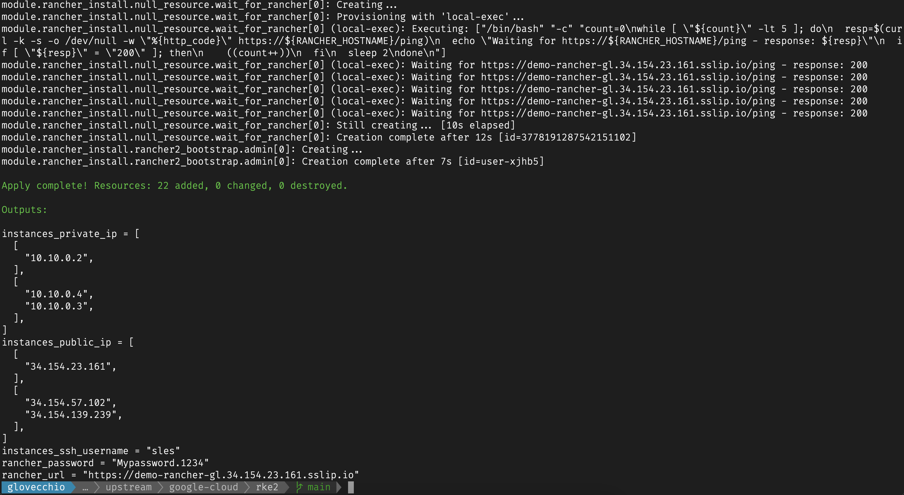
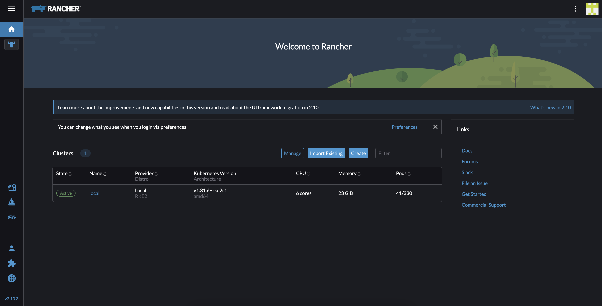

#### Configure the Rancher API key to connect from Harvester to Rancher itself

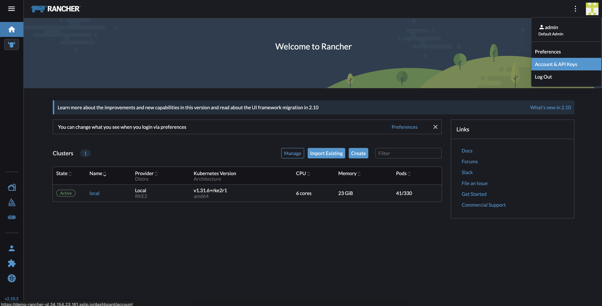
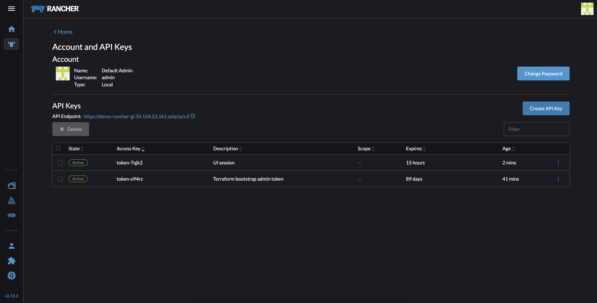
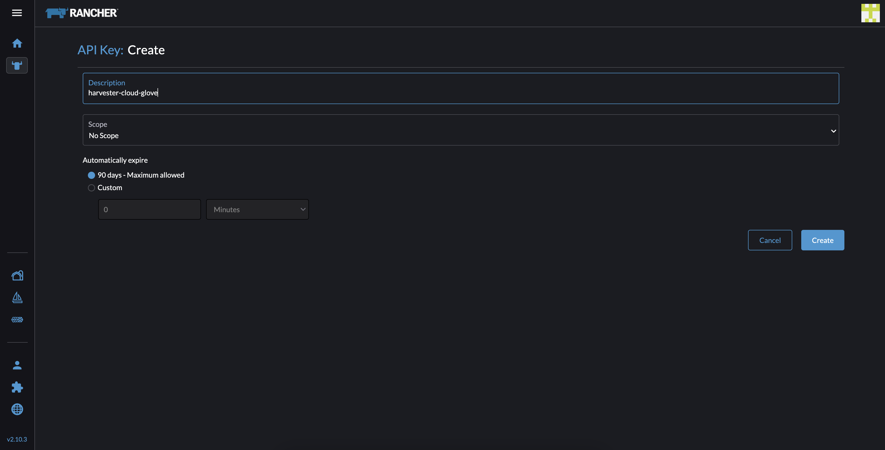

#### Create the Harvester cluster by configuring variables that allow automatic integration with the Rancher cluster created above

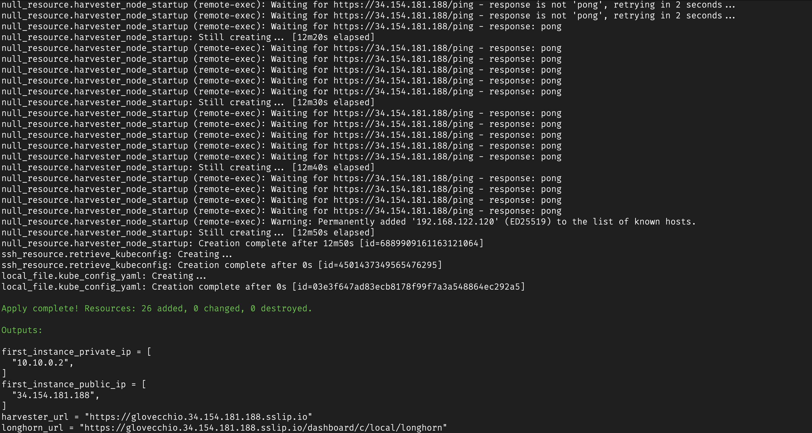


The images represent the highlights of the deployment; if you want all the details, check out [this](https://github.com/rancher/harvester-cloud/tree/main/projects/google-cloud#demostration-2---cluster-harvester-with-minimal-possible-configuration-that-is-automatically-added-to-a-rancher-cluster) documentation.

## Example

#### Environment

- Rancher version: `v2.10.3`
- Harvester version: `v1.4.1`
- Harvester VMs Image: `openSUSE-Leap-15.6-Minimal-VM.x86_64-Cloud.qcow2`
- k3s version: `v1.31.5+k3s1`

#### Workflow

To use Harvester as a Rancher Cloud Provider, you will need to:
1. Rancher -> create the Cloud Credentials
2. Harvester -> create a valid Image for the VMs
3. Harvester -> create a valid Network for the VMs

#### Create the Rancher Cloud Credentials

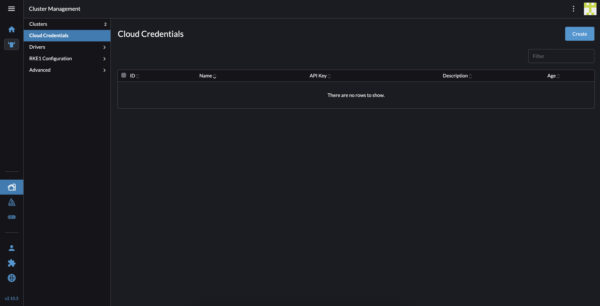
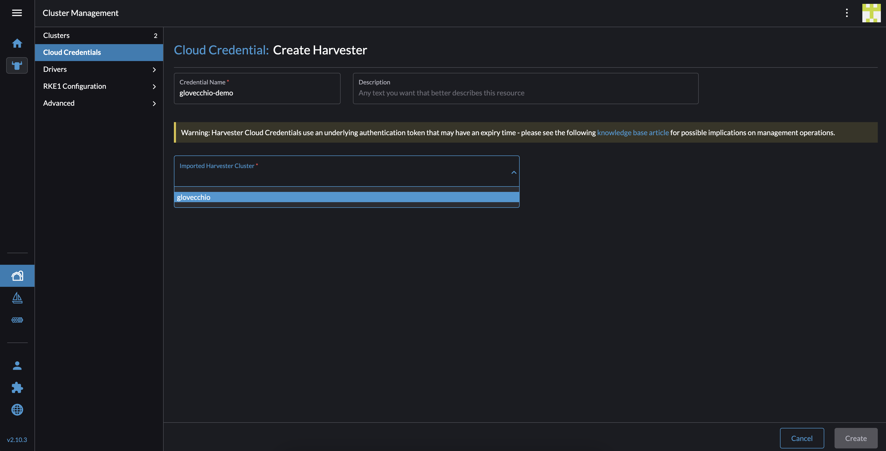
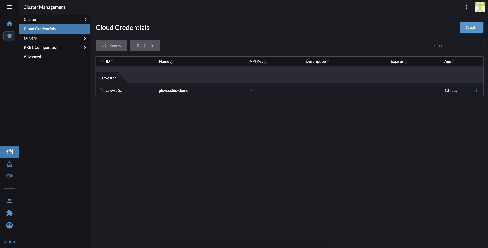

#### Create a valid Image for the (Harvester) VMs - default configuration

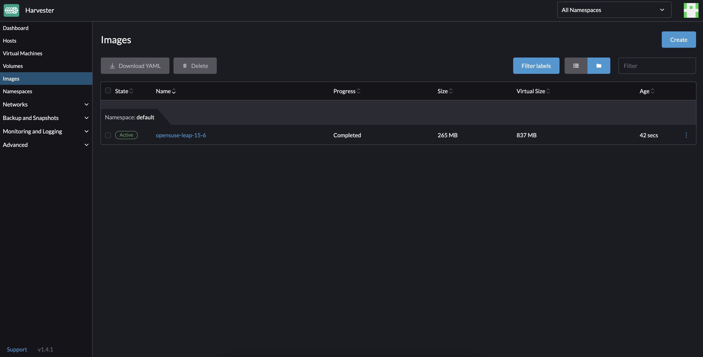

Check out [this](https://github.com/rancher/harvester-cloud/blob/main/projects/harvester-ops/image-creation/README.md) documentation for more information.

#### Create a valid Network for the (Harvester) VMs - default configuration

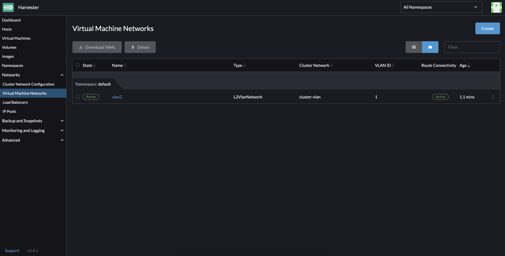

Check out [this](https://github.com/rancher/harvester-cloud/blob/main/projects/harvester-ops/network-creation/README.md) documentation for more information.

#### Create the Rancher downstream cluster on Harvester infrastructure

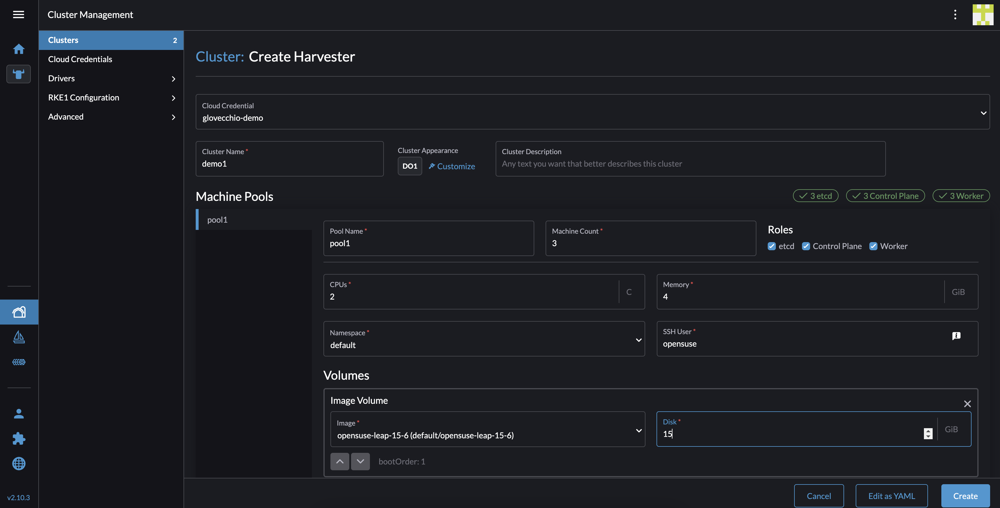
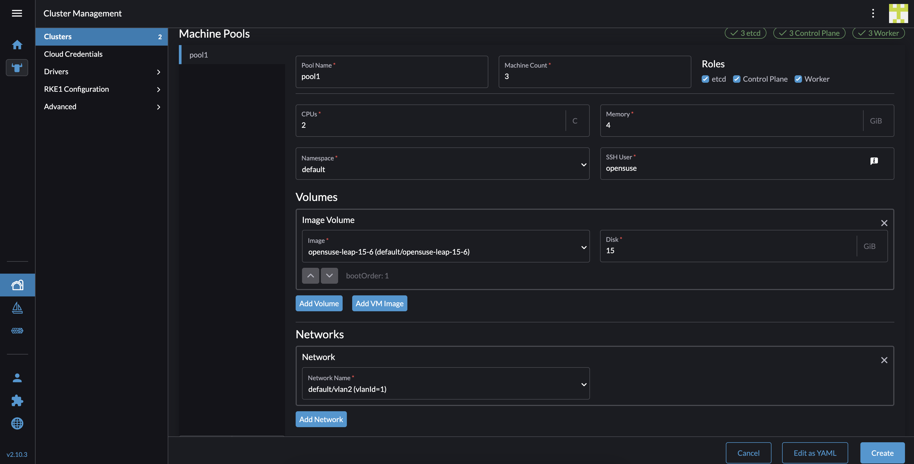
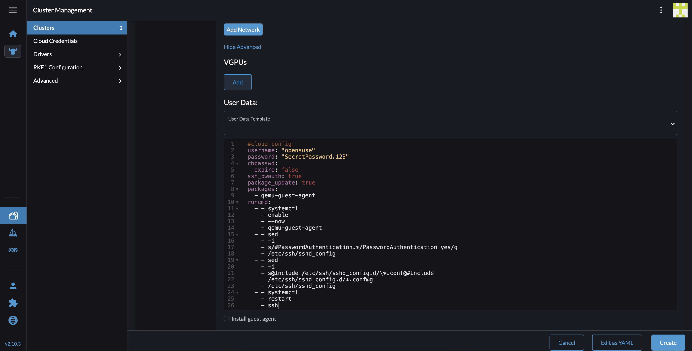

##### cloud-config file needed to configure access to VMs

```console
#cloud-config
username: "opensuse"
password: "SecretPassword.123"
chpasswd:
  expire: false
ssh_pwauth: true
package_update: true
packages:
  - qemu-guest-agent
runcmd:
  - - systemctl
    - enable
    - --now
    - qemu-guest-agent
  - - sed
    - -i
    - s/#PasswordAuthentication.*/PasswordAuthentication yes/g
    - /etc/ssh/sshd_config
  - - sed
    - -i
    - s@Include /etc/ssh/sshd_config.d/\*.conf@#Include
      /etc/ssh/sshd_config.d/*.conf@g
    - /etc/ssh/sshd_config
  - - systemctl
    - restart
    - ssh
```

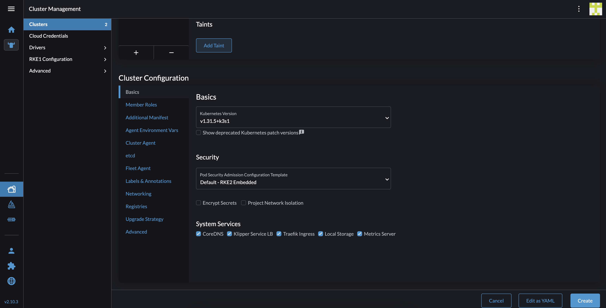

#### Final result

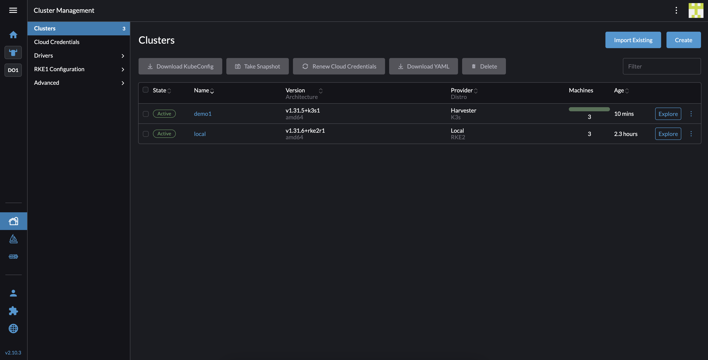
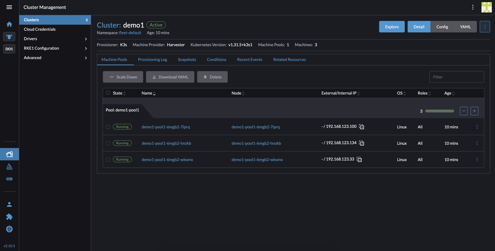
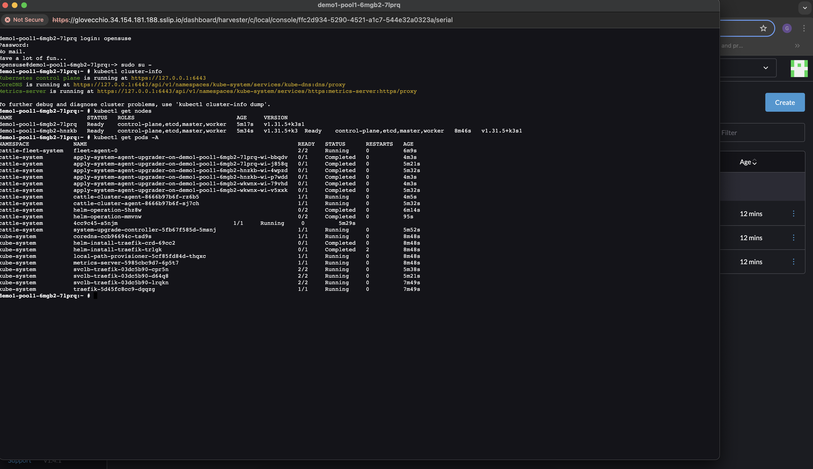
