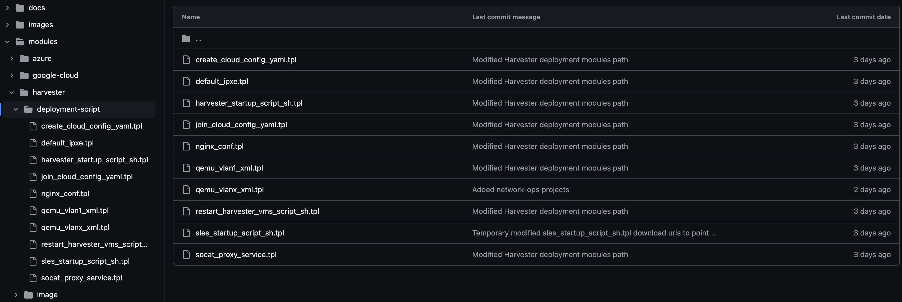
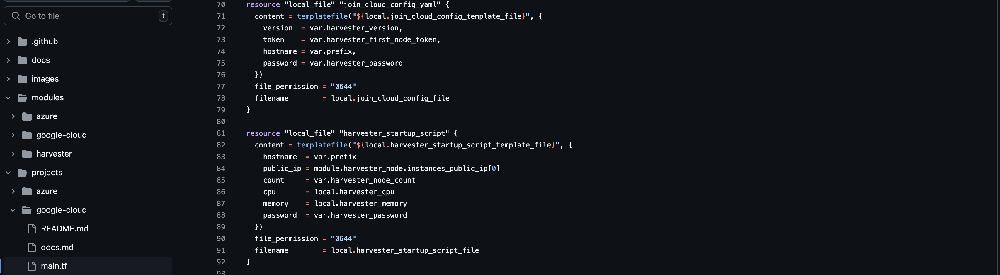
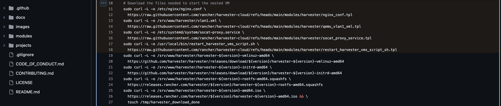

# Harvester cluster deployment process

The deployment does not require manual activities, with the exception of the configuration of four or five variables necessary for the Cloud Provider setup (subscription ID, Region, etc.).

However, it is interesting to know what happens behind the scenes.

## What happens when running Terraform files?

### PREMISE | High-level description of the steps in the Terraform *main.tf* file

1. Editing template configuration files.
2. Creating the VM (and all related resources) in the cloud <- Execution of the *sles_startup_script_sh* script to setup the VM itself.
3. Execution of the *harvester_startup_script_sh* script to start the nested VMs (Harvester nodes).

**The process is the same for all Cloud Providers.**

### 1_ Creation of the VM in the cloud

The process of managing the VM sizing and associated data disks is the only non-standard aspect. 

The logic is as follows:

- You can choose a "small" or "medium" Harvester cluster (`harvester_cluster_size` variable).
- You can select 1 or 3 data disks, where 1 indicates a single Harvester node, and 3 indicates an HA Harvester cluster (`harvester_node_count` variable).

The reason for this is that each data disk is associated with a nested VM, as if it were the VM's own disk.


#### Architecture

##### Harvester HA

     |→ Data Disk 1 → Harvester Node 1
VM --|→ Data Disk 2 → Harvester Node 2
     |→ Data Disk 3 → Harvester Node 3

##### Harvester Single-Node

VM --|→ Data Disk 1 → Harvester Node 1

### 2_ VM Setup

The template files and the scripts within the [modules/harvester/deployment-script](../modules/harvester/deployment-script) directory are processed and executed to configure the system.



Some of these need to be processed, so they are modified within the Terraform workflow and then moved to the VM, while others are standard files that are moved without being modified.

Template files that are modified (in the Terraform *main.tf* file):

- *sles_startup_script_sh.tpl*
- *default_ipxe.tpl*
- *create_cloud_config_yaml.tpl*
- *join_cloud_config_yaml.tpl*
- *harvester_startup_script_sh.tpl*





Standard files that are copied as they are (from the *sles_startup_script_sh* script):

- *nginx_conf.tpl*
- *qemu_vlan1_xml.tpl*
- *restart_harvester_vms_script_sh.tpl*
- *socat_proxy_service.tpl*



As anticipated in the introduction, the two main scripts that coordinate everything are: 

1. *[sles_startup_script_sh](../modules/harvester/deployment-script/sles_startup_script_sh.tpl)*
2. *[harvester_startup_script_sh](../modules/harvester/deployment-script/harvester_startup_script_sh.tpl)*

#### 2.1_ */srv/www/harvester/sles_startup_script_sh*

**All parameters written with the format `${...}` are replaced by the variables configured in the project.**

##### Main steps

1. Installation of pre-requisite packages

```console
sudo zypper --non-interactive addrepo https://download.opensuse.org/repositories/network/SLE_15/network.repo
sudo zypper --non-interactive --gpg-auto-import-keys refresh
sudo zypper --non-interactive install parted util-linux virt-install libvirt qemu-kvm python3-websockify novnc socat nginx sshpass
sudo systemctl enable --now libvirtd
sudo mkdir -p /srv/www/harvester
```

Explanation of the packages that will be installed:

- `parted`: Disk partition management tool.  
- `util-linux`: Essential system utilities (mount, fdisk, etc.).  
- `virt-install`: CLI tool to create KVM virtual machines.  
- `libvirt`: API and tools for managing virtual machines.  
- `qemu-kvm`: KVM-based virtualization with QEMU.  
- `python3-websockify`: WebSocket proxy for VNC/RDP connections.  
- `novnc`: Web-based VNC client for remote access.  
- `socat`: Utility for bidirectional data transfer between endpoints.  
- `nginx`: Web server and reverse proxy.  
- `sshpass`: Automates SSH login with password authentication. 

2. Download the files needed to start the nested VM

```console
sudo curl -L -o /etc/nginx/nginx.conf \
  https://raw.githubusercontent.com/rancher/harvester-cloud/refs/heads/main/modules/harvester/deployment-script/nginx_conf.tpl
sudo curl -L -o /srv/www/harvester/vlan1.xml \
  https://raw.githubusercontent.com/rancher/harvester-cloud/refs/heads/main/modules/harvester/deployment-script/qemu_vlan1_xml.tpl
sudo curl -L -o /etc/systemd/system/socat-proxy.service \
  https://raw.githubusercontent.com/rancher/harvester-cloud/refs/heads/main/modules/harvester/deployment-script/socat_proxy_service.tpl
sudo curl -L -o /usr/local/bin/restart_harvester_vms_script.sh \
  https://raw.githubusercontent.com/rancher/harvester-cloud/refs/heads/main/modules/harvester/deployment-script/restart_harvester_vms_script_sh.tpl
sudo curl -L -o /srv/www/harvester/harvester-${version}-vmlinuz-amd64 \
  https://github.com/harvester/harvester/releases/download/${version}/harvester-${version}-vmlinuz-amd64
sudo curl -L -o /srv/www/harvester/harvester-${version}-initrd-amd64 \
  https://github.com/harvester/harvester/releases/download/${version}/harvester-${version}-initrd-amd64
sudo curl -L -o /srv/www/harvester/harvester-${version}-rootfs-amd64.squashfs \
  https://releases.rancher.com/harvester/${version}/harvester-${version}-rootfs-amd64.squashfs
sudo curl -L -o /srv/www/harvester/harvester-${version}-amd64.iso \
  https://releases.rancher.com/harvester/${version}/harvester-${version}-amd64.iso && \
  touch /tmp/harvester_download_done
```

This portion of the script downloads Harvester boot and installation files, storing them in `/srv/www/harvester/`. A flag file (`/tmp/harvester_download_done`) marks completion.  

3. Disk partitioning

```console
for i in $(seq 1 "${count}"); do
  if [ -b "${disk_name}$(printf "\x$(printf %x $((97 + i)))")" ]; then
    echo "Partitioning and mounting disk ${disk_name}$(printf "\x$(printf %x $((97 + i)))") on ${mount_point}$i..."
    sudo parted --script "${disk_name}$(printf "\x$(printf %x $((97 + i)))")" mklabel gpt
    sudo parted --script "${disk_name}$(printf "\x$(printf %x $((97 + i)))")" mkpart primary ext4 0% 100%
    sudo mkfs.ext4 "${disk_name}$(printf "\x$(printf %x $((97 + i)))")1"
    sudo mkdir -p "${mount_point}$i"
    sudo mount "${disk_name}$(printf "\x$(printf %x $((97 + i)))")1" "${mount_point}$i"
    echo "${disk_name}$(printf "\x$(printf %x $((97 + i)))")1 ${mount_point}$i ext4 defaults 0 0" | sudo tee -a /etc/fstab
  else
    echo "Error: disk ${disk_name}$(printf "\x$(printf %x $((97 + i)))") does not exist."
    exit 1
  fi
done
echo "Configuration completed successfully for ${count} disks."
```

The final part of the script partitions, formats, and mounts a specified number of disks (`${count}`), appending them to `/etc/fstab` for persistence. If a disk is missing, the script exits with an error.  

#### 2.2_ */srv/www/harvester/harvester_startup_script_sh*

##### Main steps

1. Starting the Virtual Network

```console
sudo virsh net-define /srv/www/harvester/vlan1.xml
sudo virsh net-start vlan1
sudo virsh net-autostart vlan1
```

In this section, the script defines, starts, and enables autostart for the `vlan1` virtual network using `virsh`. The file `/srv/www/harvester/vlan1.xml` was downloaded by the `sles_startup_script.sh` script.

###### */srv/www/harvester/vlan1.xml*

```console
<network>
  <name>vlan1</name>
  <bridge name="virbr1"/>
  <forward mode="nat"/>
  <ip address="192.168.122.1" netmask="255.255.255.0">
    <dhcp>
      <range start="192.168.122.2" end="192.168.122.254"/>
      <bootp file="http://192.168.122.1/default.ipxe"/>
    </dhcp>
  </ip>
</network>
```

2. HTTP server configuration

```console
sudo chown nobody:nobody -R /srv/www
sudo systemctl enable --now nginx
```

This is because it is necessary for the nested VM to be able to reach the Harvester files present in the VM itself (iPXE boot).
The file `/etc/nginx/nginx.conf` was downloaded by the `sles_startup_script.sh` script.

###### */etc/nginx/nginx.conf*

```console
events {
    worker_connections  1024;
    use epoll;
}
http {
    include       mime.types;
    default_type  application/octet-stream;
    log_format  main  '$remote_addr - $remote_user [$time_local] "$request" '
                      '$status $body_bytes_sent "$http_referer" '
                      '"$http_user_agent" "$http_x_forwarded_for"';
    access_log  /var/log/nginx/access.log  main;
    sendfile        on;
    tcp_nopush     on;
    keepalive_timeout  65;
    gzip  on;
    server {
            listen 192.168.122.1:80 default_server;
            server_name _;
            root /srv/www/harvester;
            autoindex on;
    }
}
```

3. Creation of nested VMs, based on the number of data disks

```console
for i in $(seq 1 ${count}); do
  if [ $i == 1 ]; then
    sudo sed -i "s/${hostname}/${hostname}-$i/g" /srv/www/harvester/create_cloud_config.yaml
    sudo virt-install --name harvester-node-$i --memory ${memory} --vcpus ${cpu} --cpu host-passthrough --disk path=/mnt/datadisk$i/harvester-data.qcow2,size=250,bus=virtio,format=qcow2 --os-type linux --os-variant generic --network bridge=virbr1,model=virtio --graphics vnc,listen=0.0.0.0,password=yourpass,port=$((5900 + i)) --console pty,target_type=serial --pxe --autostart &
    sleep 30
  elif [ $i == 2 ]; then
    sudo sed -i "s/${hostname}/${hostname}-$i/g" /srv/www/harvester/join_cloud_config.yaml
    sudo sed -i "s/create_cloud_config.yaml/join_cloud_config.yaml/g" /srv/www/harvester/default.ipxe
    sudo virt-install --name harvester-node-$i --memory ${memory} --vcpus ${cpu} --cpu host-passthrough --disk path=/mnt/datadisk$i/harvester-data.qcow2,size=250,bus=virtio,format=qcow2 --os-type linux --os-variant generic --network bridge=virbr1,model=virtio --graphics vnc,listen=0.0.0.0,password=yourpass,port=$((5900 + i)) --console pty,target_type=serial --pxe --autostart &
    sleep 30
  else
    sudo cp /srv/www/harvester/join_cloud_config.yaml /srv/www/harvester/join_cloud_config_$((i - 1)).yaml
    sudo sed -i "s/${hostname}-$((i - 1))/${hostname}-$i/g" /srv/www/harvester/join_cloud_config_$((i - 1)).yaml
    sudo sed -i "s/join_cloud_config.yaml/join_cloud_config_$((i - 1)).yaml/g" /srv/www/harvester/default.ipxe
    sudo virt-install --name harvester-node-$i --memory ${memory} --vcpus ${cpu} --cpu host-passthrough --disk path=/mnt/datadisk$i/harvester-data.qcow2,size=250,bus=virtio,format=qcow2 --os-type linux --os-variant generic --network bridge=virbr1,model=virtio --graphics vnc,listen=0.0.0.0,password=yourpass,port=$((5900 + i)) --console pty,target_type=serial --pxe --autostart &
    sleep 30
  fi
done
```

Here, the script installs multiple `harvester-node` nested Virtual Machines based on the specified count (`${count}`).  

- For the first node, it customizes the cloud configuration file (`create_cloud_config.yaml`) and starts the VM with PXE boot.

###### */srv/www/harvester/default.ipxe* example

```console
#!ipxe
dhcp
kernel http://192.168.122.1/harvester-v1.4.1-vmlinuz-amd64 \
    initrd=harvester-v1.4.1-initrd-amd64 \
    ip=dhcp \
    console=tty1 \
    net.ifnames=1 \
    rd.cos.disable \
    rd.noverifyssl \
    root=live:http://192.168.122.1/harvester-v1.4.1-rootfs-amd64.squashfs \
    harvester.install.config_url=http://192.168.122.1/create_cloud_config.yaml\
    harvester.install.skipchecks=true \
    harvester.install.automatic=true
initrd http://192.168.122.1/harvester-v1.4.1-initrd-amd64
boot
```

###### */srv/www/harvester/create_cloud_config.yaml* example

```console
#cloud-config
scheme_version: 1
token: SecretToken.123
os:
  hostname: your-prefix
  password: SecretPassword.123
  ntp_servers:
  - 0.suse.pool.ntp.org
  - 1.suse.pool.ntp.org
install:
  mode: create
  management_interface:
    interfaces:
      - name: ens3
    default_route: true
    method: dhcp
    bond_options:
      mode: active-backup
      miimon: 100
  device: /dev/vda
  iso_url: http://192.168.122.1/harvester-v1.4.1-amd64.iso
  tty: tty1,115200n8
  vip: 192.168.122.120
  vip_mode: static
```

- For the second node, it customizes the cloud configuration for joining the cloud and updates the default iPXE boot file.

###### */srv/www/harvester/default.ipxe* example

```console
#!ipxe
dhcp
kernel http://192.168.122.1/harvester-v1.4.1-vmlinuz-amd64 \
    initrd=harvester-v1.4.1-initrd-amd64 \
    ip=dhcp \
    console=tty1 \
    net.ifnames=1 \
    rd.cos.disable \
    rd.noverifyssl \
    root=live:http://192.168.122.1/harvester-v1.4.1-rootfs-amd64.squashfs \
    harvester.install.config_url=http://192.168.122.1/join_cloud_config.yaml \ # Here is the only change
    harvester.install.skipchecks=true \
    harvester.install.automatic=true
initrd http://192.168.122.1/harvester-v1.4.1-initrd-amd64
boot
```

###### */srv/www/harvester/join_cloud_config.yaml* example

```console
#cloud-config
scheme_version: 1
server_url: https://192.168.122.120:443
token: SecretToken.123
os:
  hostname: your-prefix
  password: SecretPassword.123
  ntp_servers:
  - 0.suse.pool.ntp.org
  - 1.suse.pool.ntp.org
install:
  mode: join
  management_interface:
    interfaces:
      - name: ens3
    default_route: true
    method: dhcp
    bond_options:
      mode: active-backup
      miimon: 100
  device: /dev/vda
  iso_url: http://192.168.122.1/harvester-v1.4.1-amd64.iso
  tty: tty1,115200n8
```

- For subsequent nodes, it copies and modifies the join configuration file for each node, adjusting the hostname and updating the iPXE file.

###### */srv/www/harvester/default.ipxe* example

```console
#!ipxe
dhcp
kernel http://192.168.122.1/harvester-v1.4.1-vmlinuz-amd64 \
    initrd=harvester-v1.4.1-initrd-amd64 \
    ip=dhcp \
    console=tty1 \
    net.ifnames=1 \
    rd.cos.disable \
    rd.noverifyssl \
    root=live:http://192.168.122.1/harvester-v1.4.1-rootfs-amd64.squashfs \
    harvester.install.config_url=http://192.168.122.1/join_cloud_config_2.yaml \ # Here is the only change
    harvester.install.skipchecks=true \
    harvester.install.automatic=true
initrd http://192.168.122.1/harvester-v1.4.1-initrd-amd64
boot
```

###### */srv/www/harvester/join_cloud_config_2.yaml* example

```console
#cloud-config
scheme_version: 1
server_url: https://192.168.122.120:443
token: SecretToken.123
os:
  hostname: your-prefix
  password: SecretPassword.123
  ntp_servers:
  - 0.suse.pool.ntp.org
  - 1.suse.pool.ntp.org
install:
  mode: join
  management_interface:
    interfaces:
      - name: ens3
    default_route: true
    method: dhcp
    bond_options:
      mode: active-backup
      miimon: 100
  device: /dev/vda
  iso_url: http://192.168.122.1/harvester-v1.4.1-amd64.iso
  tty: tty1,115200n8
```

Each VM is installed using `virt-install` with specific resources (memory, CPU, disk) and configured for autostart.  

4. Monitoring nested VM states and restarting them when all are 'shut off'

```console
sudo chmod +x  /usr/local/bin/restart_harvester_vms_script.sh
(sudo crontab -l 2>/dev/null; echo "*/2 * * * * /usr/local/bin/restart_harvester_vms_script.sh") | sudo crontab -
```

This portion of the script grants execution permissions to `restart_harvester_vms_script.sh` and schedules it to run every 2 minutes using `cron`.  

This is necessary because when the VMs reboot (for example during the Harvester installation), they do not get back up and running on their own.

###### */usr/local/bin/restart_harvester_vms_script.sh*

```console
#!/bin/bash

LOGFILE="/var/log/restart_harvester_vms_script.log"

# Restart nested VMs that for some reason are not running ('shut off' state)
virsh list --all | awk '$3 == "shut" {print $2}' | while read -r vm; do
    if [[ -n "$vm" ]]; then
        echo "$(date): Starting VM $vm" | tee -a "$LOGFILE"
        virsh start "$vm" >>"$LOGFILE" 2>&1
    fi
done
```

5. Expose the Harvester nested VM via the VM's public IP

```console
sudo chmod 755 /etc/systemd/system/socat-proxy.service
sudo systemctl daemon-reload
sudo systemctl enable --now socat-proxy.service
```

In this section, the script sets the correct permissions for `socat-proxy.service`, reloads the systemd daemon, and enables the service to start immediately.

The `socat-proxy.service` is a systemd service that creates a proxy for specific TCP ports. It listens on ports `443` and `6443` and forwards the traffic to the IP `192.168.122.120` on the same ports. The service is designed to always restart if it fails and runs as the `root` user.

###### */etc/systemd/system/socat-proxy.service*

```console
[Unit]
Description=Socat Service

[Service]
ExecStart=/bin/bash -c "/usr/bin/socat TCP-LISTEN:443,fork TCP:192.168.122.120:443 & /usr/bin/socat TCP-LISTEN:6443,fork TCP:192.168.122.120:6443 & wait"
Restart=always
User=root

[Install]
WantedBy=multi-user.target
```

6. Wait for the Harvester services to start

```console
attempts=0
while [ "$attempts" -lt 15 ]; do
  ip=${public_ip}
  response=$(curl -k -s "https://$ip/ping")
  if [ "$response" == "pong" ]; then
    echo "Waiting for https://$ip/ping - response: $response"
    ((attempts++))
  else
    echo "Waiting for https://$ip/ping - response is not 'pong', retrying in 2 seconds..."
  fi
  sleep 2
done
```

7. Copying the KUBECONFIG file from the RKE2 cluster under the hood of Harvester

```console
sudo sshpass -p "${password}" ssh -oStrictHostKeyChecking=no "rancher@192.168.122.120" "sudo cat /etc/rancher/rke2/rke2.yaml" > /tmp/rke2.yaml
sudo sed -i "/certificate-authority-data:/c\\    insecure-skip-tls-verify: true" /tmp/rke2.yaml
```

### 3_ Rancher integration

The last part allows the integration of the Harvester cluster with a pre-existing Rancher cluster.

Take a look [here](https://github.com/rancher/harvester-cloud/blob/feature/issue-4/projects/google-cloud/README.md#demostration-2---cluster-harvester-with-minimal-possible-configuration-that-is-automatically-added-to-a-rancher-cluster) for the demonstration.
