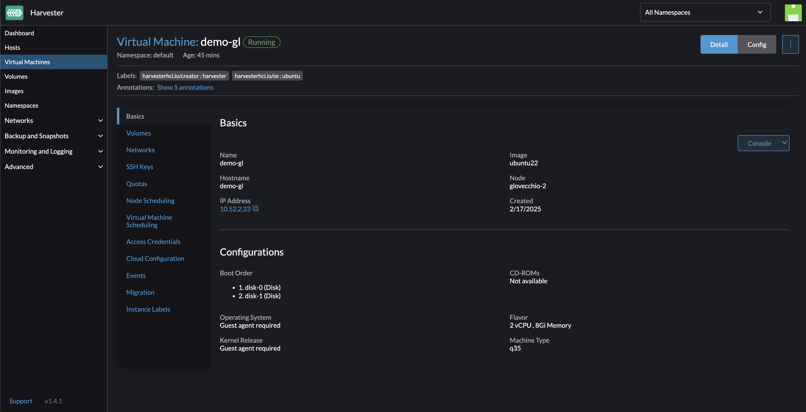
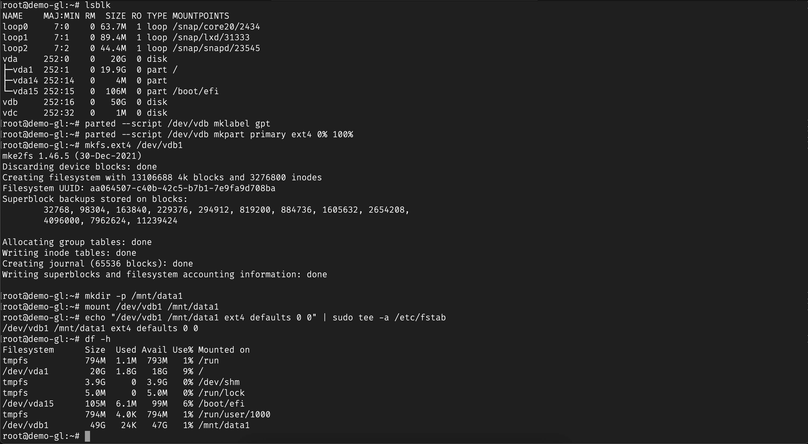
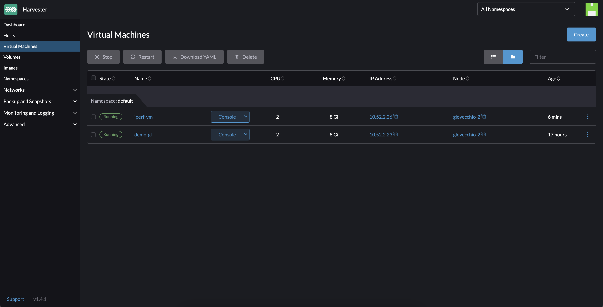

# Environment

- 1 SSD type OS disk (50GB)
- 3 SSD type data disks (3x350GB - /mnt/datadisk1, /mnt/datadisk2, and /mnt/datadisk3)
- Location: *europe-west8 (Milan)*
- Machine type: *n2-standard-32 (32 vCPUs, 128 GB Memory)*

```console
$ df -hT
Filesystem     Type      Size  Used Avail Use% Mounted on
/dev/sda3      xfs        50G   11G   40G  22% /
devtmpfs       devtmpfs  4.0M  8.0K  4.0M   1% /dev
tmpfs          tmpfs      63G     0   63G   0% /dev/shm
efivarfs       efivarfs   56K   24K   27K  48% /sys/firmware/efi/efivars
tmpfs          tmpfs      26G   26M   26G   1% /run
/dev/sda2      vfat       20M  3.8M   17M  19% /boot/efi
/dev/sdb1      ext4      344G   46G  281G  14% /mnt/datadisk1
/dev/sdc1      ext4      344G   42G  285G  13% /mnt/datadisk2
/dev/sdd1      ext4      344G   42G  285G  13% /mnt/datadisk3
tmpfs          tmpfs      13G  8.0K   13G   1% /run/user/1008
```

# Performance tests

## 1_ W/R test with *dd* (GCP Disks)

### Writing

```bash
# Quick tests
dd if=/dev/zero of=/mnt/datadisk1/testfile bs=1G count=2 oflag=direct
dd if=/dev/zero of=/mnt/datadisk2/testfile bs=1G count=2 oflag=direct
dd if=/dev/zero of=/mnt/datadisk3/testfile bs=1G count=2 oflag=direct
# Slow tests
dd if=/dev/zero of=/mnt/datadisk1/testfile bs=1M oflag=sync
dd if=/dev/zero of=/mnt/datadisk2/testfile bs=1M oflag=sync
dd if=/dev/zero of=/mnt/datadisk2/testfile bs=1M oflag=sync
```

#### Explanation

- `if=/dev/zero`: Generates "empty" data to write to disk.
- `of=/mnt/datadiskX/testfile`: Writes to one of your disks.
- `bs=1G count=2`: Writes 2GB of data in 1GB blocks.
- `oflag=direct`: Avoid system cache for more realistic testing.

For completeness of information:
- `oflag=direct`: Writes data directly to disk, bypassing the operating system cache. Improve real-world disk performance tests.
- `oflag=sync`: Each write operation is immediately written to disk, without waiting for the buffer to be emptied. Simulate a more realistic load for latency-sensitive applications.
- `oflag=dsync`: Similar to *sync*, but ensures that the file's metadata is updated before writing is completed.

#### Results

```console
# Quick tests
$ dd if=/dev/zero of=/mnt/datadisk1/testfile bs=1G count=2 oflag=direct
2+0 records in
2+0 records out
2147483648 bytes (2.1 GB, 2.0 GiB) copied, 3.21338 s, 668 MB/s
$ dd if=/dev/zero of=/mnt/datadisk2/testfile bs=1G count=2 oflag=direct
2+0 records in
2+0 records out
2147483648 bytes (2.1 GB, 2.0 GiB) copied, 3.19158 s, 673 MB/s
$ dd if=/dev/zero of=/mnt/datadisk3/testfile bs=1G count=2 oflag=direct
2+0 records in
2+0 records out
2147483648 bytes (2.1 GB, 2.0 GiB) copied, 3.12686 s, 687 MB/s
# Slow test
$ dd if=/dev/zero of=/mnt/datadisk1/testfile bs=1M oflag=sync
dd: error writing '/mnt/datadisk1/testfile': No space left on device
304935+0 records in
304934+0 records out
319747141632 bytes (320 GB, 298 GiB) copied, 847.729 s, 377 MB/s
...
...
...
```

### Reading 

```bash
# Quick tests
dd if=/mnt/datadisk1/testfile of=/dev/null bs=1G count=2 iflag=direct
dd if=/mnt/datadisk2/testfile of=/dev/null bs=1G count=2 iflag=direct
dd if=/mnt/datadisk3/testfile of=/dev/null bs=1G count=2 iflag=direct
```

#### Explanation

- `if=/mnt/datadiskX/testfile`: Reads the file just written.
- `of=/dev/null`: Discards the read data.
- `iflag=direct`: Avoid system cache.

#### Results

```console
$ dd if=/mnt/datadisk1/testfile of=/dev/null bs=1G count=2 iflag=direct
2+0 records in
2+0 records out
2147483648 bytes (2.1 GB, 2.0 GiB) copied, 2.65317 s, 809 MB/s
$ dd if=/mnt/datadisk2/testfile of=/dev/null bs=1G count=2 iflag=direct
2+0 records in
2+0 records out
2147483648 bytes (2.1 GB, 2.0 GiB) copied, 2.71187 s, 792 MB/s
$ dd if=/mnt/datadisk3/testfile of=/dev/null bs=1G count=2 iflag=direct
2+0 records in
2+0 records out
2147483648 bytes (2.1 GB, 2.0 GiB) copied, 2.6786 s, 802 MB/s
```

**Remember to delete files after testing to free up space.**

```bash
rm /mnt/datadisk1/testfile
rm /mnt/datadisk2/testfile
rm /mnt/datadisk3/testfile
```

## 2_ Random I/O test with *fio* (GCP Disks)

### Download *fio*

```bash
sudo zypper install fio libaio libaio-devel
```

### 2.1_ Sequential Writing (1 Job)

```bash
fio --name=seq-write-4-jobs --ioengine=libaio --rw=write --bs=1M --filename=/mnt/datadisk1/testfile --size=100GB --direct=1 --iodepth=128 --group_reporting
fio --name=seq-write-4-jobs --ioengine=libaio --rw=write --bs=1M --filename=/mnt/datadisk2/testfile --size=100GB --direct=1 --iodepth=128 --group_reporting
fio --name=seq-write-4-jobs --ioengine=libaio --rw=write --bs=1M --filename=/mnt/datadisk3/testfile --size=100GB --direct=1 --iodepth=128 --group_reporting
```

#### Explanation

- `--ioengine=libaio`: Asynchronous I/O engine for better performance.
- `--bs=1M`: 1M blocks.
- `--size=250G`: Test on 250GB of data.
- `--direct=1`: Bypass OS caching for more realistic results.
- `--iodepth=128`: Simulates requests in parallel (128 queued operations).
- `--group_reporting`: Generate aggregate reports for all jobs.

#### Results

```console
$ fio --name=seq-write-4-jobs --ioengine=libaio --rw=write --bs=1M --filename=/mnt/datadisk1/testfile --size=100GB --direct=1 --iodepth=128 --group_reporting
seq-write-4-jobs: (g=0): rw=write, bs=(R) 1024KiB-1024KiB, (W) 1024KiB-1024KiB, (T) 1024KiB-1024KiB, ioengine=libaio, iodepth=128
fio-3.23
Starting 1 process
seq-write-4-jobs: Laying out IO file (1 file / 102400MiB)
Jobs: 1 (f=0): [f(1)][100.0%][w=743MiB/s][w=743 IOPS][eta 00m:00s]
seq-write-4-jobs: (groupid=0, jobs=1): err= 0: pid=21545: Tue Feb 11 09:26:57 2025
  write: IOPS=765, BW=765MiB/s (803MB/s)(100GiB/133789msec); 0 zone resets
    slat (usec): min=27, max=174039, avg=121.82, stdev=2826.23
    clat (msec): min=3, max=455, avg=167.11, stdev=29.78
     lat (msec): min=3, max=455, avg=167.23, stdev=29.67
    clat percentiles (msec):
     |  1.00th=[   36],  5.00th=[  159], 10.00th=[  165], 20.00th=[  167],
     | 30.00th=[  167], 40.00th=[  167], 50.00th=[  167], 60.00th=[  167],
     | 70.00th=[  167], 80.00th=[  169], 90.00th=[  169], 95.00th=[  190],
     | 99.00th=[  296], 99.50th=[  313], 99.90th=[  330], 99.95th=[  334],
     | 99.99th=[  426]
   bw (  KiB/s): min=528384, max=1044480, per=100.00%, avg=784476.04, stdev=45106.62, samples=267
   iops        : min=  516, max= 1020, avg=766.09, stdev=44.05, samples=267
  lat (msec)   : 4=0.01%, 10=0.22%, 20=0.36%, 50=0.82%, 100=1.58%
  lat (msec)   : 250=94.74%, 500=2.29%
  cpu          : usr=4.28%, sys=1.34%, ctx=96660, majf=0, minf=357
  IO depths    : 1=0.1%, 2=0.1%, 4=0.1%, 8=0.1%, 16=0.1%, 32=0.1%, >=64=99.9%
     submit    : 0=0.0%, 4=100.0%, 8=0.0%, 16=0.0%, 32=0.0%, 64=0.0%, >=64=0.0%
     complete  : 0=0.0%, 4=100.0%, 8=0.0%, 16=0.0%, 32=0.0%, 64=0.0%, >=64=0.1%
     issued rwts: total=0,102400,0,0 short=0,0,0,0 dropped=0,0,0,0
     latency   : target=0, window=0, percentile=100.00%, depth=128

Run status group 0 (all jobs):
  WRITE: bw=765MiB/s (803MB/s), 765MiB/s-765MiB/s (803MB/s-803MB/s), io=100GiB (107GB), run=133789-133789msec

Disk stats (read/write):
  sdb: ios=9/410918, merge=0/3959, ticks=5593/69790028, in_queue=69795766, util=100.00%
$ fio --name=seq-write-4-jobs --ioengine=libaio --rw=write --bs=1M --filename=/mnt/datadisk2/testfile --size=100GB --direct=1 --iodepth=128 --group_reporting
seq-write-4-jobs: (g=0): rw=write, bs=(R) 1024KiB-1024KiB, (W) 1024KiB-1024KiB, (T) 1024KiB-1024KiB, ioengine=libaio, iodepth=128
fio-3.23
Starting 1 process
seq-write-4-jobs: Laying out IO file (1 file / 102400MiB)
Jobs: 1 (f=1): [W(1)][100.0%][w=769MiB/s][w=769 IOPS][eta 00m:00s]
seq-write-4-jobs: (groupid=0, jobs=1): err= 0: pid=22363: Tue Feb 11 09:29:50 2025
  write: IOPS=766, BW=767MiB/s (804MB/s)(100GiB/133528msec); 0 zone resets
    slat (usec): min=25, max=172039, avg=100.32, stdev=2215.08
    clat (msec): min=3, max=402, avg=166.80, stdev=29.77
     lat (msec): min=3, max=403, avg=166.90, stdev=29.70
    clat percentiles (msec):
     |  1.00th=[   27],  5.00th=[  163], 10.00th=[  165], 20.00th=[  167],
     | 30.00th=[  167], 40.00th=[  167], 50.00th=[  167], 60.00th=[  167],
     | 70.00th=[  167], 80.00th=[  169], 90.00th=[  169], 95.00th=[  184],
     | 99.00th=[  292], 99.50th=[  317], 99.90th=[  330], 99.95th=[  338],
     | 99.99th=[  388]
   bw (  KiB/s): min=548864, max=1034240, per=100.00%, avg=786562.89, stdev=39577.23, samples=266
   iops        : min=  536, max= 1010, avg=768.14, stdev=38.65, samples=266
  lat (msec)   : 4=0.01%, 10=0.40%, 20=0.40%, 50=0.82%, 100=1.45%
  lat (msec)   : 250=94.93%, 500=1.99%
  cpu          : usr=4.35%, sys=1.16%, ctx=93928, majf=0, minf=375
  IO depths    : 1=0.1%, 2=0.1%, 4=0.1%, 8=0.1%, 16=0.1%, 32=0.1%, >=64=99.9%
     submit    : 0=0.0%, 4=100.0%, 8=0.0%, 16=0.0%, 32=0.0%, 64=0.0%, >=64=0.0%
     complete  : 0=0.0%, 4=100.0%, 8=0.0%, 16=0.0%, 32=0.0%, 64=0.0%, >=64=0.1%
     issued rwts: total=0,102400,0,0 short=0,0,0,0 dropped=0,0,0,0
     latency   : target=0, window=0, percentile=100.00%, depth=128

Run status group 0 (all jobs):
  WRITE: bw=767MiB/s (804MB/s), 767MiB/s-767MiB/s (804MB/s-804MB/s), io=100GiB (107GB), run=133528-133528msec

Disk stats (read/write):
  sdc: ios=0/410053, merge=0/2563, ticks=0/65711022, in_queue=65711037, util=100.00%
$ fio --name=seq-write-4-jobs --ioengine=libaio --rw=write --bs=1M --filename=/mnt/datadisk3/testfile --size=100GB --direct=1 --iodepth=128 --group_reporting
seq-write-4-jobs: (g=0): rw=write, bs=(R) 1024KiB-1024KiB, (W) 1024KiB-1024KiB, (T) 1024KiB-1024KiB, ioengine=libaio, iodepth=128
fio-3.23
Starting 1 process
seq-write-4-jobs: Laying out IO file (1 file / 102400MiB)
Jobs: 1 (f=1): [W(1)][100.0%][w=769MiB/s][w=768 IOPS][eta 00m:00s]
seq-write-4-jobs: (groupid=0, jobs=1): err= 0: pid=23033: Tue Feb 11 09:33:11 2025
  write: IOPS=767, BW=767MiB/s (804MB/s)(100GiB/133494msec); 0 zone resets
    slat (usec): min=27, max=167380, avg=169.57, stdev=3751.30
    clat (msec): min=8, max=340, avg=166.69, stdev=43.48
     lat (msec): min=8, max=340, avg=166.86, stdev=43.34
    clat percentiles (msec):
     |  1.00th=[   10],  5.00th=[   81], 10.00th=[  144], 20.00th=[  167],
     | 30.00th=[  167], 40.00th=[  167], 50.00th=[  167], 60.00th=[  167],
     | 70.00th=[  169], 80.00th=[  176], 90.00th=[  190], 95.00th=[  243],
     | 99.00th=[  309], 99.50th=[  321], 99.90th=[  330], 99.95th=[  330],
     | 99.99th=[  334]
   bw (  KiB/s): min=528384, max=1042395, per=100.00%, avg=786737.49, stdev=86515.62, samples=266
   iops        : min=  516, max= 1017, avg=768.29, stdev=84.48, samples=266
  lat (msec)   : 10=1.10%, 20=0.90%, 50=1.55%, 100=3.04%, 250=89.21%
  lat (msec)   : 500=4.20%
  cpu          : usr=4.41%, sys=1.11%, ctx=74369, majf=0, minf=745
  IO depths    : 1=0.1%, 2=0.1%, 4=0.1%, 8=0.1%, 16=0.1%, 32=0.1%, >=64=99.9%
     submit    : 0=0.0%, 4=100.0%, 8=0.0%, 16=0.0%, 32=0.0%, 64=0.0%, >=64=0.0%
     complete  : 0=0.0%, 4=100.0%, 8=0.0%, 16=0.0%, 32=0.0%, 64=0.0%, >=64=0.1%
     issued rwts: total=0,102400,0,0 short=0,0,0,0 dropped=0,0,0,0
     latency   : target=0, window=0, percentile=100.00%, depth=128

Run status group 0 (all jobs):
  WRITE: bw=767MiB/s (804MB/s), 767MiB/s-767MiB/s (804MB/s-804MB/s), io=100GiB (107GB), run=133494-133494msec

Disk stats (read/write):
  sdd: ios=6/412220, merge=0/2470, ticks=254/59712502, in_queue=59712795, util=100.00%
```

### 2.2_ Sequential Reading (1 Job)

```bash
fio --name=seq-write-4-jobs --ioengine=libaio --rw=read --bs=1M --filename=/mnt/datadisk1/testfile --size=100GB --direct=1 --iodepth=128 --group_reporting
fio --name=seq-write-4-jobs --ioengine=libaio --rw=read --bs=1M --filename=/mnt/datadisk2/testfile --size=100GB --direct=1 --iodepth=128 --group_reporting
fio --name=seq-write-4-jobs --ioengine=libaio --rw=read --bs=1M --filename=/mnt/datadisk3/testfile --size=100GB --direct=1 --iodepth=128 --group_reporting
```

#### Results

```console
$ fio --name=seq-write-4-jobs --ioengine=libaio --rw=read --bs=1M --filename=/mnt/datadisk1/testfile --size=100GB --direct=1 --iodepth=128 --group_reporting
seq-write-4-jobs: (g=0): rw=read, bs=(R) 1024KiB-1024KiB, (W) 1024KiB-1024KiB, (T) 1024KiB-1024KiB, ioengine=libaio, iodepth=128
fio-3.23
Starting 1 process
seq-write-4-jobs: Laying out IO file (1 file / 102400MiB)
Jobs: 1 (f=1): [R(1)][100.0%][r=768MiB/s][r=767 IOPS][eta 00m:00s]
seq-write-4-jobs: (groupid=0, jobs=1): err= 0: pid=23660: Tue Feb 11 09:41:09 2025
  read: IOPS=768, BW=768MiB/s (806MB/s)(100GiB/133287msec)
    slat (usec): min=6, max=342, avg=13.13, stdev= 8.96
    clat (msec): min=11, max=336, avg=166.58, stdev=19.45
     lat (msec): min=11, max=336, avg=166.59, stdev=19.45
    clat percentiles (msec):
     |  1.00th=[   85],  5.00th=[  161], 10.00th=[  165], 20.00th=[  167],
     | 30.00th=[  167], 40.00th=[  169], 50.00th=[  169], 60.00th=[  171],
     | 70.00th=[  171], 80.00th=[  174], 90.00th=[  178], 95.00th=[  180],
     | 99.00th=[  192], 99.50th=[  199], 99.90th=[  215], 99.95th=[  262],
     | 99.99th=[  321]
   bw (  KiB/s): min=638976, max=864256, per=100.00%, avg=787417.50, stdev=10911.52, samples=266
   iops        : min=  624, max=  844, avg=768.97, stdev=10.66, samples=266
  lat (msec)   : 20=0.06%, 50=0.03%, 100=4.55%, 250=95.30%, 500=0.06%
  cpu          : usr=0.16%, sys=1.24%, ctx=101968, majf=0, minf=587
  IO depths    : 1=0.1%, 2=0.1%, 4=0.1%, 8=0.1%, 16=0.1%, 32=0.1%, >=64=99.9%
     submit    : 0=0.0%, 4=100.0%, 8=0.0%, 16=0.0%, 32=0.0%, 64=0.0%, >=64=0.0%
     complete  : 0=0.0%, 4=100.0%, 8=0.0%, 16=0.0%, 32=0.0%, 64=0.0%, >=64=0.1%
     issued rwts: total=102400,0,0,0 short=0,0,0,0 dropped=0,0,0,0
     latency   : target=0, window=0, percentile=100.00%, depth=128

Run status group 0 (all jobs):
   READ: bw=768MiB/s (806MB/s), 768MiB/s-768MiB/s (806MB/s-806MB/s), io=100GiB (107GB), run=133287-133287msec

Disk stats (read/write):
  sdb: ios=409263/21, merge=0/5, ticks=67063742/43391, in_queue=67107135, util=100.00%
$ fio --name=seq-write-4-jobs --ioengine=libaio --rw=read --bs=1M --filename=/mnt/datadisk2/testfile --size=100GB --direct=1 --iodepth=128 --group_reporting
seq-write-4-jobs: (g=0): rw=read, bs=(R) 1024KiB-1024KiB, (W) 1024KiB-1024KiB, (T) 1024KiB-1024KiB, ioengine=libaio, iodepth=128
fio-3.23
Starting 1 process
Jobs: 1 (f=1): [R(1)][100.0%][r=769MiB/s][r=768 IOPS][eta 00m:00s]
seq-write-4-jobs: (groupid=0, jobs=1): err= 0: pid=23876: Tue Feb 11 09:43:54 2025
  read: IOPS=768, BW=768MiB/s (806MB/s)(100GiB/133286msec)
    slat (usec): min=6, max=1384, avg=12.90, stdev= 9.79
    clat (msec): min=12, max=331, avg=166.58, stdev=20.32
     lat (msec): min=12, max=331, avg=166.59, stdev=20.32
    clat percentiles (msec):
     |  1.00th=[   85],  5.00th=[   89], 10.00th=[  165], 20.00th=[  167],
     | 30.00th=[  167], 40.00th=[  169], 50.00th=[  169], 60.00th=[  171],
     | 70.00th=[  171], 80.00th=[  174], 90.00th=[  178], 95.00th=[  182],
     | 99.00th=[  194], 99.50th=[  199], 99.90th=[  218], 99.95th=[  264],
     | 99.99th=[  317]
   bw (  KiB/s): min=647168, max=862208, per=100.00%, avg=787425.20, stdev=10548.68, samples=266
   iops        : min=  632, max=  842, avg=768.97, stdev=10.30, samples=266
  lat (msec)   : 20=0.06%, 50=0.03%, 100=4.97%, 250=94.89%, 500=0.06%
  cpu          : usr=0.21%, sys=1.16%, ctx=102200, majf=0, minf=650
  IO depths    : 1=0.1%, 2=0.1%, 4=0.1%, 8=0.1%, 16=0.1%, 32=0.1%, >=64=99.9%
     submit    : 0=0.0%, 4=100.0%, 8=0.0%, 16=0.0%, 32=0.0%, 64=0.0%, >=64=0.0%
     complete  : 0=0.0%, 4=100.0%, 8=0.0%, 16=0.0%, 32=0.0%, 64=0.0%, >=64=0.1%
     issued rwts: total=102400,0,0,0 short=0,0,0,0 dropped=0,0,0,0
     latency   : target=0, window=0, percentile=100.00%, depth=128

Run status group 0 (all jobs):
   READ: bw=768MiB/s (806MB/s), 768MiB/s-768MiB/s (806MB/s-806MB/s), io=100GiB (107GB), run=133286-133286msec

Disk stats (read/write):
  sdc: ios=409175/24, merge=0/10, ticks=67014490/234726, in_queue=67249216, util=100.00%
$ fio --name=seq-write-4-jobs --ioengine=libaio --rw=read --bs=1M --filename=/mnt/datadisk3/testfile --size=100GB --direct=1 --iodepth=128 --group_reporting
seq-write-4-jobs: (g=0): rw=read, bs=(R) 1024KiB-1024KiB, (W) 1024KiB-1024KiB, (T) 1024KiB-1024KiB, ioengine=libaio, iodepth=128
fio-3.23
Starting 1 process
Jobs: 1 (f=1): [R(1)][100.0%][r=770MiB/s][r=770 IOPS][eta 00m:00s]
seq-write-4-jobs: (groupid=0, jobs=1): err= 0: pid=24357: Tue Feb 11 09:51:02 2025
  read: IOPS=768, BW=768MiB/s (806MB/s)(100GiB/133285msec)
    slat (usec): min=6, max=396, avg=12.61, stdev= 8.29
    clat (msec): min=11, max=340, avg=166.58, stdev=18.99
     lat (msec): min=11, max=340, avg=166.59, stdev=18.99
    clat percentiles (msec):
     |  1.00th=[   85],  5.00th=[  163], 10.00th=[  165], 20.00th=[  167],
     | 30.00th=[  167], 40.00th=[  169], 50.00th=[  169], 60.00th=[  171],
     | 70.00th=[  171], 80.00th=[  174], 90.00th=[  178], 95.00th=[  180],
     | 99.00th=[  190], 99.50th=[  197], 99.90th=[  236], 99.95th=[  266],
     | 99.99th=[  326]
   bw (  KiB/s): min=645120, max=858112, per=100.00%, avg=787425.20, stdev=10509.60, samples=266
   iops        : min=  630, max=  838, avg=768.97, stdev=10.26, samples=266
  lat (msec)   : 20=0.06%, 50=0.03%, 100=4.32%, 250=95.54%, 500=0.06%
  cpu          : usr=0.19%, sys=1.14%, ctx=102297, majf=0, minf=653
  IO depths    : 1=0.1%, 2=0.1%, 4=0.1%, 8=0.1%, 16=0.1%, 32=0.1%, >=64=99.9%
     submit    : 0=0.0%, 4=100.0%, 8=0.0%, 16=0.0%, 32=0.0%, 64=0.0%, >=64=0.0%
     complete  : 0=0.0%, 4=100.0%, 8=0.0%, 16=0.0%, 32=0.0%, 64=0.0%, >=64=0.1%
     issued rwts: total=102400,0,0,0 short=0,0,0,0 dropped=0,0,0,0
     latency   : target=0, window=0, percentile=100.00%, depth=128

Run status group 0 (all jobs):
   READ: bw=768MiB/s (806MB/s), 768MiB/s-768MiB/s (806MB/s-806MB/s), io=100GiB (107GB), run=133285-133285msec

Disk stats (read/write):
  sdd: ios=409183/32, merge=0/3, ticks=67076342/191595, in_queue=67267938, util=100.00%
```

**Remember to delete files after testing to free up space.**

```bash
rm /mnt/datadisk1/testfile
rm /mnt/datadisk2/testfile
rm /mnt/datadisk3/testfile
```

### 2.3_ Sequential Writing (4 Jobs)

```bash
fio --name=seq-write-4-jobs --ioengine=libaio --rw=write --bs=1M --filename=/mnt/datadisk1/testfile --size=100GB --direct=1 --numjobs=4 --iodepth=32 --group_reporting
fio --name=seq-write-4-jobs --ioengine=libaio --rw=write --bs=1M --filename=/mnt/datadisk2/testfile --size=100GB --direct=1 --numjobs=4 --iodepth=32 --group_reporting
fio --name=seq-write-4-jobs --ioengine=libaio --rw=write --bs=1M --filename=/mnt/datadisk3/testfile --size=100GB --direct=1 --numjobs=4 --iodepth=32 --group_reporting
```

#### Results

```console
$ fio --name=seq-write-4-jobs --ioengine=libaio --rw=write --bs=1M --filename=/mnt/datadisk1/testfile --size=100GB --direct=1 --numjobs=4 --iodepth=32 --group_reporting
seq-write-4-jobs: (g=0): rw=write, bs=(R) 1024KiB-1024KiB, (W) 1024KiB-1024KiB, (T) 1024KiB-1024KiB, ioengine=libaio, iodepth=32
...
fio-3.23
Starting 4 processes
seq-write-4-jobs: Laying out IO file (1 file / 102400MiB)
Jobs: 2 (f=1): [W(1),_(1),f(1),_(1)][100.0%][w=761MiB/s][w=760 IOPS][eta 00m:00s]
seq-write-4-jobs: (groupid=0, jobs=4): err= 0: pid=25846: Tue Feb 11 10:18:27 2025
  write: IOPS=767, BW=767MiB/s (804MB/s)(400GiB/533878msec); 0 zone resets
    slat (usec): min=23, max=236609, avg=139.07, stdev=3250.58
    clat (msec): min=2, max=462, avg=166.66, stdev=15.51
     lat (msec): min=2, max=462, avg=166.79, stdev=15.19
    clat percentiles (msec):
     |  1.00th=[  107],  5.00th=[  165], 10.00th=[  167], 20.00th=[  167],
     | 30.00th=[  167], 40.00th=[  167], 50.00th=[  167], 60.00th=[  167],
     | 70.00th=[  167], 80.00th=[  167], 90.00th=[  169], 95.00th=[  169],
     | 99.00th=[  203], 99.50th=[  259], 99.90th=[  317], 99.95th=[  326],
     | 99.99th=[  338]
   bw (  KiB/s): min=520192, max=1022454, per=100.00%, avg=786975.07, stdev=6916.45, samples=4260
   iops        : min=  508, max=  997, avg=768.46, stdev= 6.75, samples=4260
  lat (msec)   : 4=0.01%, 10=0.05%, 20=0.09%, 50=0.21%, 100=0.55%
  lat (msec)   : 250=98.52%, 500=0.57%
  cpu          : usr=1.14%, sys=0.35%, ctx=402646, majf=0, minf=277
  IO depths    : 1=0.1%, 2=0.1%, 4=0.1%, 8=0.1%, 16=0.1%, 32=100.0%, >=64=0.0%
     submit    : 0=0.0%, 4=100.0%, 8=0.0%, 16=0.0%, 32=0.0%, 64=0.0%, >=64=0.0%
     complete  : 0=0.0%, 4=100.0%, 8=0.0%, 16=0.0%, 32=0.1%, 64=0.0%, >=64=0.0%
     issued rwts: total=0,409600,0,0 short=0,0,0,0 dropped=0,0,0,0
     latency   : target=0, window=0, percentile=100.00%, depth=32

Run status group 0 (all jobs):
  WRITE: bw=767MiB/s (804MB/s), 767MiB/s-767MiB/s (804MB/s-804MB/s), io=400GiB (429GB), run=533878-533878msec

Disk stats (read/write):
  sdb: ios=21/1640467, merge=0/2051, ticks=6441/298553303, in_queue=298559766, util=100.00%
$ fio --name=seq-write-4-jobs --ioengine=libaio --rw=write --bs=1M --filename=/mnt/datadisk2/testfile --size=100GB --direct=1 --numjobs=4 --iodepth=32 --group_reporting
seq-write-4-jobs: (g=0): rw=write, bs=(R) 1024KiB-1024KiB, (W) 1024KiB-1024KiB, (T) 1024KiB-1024KiB, ioengine=libaio, iodepth=32
...
fio-3.23
Starting 4 processes
seq-write-4-jobs: Laying out IO file (1 file / 102400MiB)
Jobs: 4 (f=4): [W(4)][99.8%][w=767MiB/s][w=766 IOPS][eta 00m:01s]
seq-write-4-jobs: (groupid=0, jobs=4): err= 0: pid=27077: Tue Feb 11 10:31:19 2025
  write: IOPS=765, BW=766MiB/s (803MB/s)(400GiB/534758msec); 0 zone resets
    slat (usec): min=26, max=171415, avg=99.82, stdev=2187.18
    clat (msec): min=2, max=397, avg=166.97, stdev=12.19
     lat (msec): min=2, max=397, avg=167.07, stdev=12.01
    clat percentiles (msec):
     |  1.00th=[  142],  5.00th=[  165], 10.00th=[  167], 20.00th=[  167],
     | 30.00th=[  167], 40.00th=[  167], 50.00th=[  167], 60.00th=[  167],
     | 70.00th=[  167], 80.00th=[  169], 90.00th=[  169], 95.00th=[  169],
     | 99.00th=[  192], 99.50th=[  226], 99.90th=[  300], 99.95th=[  313],
     | 99.99th=[  326]
   bw (  KiB/s): min=559104, max=1005568, per=100.00%, avg=785619.07, stdev=6142.98, samples=4268
   iops        : min=  546, max=  982, avg=767.20, stdev= 6.00, samples=4268
  lat (msec)   : 4=0.01%, 10=0.02%, 20=0.04%, 50=0.11%, 100=0.49%
  lat (msec)   : 250=99.00%, 500=0.33%
  cpu          : usr=1.11%, sys=0.34%, ctx=410871, majf=0, minf=305
  IO depths    : 1=0.1%, 2=0.1%, 4=0.1%, 8=0.1%, 16=0.1%, 32=100.0%, >=64=0.0%
     submit    : 0=0.0%, 4=100.0%, 8=0.0%, 16=0.0%, 32=0.0%, 64=0.0%, >=64=0.0%
     complete  : 0=0.0%, 4=100.0%, 8=0.0%, 16=0.0%, 32=0.1%, 64=0.0%, >=64=0.0%
     issued rwts: total=0,409600,0,0 short=0,0,0,0 dropped=0,0,0,0
     latency   : target=0, window=0, percentile=100.00%, depth=32

Run status group 0 (all jobs):
  WRITE: bw=766MiB/s (803MB/s), 766MiB/s-766MiB/s (803MB/s-803MB/s), io=400GiB (429GB), run=534758-534758msec

Disk stats (read/write):
  sdc: ios=10/1639296, merge=0/1266, ticks=7312/300545714, in_queue=300553037, util=100.00%
$ fio --name=seq-write-4-jobs --ioengine=libaio --rw=write --bs=1M --filename=/mnt/datadisk3/testfile --size=100GB --direct=1 --numjobs=4 --iodepth=32 --group_reporting
seq-write-4-jobs: (g=0): rw=write, bs=(R) 1024KiB-1024KiB, (W) 1024KiB-1024KiB, (T) 1024KiB-1024KiB, ioengine=libaio, iodepth=32
...
fio-3.23
Starting 4 processes
seq-write-4-jobs: Laying out IO file (1 file / 102400MiB)
Jobs: 4 (f=4): [W(4)][100.0%][w=768MiB/s][w=768 IOPS][eta 00m:00s]
seq-write-4-jobs: (groupid=0, jobs=4): err= 0: pid=29964: Tue Feb 11 11:08:10 2025
  write: IOPS=764, BW=765MiB/s (802MB/s)(400GiB/535552msec); 0 zone resets
    slat (usec): min=22, max=267301, avg=100.31, stdev=2222.74
    clat (msec): min=2, max=471, avg=167.22, stdev=13.22
     lat (msec): min=3, max=471, avg=167.32, stdev=13.05
    clat percentiles (msec):
     |  1.00th=[  146],  5.00th=[  165], 10.00th=[  167], 20.00th=[  167],
     | 30.00th=[  167], 40.00th=[  167], 50.00th=[  167], 60.00th=[  167],
     | 70.00th=[  167], 80.00th=[  169], 90.00th=[  169], 95.00th=[  169],
     | 99.00th=[  209], 99.50th=[  241], 99.90th=[  309], 99.95th=[  326],
     | 99.99th=[  418]
   bw (  KiB/s): min=360448, max=1083392, per=100.00%, avg=784480.60, stdev=7170.40, samples=4275
   iops        : min=  352, max= 1058, avg=766.08, stdev= 7.00, samples=4275
  lat (msec)   : 4=0.01%, 10=0.02%, 20=0.04%, 50=0.11%, 100=0.48%
  lat (msec)   : 250=98.90%, 500=0.44%
  cpu          : usr=1.15%, sys=0.34%, ctx=409047, majf=0, minf=351
  IO depths    : 1=0.1%, 2=0.1%, 4=0.1%, 8=0.1%, 16=0.1%, 32=100.0%, >=64=0.0%
     submit    : 0=0.0%, 4=100.0%, 8=0.0%, 16=0.0%, 32=0.0%, 64=0.0%, >=64=0.0%
     complete  : 0=0.0%, 4=100.0%, 8=0.0%, 16=0.0%, 32=0.1%, 64=0.0%, >=64=0.0%
     issued rwts: total=0,409600,0,0 short=0,0,0,0 dropped=0,0,0,0
     latency   : target=0, window=0, percentile=100.00%, depth=32

Run status group 0 (all jobs):
  WRITE: bw=765MiB/s (802MB/s), 765MiB/s-765MiB/s (802MB/s-802MB/s), io=400GiB (429GB), run=535552-535552msec

Disk stats (read/write):
  sdd: ios=0/1638768, merge=0/1825, ticks=0/276328609, in_queue=276328645, util=100.00%
```

### 2.4_ Sequential Reading (4 Jobs)

```bash
fio --name=seq-write-4-jobs --ioengine=libaio --rw=read --bs=1M --filename=/mnt/datadisk1/testfile --size=100GB --direct=1 --numjobs=4 --iodepth=32 --group_reporting
fio --name=seq-write-4-jobs --ioengine=libaio --rw=read --bs=1M --filename=/mnt/datadisk2/testfile --size=100GB --direct=1 --numjobs=4 --iodepth=32 --group_reporting
fio --name=seq-write-4-jobs --ioengine=libaio --rw=read --bs=1M --filename=/mnt/datadisk3/testfile --size=100GB --direct=1 --numjobs=4 --iodepth=32 --group_reporting
```

#### Results

```console
$ fio --name=seq-write-4-jobs --ioengine=libaio --rw=read --bs=1M --filename=/mnt/datadisk1/testfile --size=100GB --direct=1 --numjobs=4 --iodepth=32 --group_reporting
seq-write-4-jobs: (g=0): rw=read, bs=(R) 1024KiB-1024KiB, (W) 1024KiB-1024KiB, (T) 1024KiB-1024KiB, ioengine=libaio, iodepth=32
...
fio-3.23
Starting 4 processes
Jobs: 4 (f=4): [R(4)][99.8%][r=767MiB/s][r=767 IOPS][eta 00m:01s]
seq-write-4-jobs: (groupid=0, jobs=4): err= 0: pid=31804: Tue Feb 11 11:29:53 2025
  read: IOPS=764, BW=765MiB/s (802MB/s)(400GiB/535657msec)
    slat (usec): min=6, max=1940, avg=15.29, stdev= 8.51
    clat (msec): min=41, max=321, avg=167.35, stdev=13.29
     lat (msec): min=41, max=321, avg=167.36, stdev=13.29
    clat percentiles (msec):
     |  1.00th=[   86],  5.00th=[  165], 10.00th=[  165], 20.00th=[  167],
     | 30.00th=[  167], 40.00th=[  167], 50.00th=[  169], 60.00th=[  169],
     | 70.00th=[  169], 80.00th=[  171], 90.00th=[  174], 95.00th=[  176],
     | 99.00th=[  194], 99.50th=[  197], 99.90th=[  201], 99.95th=[  205],
     | 99.99th=[  247]
   bw (  KiB/s): min=651264, max=856064, per=100.00%, avg=784299.57, stdev=5245.83, samples=4276
   iops        : min=  636, max=  836, avg=765.91, stdev= 5.12, samples=4276
  lat (msec)   : 50=0.02%, 100=2.12%, 250=97.85%, 500=0.01%
  cpu          : usr=0.10%, sys=0.36%, ctx=409838, majf=0, minf=2544
  IO depths    : 1=0.1%, 2=0.1%, 4=0.1%, 8=0.1%, 16=0.1%, 32=100.0%, >=64=0.0%
     submit    : 0=0.0%, 4=100.0%, 8=0.0%, 16=0.0%, 32=0.0%, 64=0.0%, >=64=0.0%
     complete  : 0=0.0%, 4=100.0%, 8=0.0%, 16=0.0%, 32=0.1%, 64=0.0%, >=64=0.0%
     issued rwts: total=409600,0,0,0 short=0,0,0,0 dropped=0,0,0,0
     latency   : target=0, window=0, percentile=100.00%, depth=32

Run status group 0 (all jobs):
   READ: bw=765MiB/s (802MB/s), 765MiB/s-765MiB/s (802MB/s-802MB/s), io=400GiB (429GB), run=535657-535657msec

Disk stats (read/write):
  sdb: ios=1638361/638, merge=0/33, ticks=269985736/22516844, in_queue=292502583, util=100.00%
$ fio --name=seq-write-4-jobs --ioengine=libaio --rw=read --bs=1M --filename=/mnt/datadisk2/testfile --size=100GB --direct=1 --numjobs=4 --iodepth=32 --group_reporting
seq-write-4-jobs: (g=0): rw=read, bs=(R) 1024KiB-1024KiB, (W) 1024KiB-1024KiB, (T) 1024KiB-1024KiB, ioengine=libaio, iodepth=32
...
fio-3.23
Starting 4 processes
Jobs: 4 (f=4): [R(4)][99.8%][r=765MiB/s][r=765 IOPS][eta 00m:01s]
seq-write-4-jobs: (groupid=0, jobs=4): err= 0: pid=13119: Tue Feb 11 14:56:19 2025
  read: IOPS=767, BW=768MiB/s (805MB/s)(400GiB/533635msec)
    slat (usec): min=6, max=1126, avg=14.69, stdev= 7.41
    clat (msec): min=9, max=326, avg=166.72, stdev=12.16
     lat (msec): min=9, max=326, avg=166.73, stdev=12.16
    clat percentiles (msec):
     |  1.00th=[   86],  5.00th=[  165], 10.00th=[  165], 20.00th=[  167],
     | 30.00th=[  167], 40.00th=[  167], 50.00th=[  169], 60.00th=[  169],
     | 70.00th=[  169], 80.00th=[  171], 90.00th=[  171], 95.00th=[  174],
     | 99.00th=[  180], 99.50th=[  182], 99.90th=[  190], 99.95th=[  194],
     | 99.99th=[  245]
   bw (  KiB/s): min=714752, max=860160, per=100.00%, avg=787249.71, stdev=2919.30, samples=4260
   iops        : min=  698, max=  840, avg=768.80, stdev= 2.85, samples=4260
  lat (msec)   : 10=0.01%, 20=0.01%, 50=0.01%, 100=1.94%, 250=98.03%
  lat (msec)   : 500=0.01%
  cpu          : usr=0.10%, sys=0.35%, ctx=409912, majf=0, minf=2411
  IO depths    : 1=0.1%, 2=0.1%, 4=0.1%, 8=0.1%, 16=0.1%, 32=100.0%, >=64=0.0%
     submit    : 0=0.0%, 4=100.0%, 8=0.0%, 16=0.0%, 32=0.0%, 64=0.0%, >=64=0.0%
     complete  : 0=0.0%, 4=100.0%, 8=0.0%, 16=0.0%, 32=0.1%, 64=0.0%, >=64=0.0%
     issued rwts: total=409600,0,0,0 short=0,0,0,0 dropped=0,0,0,0
     latency   : target=0, window=0, percentile=100.00%, depth=32

Run status group 0 (all jobs):
   READ: bw=768MiB/s (805MB/s), 768MiB/s-768MiB/s (805MB/s-805MB/s), io=400GiB (429GB), run=533635-533635msec

Disk stats (read/write):
  sdc: ios=1637657/21, merge=0/1, ticks=269185734/165307, in_queue=269351042, util=100.00%
$ fio --name=seq-write-4-jobs --ioengine=libaio --rw=read --bs=1M --filename=/mnt/datadisk3/testfile --size=100GB --direct=1 --numjobs=4 --iodepth=32 --group_reporting
seq-write-4-jobs: (g=0): rw=read, bs=(R) 1024KiB-1024KiB, (W) 1024KiB-1024KiB, (T) 1024KiB-1024KiB, ioengine=libaio, iodepth=32
...
fio-3.23
Starting 4 processes
Jobs: 4 (f=4): [R(4)][100.0%][r=766MiB/s][r=766 IOPS][eta 00m:00s]
seq-write-4-jobs: (groupid=0, jobs=4): err= 0: pid=12434: Tue Feb 11 14:45:34 2025
  read: IOPS=768, BW=768MiB/s (805MB/s)(400GiB/533281msec)
    slat (usec): min=6, max=679, avg=15.06, stdev= 7.90
    clat (msec): min=4, max=317, avg=166.62, stdev=13.18
     lat (msec): min=5, max=317, avg=166.64, stdev=13.18
    clat percentiles (msec):
     |  1.00th=[   86],  5.00th=[  165], 10.00th=[  165], 20.00th=[  167],
     | 30.00th=[  167], 40.00th=[  167], 50.00th=[  169], 60.00th=[  169],
     | 70.00th=[  169], 80.00th=[  171], 90.00th=[  174], 95.00th=[  174],
     | 99.00th=[  178], 99.50th=[  180], 99.90th=[  184], 99.95th=[  190],
     | 99.99th=[  251]
   bw (  KiB/s): min=745472, max=862208, per=100.00%, avg=787775.52, stdev=2753.46, samples=4256
   iops        : min=  728, max=  842, avg=769.31, stdev= 2.69, samples=4256
  lat (msec)   : 10=0.01%, 20=0.01%, 50=0.01%, 100=2.34%, 250=97.64%
  lat (msec)   : 500=0.01%
  cpu          : usr=0.10%, sys=0.35%, ctx=409856, majf=0, minf=2397
  IO depths    : 1=0.1%, 2=0.1%, 4=0.1%, 8=0.1%, 16=0.1%, 32=100.0%, >=64=0.0%
     submit    : 0=0.0%, 4=100.0%, 8=0.0%, 16=0.0%, 32=0.0%, 64=0.0%, >=64=0.0%
     complete  : 0=0.0%, 4=100.0%, 8=0.0%, 16=0.0%, 32=0.1%, 64=0.0%, >=64=0.0%
     issued rwts: total=409600,0,0,0 short=0,0,0,0 dropped=0,0,0,0
     latency   : target=0, window=0, percentile=100.00%, depth=32

Run status group 0 (all jobs):
   READ: bw=768MiB/s (805MB/s), 768MiB/s-768MiB/s (805MB/s-805MB/s), io=400GiB (429GB), run=533281-533281msec

Disk stats (read/write):
  sdd: ios=1637979/31, merge=0/5, ticks=268849265/1847858, in_queue=270697124, util=100.00%
```

**Remember to delete files after testing to free up space.**

```bash
rm /mnt/datadisk1/testfile
rm /mnt/datadisk2/testfile
rm /mnt/datadisk3/testfile
```

### 2.5_ Random Writing

```bash
fio --name=seq-write --ioengine=libaio --rw=randwrite --bs=4k --filename=/mnt/datadisk1/testfile --size=100GB --direct=1 --numjobs=4 --iodepth=32 --group_reporting
fio --name=seq-write --ioengine=libaio --rw=randwrite --bs=4k --filename=/mnt/datadisk2/testfile --size=100GB --direct=1 --numjobs=4 --iodepth=32 --group_reporting
fio --name=seq-write --ioengine=libaio --rw=randwrite --bs=4k --filename=/mnt/datadisk3/testfile --size=100GB --direct=1 --numjobs=4 --iodepth=32 --group_reporting
```

#### Results

```console
$ fio --name=seq-write --ioengine=libaio --rw=randwrite --bs=4k --filename=/mnt/datadisk1/testfile --size=100GB --direct=1 --numjobs=4 --iodepth=32 --group_reporting
seq-write: (g=0): rw=randwrite, bs=(R) 4096B-4096B, (W) 4096B-4096B, (T) 4096B-4096B, ioengine=libaio, iodepth=32
...
fio-3.23
Starting 4 processes
seq-write: Laying out IO file (1 file / 102400MiB)
Jobs: 4 (f=4): [w(4)][100.0%][w=152MiB/s][w=38.9k IOPS][eta 00m:01s]
seq-write: (groupid=0, jobs=4): err= 0: pid=14982: Tue Feb 11 15:59:47 2025
  write: IOPS=38.1k, BW=149MiB/s (156MB/s)(400GiB/2751700msec); 0 zone resets
    slat (nsec): min=1560, max=464714k, avg=11823.48, stdev=328533.98
    clat (usec): min=159, max=508470, avg=3346.04, stdev=2039.97
     lat (usec): min=168, max=568006, avg=3357.97, stdev=2063.80
    clat percentiles (usec):
     |  1.00th=[  717],  5.00th=[ 2835], 10.00th=[ 2900], 20.00th=[ 2966],
     | 30.00th=[ 3064], 40.00th=[ 3163], 50.00th=[ 3294], 60.00th=[ 3392],
     | 70.00th=[ 3458], 80.00th=[ 3556], 90.00th=[ 3654], 95.00th=[ 3785],
     | 99.00th=[ 6390], 99.50th=[ 8291], 99.90th=[32637], 99.95th=[45876],
     | 99.99th=[77071]
   bw (  KiB/s): min=54032, max=431704, per=100.00%, avg=152655.77, stdev=2438.06, samples=21976
   iops        : min=13508, max=107926, avg=38163.95, stdev=609.52, samples=21976
  lat (usec)   : 250=0.01%, 500=0.35%, 750=0.72%, 1000=0.47%
  lat (msec)   : 2=0.86%, 4=95.07%, 10=2.16%, 20=0.18%, 50=0.14%
  lat (msec)   : 100=0.04%, 250=0.01%, 500=0.01%, 750=0.01%
  cpu          : usr=1.56%, sys=9.51%, ctx=78022196, majf=0, minf=1742
  IO depths    : 1=0.1%, 2=0.1%, 4=0.1%, 8=0.1%, 16=0.1%, 32=100.0%, >=64=0.0%
     submit    : 0=0.0%, 4=100.0%, 8=0.0%, 16=0.0%, 32=0.0%, 64=0.0%, >=64=0.0%
     complete  : 0=0.0%, 4=100.0%, 8=0.0%, 16=0.0%, 32=0.1%, 64=0.0%, >=64=0.0%
     issued rwts: total=0,104857600,0,0 short=0,0,0,0 dropped=0,0,0,0
     latency   : target=0, window=0, percentile=100.00%, depth=32

Run status group 0 (all jobs):
  WRITE: bw=149MiB/s (156MB/s), 149MiB/s-149MiB/s (156MB/s-156MB/s), io=400GiB (429GB), run=2751700-2751700msec

Disk stats (read/write):
  sdb: ios=1/107126272, merge=0/24000826, ticks=4/347604314, in_queue=347607437, util=100.00%
$ fio --name=seq-write --ioengine=libaio --rw=randwrite --bs=4k --filename=/mnt/datadisk2/testfile --size=100GB --direct=1 --numjobs=4 --iodepth=32 --group_reporting
seq-write: (g=0): rw=randwrite, bs=(R) 4096B-4096B, (W) 4096B-4096B, (T) 4096B-4096B, ioengine=libaio, iodepth=32
...
fio-3.23
Starting 4 processes
seq-write: Laying out IO file (1 file / 102400MiB)
Jobs: 2 (f=2): [w(2),_(2)][100.0%][w=152MiB/s][w=38.8k IOPS][eta 00m:00s]
seq-write: (groupid=0, jobs=4): err= 0: pid=20071: Tue Feb 11 17:09:08 2025
  write: IOPS=38.1k, BW=149MiB/s (156MB/s)(400GiB/2750079msec); 0 zone resets
    slat (nsec): min=1524, max=304306k, avg=11742.30, stdev=304892.71
    clat (usec): min=164, max=327711, avg=3344.23, stdev=1909.80
     lat (usec): min=187, max=332808, avg=3356.06, stdev=1930.84
    clat percentiles (usec):
     |  1.00th=[  742],  5.00th=[ 2802], 10.00th=[ 2868], 20.00th=[ 2966],
     | 30.00th=[ 3032], 40.00th=[ 3163], 50.00th=[ 3294], 60.00th=[ 3392],
     | 70.00th=[ 3458], 80.00th=[ 3556], 90.00th=[ 3687], 95.00th=[ 3818],
     | 99.00th=[ 6063], 99.50th=[ 8356], 99.90th=[32900], 99.95th=[44827],
     | 99.99th=[69731]
   bw (  KiB/s): min=61328, max=437592, per=100.00%, avg=152743.26, stdev=2364.14, samples=21963
   iops        : min=15332, max=109398, avg=38185.81, stdev=591.03, samples=21963
  lat (usec)   : 250=0.01%, 500=0.34%, 750=0.68%, 1000=0.45%
  lat (msec)   : 2=0.82%, 4=94.88%, 10=2.48%, 20=0.18%, 50=0.15%
  lat (msec)   : 100=0.03%, 250=0.01%, 500=0.01%
  cpu          : usr=1.50%, sys=9.52%, ctx=77541826, majf=0, minf=1729
  IO depths    : 1=0.1%, 2=0.1%, 4=0.1%, 8=0.1%, 16=0.1%, 32=100.0%, >=64=0.0%
     submit    : 0=0.0%, 4=100.0%, 8=0.0%, 16=0.0%, 32=0.0%, 64=0.0%, >=64=0.0%
     complete  : 0=0.0%, 4=100.0%, 8=0.0%, 16=0.0%, 32=0.1%, 64=0.0%, >=64=0.0%
     issued rwts: total=0,104857600,0,0 short=0,0,0,0 dropped=0,0,0,0
     latency   : target=0, window=0, percentile=100.00%, depth=32

Run status group 0 (all jobs):
  WRITE: bw=149MiB/s (156MB/s), 149MiB/s-149MiB/s (156MB/s-156MB/s), io=400GiB (429GB), run=2750079-2750079msec

Disk stats (read/write):
  sdc: ios=0/107054385, merge=0/23934400, ticks=0/346722162, in_queue=346725441, util=100.00%
$ fio --name=seq-write --ioengine=libaio --rw=randwrite --bs=4k --filename=/mnt/datadisk3/testfile --size=100GB --direct=1 --numjobs=4 --iodepth=32 --group_reporting
seq-write: (g=0): rw=randwrite, bs=(R) 4096B-4096B, (W) 4096B-4096B, (T) 4096B-4096B, ioengine=libaio, iodepth=32
...
fio-3.23
Starting 4 processes
seq-write: Laying out IO file (1 file / 102400MiB)
Jobs: 4 (f=3): [w(3),f(1)][100.0%][w=152MiB/s][w=38.9k IOPS][eta 00m:00s]
seq-write: (groupid=0, jobs=4): err= 0: pid=17967: Wed Feb 12 09:59:00 2025
  write: IOPS=38.1k, BW=149MiB/s (156MB/s)(400GiB/2750742msec); 0 zone resets
    slat (usec): min=2, max=440200, avg=15.66, stdev=367.05
    clat (usec): min=181, max=454181, avg=3340.90, stdev=2221.06
     lat (usec): min=197, max=454199, avg=3356.69, stdev=2248.21
    clat percentiles (usec):
     |  1.00th=[  660],  5.00th=[ 2769], 10.00th=[ 2900], 20.00th=[ 2999],
     | 30.00th=[ 3064], 40.00th=[ 3163], 50.00th=[ 3294], 60.00th=[ 3359],
     | 70.00th=[ 3458], 80.00th=[ 3523], 90.00th=[ 3654], 95.00th=[ 3785],
     | 99.00th=[ 6849], 99.50th=[ 8717], 99.90th=[34866], 99.95th=[51119],
     | 99.99th=[86508]
   bw (  KiB/s): min=32976, max=385373, per=100.00%, avg=152713.66, stdev=2444.96, samples=21968
   iops        : min= 8244, max=96343, avg=38178.42, stdev=611.24, samples=21968
  lat (usec)   : 250=0.01%, 500=0.42%, 750=0.89%, 1000=0.66%
  lat (msec)   : 2=1.41%, 4=93.78%, 10=2.43%, 20=0.20%, 50=0.15%
  lat (msec)   : 100=0.05%, 250=0.01%, 500=0.01%
  cpu          : usr=2.47%, sys=12.06%, ctx=72426067, majf=0, minf=4124
  IO depths    : 1=0.1%, 2=0.1%, 4=0.1%, 8=0.1%, 16=0.1%, 32=100.0%, >=64=0.0%
     submit    : 0=0.0%, 4=100.0%, 8=0.0%, 16=0.0%, 32=0.0%, 64=0.0%, >=64=0.0%
     complete  : 0=0.0%, 4=100.0%, 8=0.0%, 16=0.0%, 32=0.1%, 64=0.0%, >=64=0.0%
     issued rwts: total=0,104857600,0,0 short=0,0,0,0 dropped=0,0,0,0
     latency   : target=0, window=0, percentile=100.00%, depth=32

Run status group 0 (all jobs):
  WRITE: bw=149MiB/s (156MB/s), 149MiB/s-149MiB/s (156MB/s-156MB/s), io=400GiB (429GB), run=2750742-2750742msec

Disk stats (read/write):
  sdd: ios=11/107077919, merge=0/24043780, ticks=24/341958655, in_queue=341962671, util=100.00%
```

### 2.6_ Random Reading

```bash
fio --name=seq-write --ioengine=libaio --rw=randread --bs=4k --filename=/mnt/datadisk1/testfile --size=100GB --direct=1 --numjobs=4 --iodepth=32 --group_reporting
fio --name=seq-write --ioengine=libaio --rw=randread --bs=4k --filename=/mnt/datadisk2/testfile --size=100GB --direct=1 --numjobs=4 --iodepth=32 --group_reporting
fio --name=seq-write --ioengine=libaio --rw=randread --bs=4k --filename=/mnt/datadisk3/testfile --size=100GB --direct=1 --numjobs=4 --iodepth=32 --group_reporting
```

#### Results

```console
$ fio --name=seq-write --ioengine=libaio --rw=randread --bs=4k --filename=/mnt/datadisk1/testfile --size=100GB --direct=1 --numjobs=4 --iodepth=32 --group_reporting
seq-write: (g=0): rw=randread, bs=(R) 4096B-4096B, (W) 4096B-4096B, (T) 4096B-4096B, ioengine=libaio, iodepth=32
...
fio-3.23
Starting 4 processes
seq-write: Laying out IO file (1 file / 102400MiB)
Jobs: 3 (f=0): [f(2),_(1),f(1)][100.0%][r=146MiB/s][r=37.4k IOPS][eta 00m:00s]
seq-write: (groupid=0, jobs=4): err= 0: pid=22399: Wed Feb 12 10:50:53 2025
  read: IOPS=38.8k, BW=152MiB/s (159MB/s)(400GiB/2699643msec)
    slat (nsec): min=1772, max=16769k, avg=8577.58, stdev=5298.88
    clat (usec): min=159, max=43557, avg=3285.76, stdev=150.28
     lat (usec): min=178, max=43566, avg=3294.45, stdev=150.22
    clat percentiles (usec):
     |  1.00th=[ 3097],  5.00th=[ 3163], 10.00th=[ 3195], 20.00th=[ 3228],
     | 30.00th=[ 3228], 40.00th=[ 3261], 50.00th=[ 3261], 60.00th=[ 3294],
     | 70.00th=[ 3326], 80.00th=[ 3359], 90.00th=[ 3392], 95.00th=[ 3458],
     | 99.00th=[ 3589], 99.50th=[ 3687], 99.90th=[ 4113], 99.95th=[ 4555],
     | 99.99th=[ 6718]
   bw (  KiB/s): min=152032, max=689752, per=100.00%, avg=155596.67, stdev=1821.07, samples=21564
   iops        : min=38008, max=172438, avg=38899.17, stdev=455.27, samples=21564
  lat (usec)   : 250=0.01%, 500=0.03%, 750=0.05%, 1000=0.01%
  lat (msec)   : 2=0.01%, 4=99.77%, 10=0.13%, 20=0.01%, 50=0.01%
  cpu          : usr=2.31%, sys=9.83%, ctx=85669011, majf=0, minf=295
  IO depths    : 1=0.1%, 2=0.1%, 4=0.1%, 8=0.1%, 16=0.1%, 32=100.0%, >=64=0.0%
     submit    : 0=0.0%, 4=100.0%, 8=0.0%, 16=0.0%, 32=0.0%, 64=0.0%, >=64=0.0%
     complete  : 0=0.0%, 4=100.0%, 8=0.0%, 16=0.0%, 32=0.1%, 64=0.0%, >=64=0.0%
     issued rwts: total=104857600,0,0,0 short=0,0,0,0 dropped=0,0,0,0
     latency   : target=0, window=0, percentile=100.00%, depth=32

Run status group 0 (all jobs):
   READ: bw=152MiB/s (159MB/s), 152MiB/s-152MiB/s (159MB/s-159MB/s), io=400GiB (429GB), run=2699643-2699643msec

Disk stats (read/write):
  sdb: ios=104849478/227991, merge=0/22116, ticks=344182896/533296, in_queue=344719336, util=100.00%
$ fio --name=seq-write --ioengine=libaio --rw=randread --bs=4k --filename=/mnt/datadisk2/testfile --size=100GB --direct=1 --numjobs=4 --iodepth=32 --group_reporting
seq-write: (g=0): rw=randread, bs=(R) 4096B-4096B, (W) 4096B-4096B, (T) 4096B-4096B, ioengine=libaio, iodepth=32
...
fio-3.23
Starting 4 processes
seq-write: Laying out IO file (1 file / 102400MiB)
Jobs: 4 (f=4): [r(4)][100.0%][r=152MiB/s][r=38.9k IOPS][eta 00m:01s]
seq-write: (groupid=0, jobs=4): err= 0: pid=26409: Wed Feb 12 11:58:59 2025
  read: IOPS=38.8k, BW=152MiB/s (159MB/s)(400GiB/2699604msec)
    slat (nsec): min=1734, max=18477k, avg=6811.24, stdev=5674.05
    clat (usec): min=160, max=41722, avg=3287.29, stdev=154.45
     lat (usec): min=202, max=41729, avg=3294.22, stdev=154.38
    clat percentiles (usec):
     |  1.00th=[ 3097],  5.00th=[ 3163], 10.00th=[ 3195], 20.00th=[ 3228],
     | 30.00th=[ 3228], 40.00th=[ 3261], 50.00th=[ 3294], 60.00th=[ 3294],
     | 70.00th=[ 3326], 80.00th=[ 3359], 90.00th=[ 3392], 95.00th=[ 3458],
     | 99.00th=[ 3589], 99.50th=[ 3687], 99.90th=[ 4178], 99.95th=[ 4621],
     | 99.99th=[ 6980]
   bw (  KiB/s): min=151544, max=690584, per=100.00%, avg=155605.55, stdev=1829.84, samples=21561
   iops        : min=37886, max=172646, avg=38901.39, stdev=457.46, samples=21561
  lat (usec)   : 250=0.01%, 500=0.02%, 750=0.05%, 1000=0.02%
  lat (msec)   : 2=0.02%, 4=99.75%, 10=0.14%, 20=0.01%, 50=0.01%
  cpu          : usr=2.38%, sys=8.28%, ctx=86839963, majf=0, minf=1929
  IO depths    : 1=0.1%, 2=0.1%, 4=0.1%, 8=0.1%, 16=0.1%, 32=100.0%, >=64=0.0%
     submit    : 0=0.0%, 4=100.0%, 8=0.0%, 16=0.0%, 32=0.0%, 64=0.0%, >=64=0.0%
     complete  : 0=0.0%, 4=100.0%, 8=0.0%, 16=0.0%, 32=0.1%, 64=0.0%, >=64=0.0%
     issued rwts: total=104857600,0,0,0 short=0,0,0,0 dropped=0,0,0,0
     latency   : target=0, window=0, percentile=100.00%, depth=32

Run status group 0 (all jobs):
   READ: bw=152MiB/s (159MB/s), 152MiB/s-152MiB/s (159MB/s-159MB/s), io=400GiB (429GB), run=2699604-2699604msec

Disk stats (read/write):
  sdc: ios=104851587/233575, merge=0/37697, ticks=344570433/572783, in_queue=345146866, util=100.00%
$ fio --name=seq-write --ioengine=libaio --rw=randread --bs=4k --filename=/mnt/datadisk3/testfile --size=100GB --direct=1 --numjobs=4 --iodepth=32 --group_reporting
seq-write: (g=0): rw=randread, bs=(R) 4096B-4096B, (W) 4096B-4096B, (T) 4096B-4096B, ioengine=libaio, iodepth=32
...
fio-3.23
Starting 4 processes
Jobs: 4 (f=4): [r(4)][100.0%][r=152MiB/s][r=38.8k IOPS][eta 00m:00s]
seq-write: (groupid=0, jobs=4): err= 0: pid=560: Wed Feb 12 13:57:24 2025
  read: IOPS=38.9k, BW=152MiB/s (159MB/s)(400GiB/2698908msec)
    slat (nsec): min=1732, max=22302k, avg=6395.42, stdev=4847.74
    clat (usec): min=42, max=51788, avg=3286.98, stdev=163.38
     lat (usec): min=225, max=51796, avg=3293.50, stdev=163.32
    clat percentiles (usec):
     |  1.00th=[ 3097],  5.00th=[ 3163], 10.00th=[ 3195], 20.00th=[ 3228],
     | 30.00th=[ 3228], 40.00th=[ 3261], 50.00th=[ 3294], 60.00th=[ 3294],
     | 70.00th=[ 3326], 80.00th=[ 3359], 90.00th=[ 3392], 95.00th=[ 3458],
     | 99.00th=[ 3556], 99.50th=[ 3654], 99.90th=[ 4080], 99.95th=[ 4490],
     | 99.99th=[ 7046]
   bw (  KiB/s): min=148753, max=686729, per=100.00%, avg=155638.14, stdev=1810.86, samples=21556
   iops        : min=37188, max=171682, avg=38909.54, stdev=452.71, samples=21556
  lat (usec)   : 50=0.01%, 250=0.01%, 500=0.03%, 750=0.06%, 1000=0.01%
  lat (msec)   : 2=0.02%, 4=99.78%, 10=0.11%, 20=0.01%, 50=0.01%
  lat (msec)   : 100=0.01%
  cpu          : usr=2.31%, sys=7.91%, ctx=87561713, majf=0, minf=6003
  IO depths    : 1=0.1%, 2=0.1%, 4=0.1%, 8=0.1%, 16=0.1%, 32=100.0%, >=64=0.0%
     submit    : 0=0.0%, 4=100.0%, 8=0.0%, 16=0.0%, 32=0.0%, 64=0.0%, >=64=0.0%
     complete  : 0=0.0%, 4=100.0%, 8=0.0%, 16=0.0%, 32=0.1%, 64=0.0%, >=64=0.0%
     issued rwts: total=104857600,0,0,0 short=0,0,0,0 dropped=0,0,0,0
     latency   : target=0, window=0, percentile=100.00%, depth=32

Run status group 0 (all jobs):
   READ: bw=152MiB/s (159MB/s), 152MiB/s-152MiB/s (159MB/s-159MB/s), io=400GiB (429GB), run=2698908-2698908msec

Disk stats (read/write):
  sdd: ios=104853821/227228, merge=0/21238, ticks=344623312/527267, in_queue=345153507, util=100.00%
```

**Remember to delete files after testing to free up space.**

```bash
rm /mnt/datadisk1/testfile
rm /mnt/datadisk2/testfile
rm /mnt/datadisk3/testfile
```

## 3_ Random I/O test with *fio* (Longhorn Volumes)

### Create a Virtual Machine on Harvester and attach a data disk to it

Check it out [here](./VM_SETUP_AND_SSH_LOGIN.md).





### Download *fio*

```bash
# Ubuntu OS
sudo apt update && sudo apt install -y fio
```

### 3.1_ Sequential Writing (1 Job)

```bash
fio --name=seq-write-4-jobs --ioengine=libaio --rw=write --bs=1M --filename=/mnt/data1/testfile --size=45GB --direct=1 --iodepth=128 --group_reporting
```

#### Results

```console
$ fio --name=seq-write-4-jobs --ioengine=libaio --rw=write --bs=1M --filename=/mnt/data1/testfile --size=45GB --direct=1 --iodepth=128 --group_reporting
seq-write-4-jobs: (g=0): rw=write, bs=(R) 1024KiB-1024KiB, (W) 1024KiB-1024KiB, (T) 1024KiB-1024KiB, ioengine=libaio, iodepth=128
fio-3.28
Starting 1 process
seq-write-4-jobs: Laying out IO file (1 file / 46080MiB)
Jobs: 1 (f=1): [W(1)][99.8%][w=50.3MiB/s][w=50 IOPS][eta 00m:01s]
seq-write-4-jobs: (groupid=0, jobs=1): err= 0: pid=2408: Mon Feb 17 16:26:20 2025
  write: IOPS=93, BW=93.3MiB/s (97.9MB/s)(45.0GiB/493662msec); 0 zone resets
    slat (usec): min=31, max=1973.2k, avg=3050.58, stdev=50907.72
    clat (msec): min=23, max=3694, avg=1368.08, stdev=585.61
     lat (msec): min=23, max=3694, avg=1371.14, stdev=583.68
    clat percentiles (msec):
     |  1.00th=[  103],  5.00th=[  347], 10.00th=[  558], 20.00th=[  978],
     | 30.00th=[ 1133], 40.00th=[ 1234], 50.00th=[ 1334], 60.00th=[ 1435],
     | 70.00th=[ 1569], 80.00th=[ 1787], 90.00th=[ 2165], 95.00th=[ 2467],
     | 99.00th=[ 2836], 99.50th=[ 2970], 99.90th=[ 3306], 99.95th=[ 3440],
     | 99.99th=[ 3641]
   bw (  KiB/s): min= 1946, max=373100, per=100.00%, avg=115614.55, stdev=76306.71, samples=809
   iops        : min=    1, max=  364, avg=112.34, stdev=74.58, samples=809
  lat (msec)   : 50=0.20%, 100=0.76%, 250=2.49%, 500=5.06%, 750=5.38%
  lat (msec)   : 1000=6.89%, 2000=65.51%, >=2000=13.72%
  cpu          : usr=2.71%, sys=8.68%, ctx=18165, majf=0, minf=11
  IO depths    : 1=0.1%, 2=0.1%, 4=0.1%, 8=0.1%, 16=0.1%, 32=0.1%, >=64=99.9%
     submit    : 0=0.0%, 4=100.0%, 8=0.0%, 16=0.0%, 32=0.0%, 64=0.0%, >=64=0.0%
     complete  : 0=0.0%, 4=100.0%, 8=0.0%, 16=0.0%, 32=0.0%, 64=0.0%, >=64=0.1%
     issued rwts: total=0,46080,0,0 short=0,0,0,0 dropped=0,0,0,0
     latency   : target=0, window=0, percentile=100.00%, depth=128

Run status group 0 (all jobs):
  WRITE: bw=93.3MiB/s (97.9MB/s), 93.3MiB/s-93.3MiB/s (97.9MB/s-97.9MB/s), io=45.0GiB (48.3GB), run=493662-493662msec

Disk stats (read/write):
  vdb: ios=0/50071, merge=0/1262, ticks=0/59715008, in_queue=59716478, util=95.54% 
```

### 3.2_ Sequential Reading (1 Job)

```bash
fio --name=seq-write-4-jobs --ioengine=libaio --rw=read --bs=1M --filename=/mnt/data1/testfile --size=45GB --direct=1 --iodepth=128 --group_reporting
```

#### Results

```console
$ fio --name=seq-write-4-jobs --ioengine=libaio --rw=read --bs=1M --filename=/mnt/data1/testfile --size=45GB --direct=1 --iodepth=128 --group_reporting
seq-write-4-jobs: (g=0): rw=read, bs=(R) 1024KiB-1024KiB, (W) 1024KiB-1024KiB, (T) 1024KiB-1024KiB, ioengine=libaio, iodepth=128
fio-3.28
Starting 1 process
Jobs: 1 (f=0): [f(1)][100.0%][r=228MiB/s][r=227 IOPS][eta 00m:00s]
seq-write-4-jobs: (groupid=0, jobs=1): err= 0: pid=2667: Mon Feb 17 16:29:13 2025
  read: IOPS=331, BW=332MiB/s (348MB/s)(45.0GiB/138900msec)
    slat (usec): min=13, max=239480, avg=712.49, stdev=3164.33
    clat (msec): min=17, max=4296, avg=384.66, stdev=374.29
     lat (msec): min=17, max=4296, avg=385.38, stdev=374.23
    clat percentiles (msec):
     |  1.00th=[  107],  5.00th=[  165], 10.00th=[  186], 20.00th=[  213],
     | 30.00th=[  230], 40.00th=[  245], 50.00th=[  264], 60.00th=[  292],
     | 70.00th=[  351], 80.00th=[  418], 90.00th=[  793], 95.00th=[ 1011],
     | 99.00th=[ 2072], 99.50th=[ 2635], 99.90th=[ 3742], 99.95th=[ 4044],
     | 99.99th=[ 4329]
   bw (  KiB/s): min= 2035, max=713325, per=100.00%, avg=360494.44, stdev=181955.25, samples=259
   iops        : min=    1, max=  696, avg=351.57, stdev=177.72, samples=259
  lat (msec)   : 20=0.02%, 50=0.17%, 100=0.71%, 250=42.23%, 500=43.52%
  lat (msec)   : 750=2.11%, 1000=6.06%, 2000=3.94%, >=2000=1.24%
  cpu          : usr=1.33%, sys=27.07%, ctx=11218, majf=0, minf=32781
  IO depths    : 1=0.1%, 2=0.1%, 4=0.1%, 8=0.1%, 16=0.1%, 32=0.1%, >=64=99.9%
     submit    : 0=0.0%, 4=100.0%, 8=0.0%, 16=0.0%, 32=0.0%, 64=0.0%, >=64=0.0%
     complete  : 0=0.0%, 4=100.0%, 8=0.0%, 16=0.0%, 32=0.0%, 64=0.0%, >=64=0.1%
     issued rwts: total=46080,0,0,0 short=0,0,0,0 dropped=0,0,0,0
     latency   : target=0, window=0, percentile=100.00%, depth=128

Run status group 0 (all jobs):
   READ: bw=332MiB/s (348MB/s), 332MiB/s-332MiB/s (348MB/s-348MB/s), io=45.0GiB (48.3GB), run=138900-138900msec

Disk stats (read/write):
  vdb: ios=49921/3, merge=0/1, ticks=18593077/2886, in_queue=18595967, util=98.56% 
```

**Remember to delete files after testing to free up space.**

```bash
rm /mnt/data1/testfile
```

### 3.3_ Sequential Writing (4 Jobs)

```bash
fio --name=seq-write-4-jobs --ioengine=libaio --rw=write --bs=1M --filename=/mnt/data1/testfile --size=45GB --direct=1 --numjobs=4 --iodepth=32 --group_reporting
```

#### Results

```console
$ fio --name=seq-write-4-jobs --ioengine=libaio --rw=write --bs=1M --filename=/mnt/data1/testfile --size=45GB --direct=1 --numjobs=4 --iodepth=32 --group_reporting
seq-write-4-jobs: (g=0): rw=write, bs=(R) 1024KiB-1024KiB, (W) 1024KiB-1024KiB, (T) 1024KiB-1024KiB, ioengine=libaio, iodepth=32
...
fio-3.28
Starting 4 processes
seq-write-4-jobs: Laying out IO file (1 file / 46080MiB)
Jobs: 4 (f=4): [W(4)][99.9%][eta 00m:01s]                        
seq-write-4-jobs: (groupid=0, jobs=4): err= 0: pid=2690: Mon Feb 17 17:11:27 2025
  write: IOPS=92, BW=93.0MiB/s (97.5MB/s)(180GiB/1982049msec); 0 zone resets
    slat (usec): min=31, max=1963.2k, avg=6260.67, stdev=69055.42
    clat (usec): min=979, max=4860.4k, avg=1370050.77, stdev=714355.16
     lat (msec): min=14, max=4860, avg=1376.32, stdev=711.10
    clat percentiles (msec):
     |  1.00th=[   85],  5.00th=[  255], 10.00th=[  376], 20.00th=[  718],
     | 30.00th=[ 1036], 40.00th=[ 1217], 50.00th=[ 1351], 60.00th=[ 1485],
     | 70.00th=[ 1670], 80.00th=[ 1921], 90.00th=[ 2333], 95.00th=[ 2601],
     | 99.00th=[ 3205], 99.50th=[ 3540], 99.90th=[ 4178], 99.95th=[ 4329],
     | 99.99th=[ 4530]
   bw (  KiB/s): min= 7552, max=489198, per=100.00%, avg=114066.34, stdev=18962.69, samples=13166
   iops        : min=    4, max=  477, avg=108.54, stdev=18.57, samples=13166
  lat (usec)   : 1000=0.01%
  lat (msec)   : 10=0.01%, 20=0.02%, 50=0.27%, 100=1.01%, 250=3.55%
  lat (msec)   : 500=9.92%, 750=6.02%, 1000=7.49%, 2000=53.97%, >=2000=17.75%
  cpu          : usr=0.77%, sys=3.14%, ctx=174152, majf=0, minf=53
  IO depths    : 1=0.1%, 2=0.1%, 4=0.1%, 8=0.1%, 16=0.1%, 32=99.9%, >=64=0.0%
     submit    : 0=0.0%, 4=100.0%, 8=0.0%, 16=0.0%, 32=0.0%, 64=0.0%, >=64=0.0%
     complete  : 0=0.0%, 4=100.0%, 8=0.0%, 16=0.0%, 32=0.1%, 64=0.0%, >=64=0.0%
     issued rwts: total=0,184320,0,0 short=0,0,0,0 dropped=0,0,0,0
     latency   : target=0, window=0, percentile=100.00%, depth=32

Run status group 0 (all jobs):
  WRITE: bw=93.0MiB/s (97.5MB/s), 93.0MiB/s-93.0MiB/s (97.5MB/s-97.5MB/s), io=180GiB (193GB), run=1982049-1982049msec

Disk stats (read/write):
  vdb: ios=0/196688, merge=0/1684, ticks=0/231694837, in_queue=231696324, util=96.03%
```

### 3.4_ Sequential Reading (4 Jobs)

```bash
fio --name=seq-write-4-jobs --ioengine=libaio --rw=read --bs=1M --filename=/mnt/data1/testfile --size=45GB --direct=1 --numjobs=4 --iodepth=32 --group_reporting
```

#### Results

```console
$ fio --name=seq-write-4-jobs --ioengine=libaio --rw=read --bs=1M --filename=/mnt/data1/testfile --size=45GB --direct=1 --numjobs=4 --iodepth=32 --group_reporting
seq-write-4-jobs: (g=0): rw=read, bs=(R) 1024KiB-1024KiB, (W) 1024KiB-1024KiB, (T) 1024KiB-1024KiB, ioengine=libaio, iodepth=32
...
fio-3.28
Starting 4 processes
Jobs: 2 (f=2): [_(2),R(2)][99.6%][r=427MiB/s][r=427 IOPS][eta 00m:02s]     
seq-write-4-jobs: (groupid=0, jobs=4): err= 0: pid=2961: Mon Feb 17 17:21:10 2025
  read: IOPS=349, BW=350MiB/s (367MB/s)(180GiB/526795msec)
    slat (usec): min=13, max=698034, avg=686.89, stdev=4605.37
    clat (usec): min=1046, max=8920.2k, avg=361751.30, stdev=422326.77
     lat (msec): min=3, max=8921, avg=362.44, stdev=422.31
    clat percentiles (msec):
     |  1.00th=[   39],  5.00th=[   63], 10.00th=[   92], 20.00th=[  144],
     | 30.00th=[  188], 40.00th=[  226], 50.00th=[  268], 60.00th=[  313],
     | 70.00th=[  372], 80.00th=[  447], 90.00th=[  760], 95.00th=[  961],
     | 99.00th=[ 1670], 99.50th=[ 2299], 99.90th=[ 5805], 99.95th=[ 7148],
     | 99.99th=[ 8792]
   bw (  KiB/s): min= 8013, max=1414386, per=100.00%, avg=408293.65, stdev=52637.47, samples=3652
   iops        : min=    4, max= 1380, avg=396.41, stdev=51.48, samples=3652
  lat (msec)   : 2=0.01%, 4=0.01%, 10=0.02%, 20=0.07%, 50=2.70%
  lat (msec)   : 100=8.81%, 250=34.29%, 500=37.91%, 750=5.93%, 1000=5.84%
  lat (msec)   : 2000=3.76%, >=2000=0.67%
  cpu          : usr=0.34%, sys=7.07%, ctx=79939, majf=0, minf=32819
  IO depths    : 1=0.1%, 2=0.1%, 4=0.1%, 8=0.1%, 16=0.1%, 32=99.9%, >=64=0.0%
     submit    : 0=0.0%, 4=100.0%, 8=0.0%, 16=0.0%, 32=0.0%, 64=0.0%, >=64=0.0%
     complete  : 0=0.0%, 4=100.0%, 8=0.0%, 16=0.0%, 32=0.1%, 64=0.0%, >=64=0.0%
     issued rwts: total=184320,0,0,0 short=0,0,0,0 dropped=0,0,0,0
     latency   : target=0, window=0, percentile=100.00%, depth=32

Run status group 0 (all jobs):
   READ: bw=350MiB/s (367MB/s), 350MiB/s-350MiB/s (367MB/s-367MB/s), io=180GiB (193GB), run=526795-526795msec

Disk stats (read/write):
  vdb: ios=198620/3, merge=0/1, ticks=70614921/3360, in_queue=70618293, util=98.68% 
```

**Remember to delete files after testing to free up space.**

```bash
rm /mnt/data1/testfile
```

### 3.5_ Random Writing

```bash
fio --name=seq-write --ioengine=libaio --rw=randwrite --bs=4k --filename=/mnt/data1/testfile --size=45GB --direct=1 --numjobs=4 --iodepth=32 --group_reporting
```

#### Results

```console
$ fio --name=seq-write --ioengine=libaio --rw=randwrite --bs=4k --filename=/mnt/data1/testfile --size=45GB --direct=1 --numjobs=4 --iodepth=32 --group_reporting
seq-write: (g=0): rw=randwrite, bs=(R) 4096B-4096B, (W) 4096B-4096B, (T) 4096B-4096B, ioengine=libaio, iodepth=32
...
fio-3.28
Starting 4 processes
seq-write: Laying out IO file (1 file / 46080MiB)
Jobs: 1 (f=1): [w(1),_(3)][100.0%][w=13.5MiB/s][w=3449 IOPS][eta 00m:01s]    
seq-write: (groupid=0, jobs=4): err= 0: pid=3353: Mon Feb 17 21:10:40 2025
  write: IOPS=4038, BW=15.8MiB/s (16.5MB/s)(180GiB/11682599msec); 0 zone resets
    slat (nsec): min=0, max=1368.3M, avg=794754.69, stdev=4613158.67
    clat (nsec): min=871, max=1484.1M, avg=30843254.18, stdev=34503183.11
     lat (usec): min=1040, max=1484.1k, avg=31640.71, stdev=35154.19
    clat percentiles (msec):
     |  1.00th=[    4],  5.00th=[    7], 10.00th=[    9], 20.00th=[   12],
     | 30.00th=[   15], 40.00th=[   18], 50.00th=[   22], 60.00th=[   27],
     | 70.00th=[   34], 80.00th=[   45], 90.00th=[   65], 95.00th=[   84],
     | 99.00th=[  129], 99.50th=[  165], 99.90th=[  460], 99.95th=[  558],
     | 99.99th=[  776]
   bw (  KiB/s): min=   28, max=66811, per=100.00%, avg=16223.29, stdev=1935.64, samples=92644
   iops        : min=    4, max=16701, avg=4054.44, stdev=483.91, samples=92644
  lat (nsec)   : 1000=0.01%
  lat (usec)   : 2=0.01%, 4=0.01%, 10=0.01%, 20=0.01%, 50=0.01%
  lat (usec)   : 100=0.01%, 250=0.01%, 500=0.01%, 750=0.01%, 1000=0.01%
  lat (msec)   : 2=0.14%, 4=1.39%, 10=14.54%, 20=30.92%, 50=36.11%
  lat (msec)   : 100=14.26%, 250=2.29%, 500=0.23%, 750=0.06%, 1000=0.01%
  lat (msec)   : 2000=0.01%
  cpu          : usr=0.79%, sys=22.63%, ctx=17476375, majf=0, minf=58
  IO depths    : 1=0.1%, 2=0.1%, 4=0.1%, 8=0.1%, 16=0.1%, 32=100.0%, >=64=0.0%
     submit    : 0=0.0%, 4=100.0%, 8=0.0%, 16=0.0%, 32=0.0%, 64=0.0%, >=64=0.0%
     complete  : 0=0.0%, 4=100.0%, 8=0.0%, 16=0.0%, 32=0.1%, 64=0.0%, >=64=0.0%
     issued rwts: total=0,47185920,0,0 short=0,0,0,0 dropped=0,0,0,0
     latency   : target=0, window=0, percentile=100.00%, depth=32

Run status group 0 (all jobs):
  WRITE: bw=15.8MiB/s (16.5MB/s), 15.8MiB/s-15.8MiB/s (16.5MB/s-16.5MB/s), io=180GiB (193GB), run=11682599-11682599msec

Disk stats (read/write):
  vdb: ios=0/49287430, merge=0/11334783, ticks=0/512317278, in_queue=512326594, util=99.74%
```

### 3.6_ Random Reading

```bash
fio --name=seq-write --ioengine=libaio --rw=randread --bs=4k --filename=/mnt/data1/testfile --size=45GB --direct=1 --numjobs=4 --iodepth=32 --group_reporting
```

#### Results

```console
$ fio --name=seq-write --ioengine=libaio --rw=randread --bs=4k --filename=/mnt/data1/testfile --size=45GB --direct=1 --numjobs=4 --iodepth=32 --group_reporting
seq-write: (g=0): rw=randread, bs=(R) 4096B-4096B, (W) 4096B-4096B, (T) 4096B-4096B, ioengine=libaio, iodepth=32
...
fio-3.28
Starting 4 processes
Jobs: 1 (f=1): [r(1),_(3)][100.0%][r=20.8MiB/s][r=5319 IOPS][eta 00m:01s]
seq-write: (groupid=0, jobs=4): err= 0: pid=3690: Mon Feb 17 22:41:14 2025
  read: IOPS=9114, BW=35.6MiB/s (37.3MB/s)(180GiB/5177011msec)
    slat (nsec): min=0, max=155777k, avg=180483.78, stdev=1018292.23
    clat (nsec): min=1195, max=385538k, avg=13830945.55, stdev=9013945.48
     lat (usec): min=641, max=385540, avg=14013.87, stdev=9086.26
    clat percentiles (msec):
     |  1.00th=[    3],  5.00th=[    5], 10.00th=[    6], 20.00th=[    8],
     | 30.00th=[    9], 40.00th=[   11], 50.00th=[   12], 60.00th=[   14],
     | 70.00th=[   16], 80.00th=[   20], 90.00th=[   25], 95.00th=[   31],
     | 99.00th=[   47], 99.50th=[   55], 99.90th=[   75], 99.95th=[   88],
     | 99.99th=[  121]
   bw (  KiB/s): min= 7189, max=73758, per=100.00%, avg=36546.52, stdev=1864.93, samples=41094
   iops        : min= 1796, max=18438, avg=9135.23, stdev=466.23, samples=41094
  lat (usec)   : 2=0.01%, 4=0.01%, 10=0.01%, 20=0.01%, 50=0.01%
  lat (usec)   : 100=0.01%, 250=0.07%, 500=0.03%, 750=0.02%, 1000=0.02%
  lat (msec)   : 2=0.25%, 4=3.24%, 10=35.27%, 20=43.97%, 50=16.38%
  lat (msec)   : 100=0.72%, 250=0.03%, 500=0.01%
  cpu          : usr=2.24%, sys=32.26%, ctx=5102101, majf=0, minf=182
  IO depths    : 1=0.1%, 2=0.1%, 4=0.1%, 8=0.1%, 16=0.1%, 32=100.0%, >=64=0.0%
     submit    : 0=0.0%, 4=100.0%, 8=0.0%, 16=0.0%, 32=0.0%, 64=0.0%, >=64=0.0%
     complete  : 0=0.0%, 4=100.0%, 8=0.0%, 16=0.0%, 32=0.1%, 64=0.0%, >=64=0.0%
     issued rwts: total=47185920,0,0,0 short=0,0,0,0 dropped=0,0,0,0
     latency   : target=0, window=0, percentile=100.00%, depth=32

Run status group 0 (all jobs):
   READ: bw=35.6MiB/s (37.3MB/s), 35.6MiB/s-35.6MiB/s (37.3MB/s-37.3MB/s), io=180GiB (193GB), run=5177011-5177011msec

Disk stats (read/write):
  vdb: ios=47184881/3, merge=0/1, ticks=443307936/20, in_queue=443307956, util=99.49% 
```

**Remember to delete files after testing to free up space.**

```bash
rm /mnt/data1/testfile
```

## 4_ Measure the network bandwidth between two Harvester VMs (tests host2host using *iperf*)

### Create a second Virtual Machine on Harvester



### Download *iperf* on both VMs

```bash
# Ubuntu OS
sudo apt update && sudo apt install iperf3 -y
```

[](../images/PERFORMANCE_5.png)
[](../images/PERFORMANCE_6.png)

### 4.1_ TCP Throughput (measure maximum bandwidth)

```bash
# Server (on target host)
iperf3 -s
```

[](../images/PERFORMANCE_7.png)

**This starts `iperf3` in server mode listening on port 5201 (default).**

```bash
# Client (on source host)
iperf3 -c <IP_SERVER>
```

[](../images/PERFORMANCE_8.png)

#### Results

```console
$ iperf3 -c 10.52.2.23
Connecting to host 10.52.2.23, port 5201
[  5] local 10.0.2.2 port 46586 connected to 10.52.2.23 port 5201
[ ID] Interval           Transfer     Bitrate         Retr  Cwnd
[  5]   0.00-1.00   sec   234 MBytes  1.96 Gbits/sec  246   1.54 MBytes       
[  5]   1.00-2.00   sec   285 MBytes  2.39 Gbits/sec  211   1.17 MBytes       
[  5]   2.00-3.00   sec   248 MBytes  2.08 Gbits/sec    0   1.30 MBytes       
[  5]   3.00-4.00   sec   265 MBytes  2.22 Gbits/sec    0   1.43 MBytes       
[  5]   4.00-5.00   sec   272 MBytes  2.29 Gbits/sec    0   1.54 MBytes       
[  5]   5.00-6.00   sec   292 MBytes  2.46 Gbits/sec   91   1.22 MBytes       
[  5]   6.00-7.00   sec   232 MBytes  1.95 Gbits/sec    0   1.33 MBytes       
[  5]   7.00-8.00   sec   285 MBytes  2.39 Gbits/sec    0   1.46 MBytes       
[  5]   8.00-9.01   sec   279 MBytes  2.33 Gbits/sec    0   1.57 MBytes       
[  5]   9.01-10.00  sec   298 MBytes  2.51 Gbits/sec   25   1.18 MBytes       
- - - - - - - - - - - - - - - - - - - - - - - - -
[ ID] Interval           Transfer     Bitrate         Retr
[  5]   0.00-10.00  sec  2.63 GBytes  2.26 Gbits/sec  573             sender
[  5]   0.00-10.04  sec  2.63 GBytes  2.25 Gbits/sec                  receiver

iperf Done. 
```

### 4.2_ TCP with multiple parallel connections

```bash
# Client (on source host)
iperf3 -c <IP_SERVER> -P 8
```

#### Results

```console
$ iperf3 -c 10.52.2.23 -P 8
Connecting to host 10.52.2.23, port 5201
[  5] local 10.0.2.2 port 59750 connected to 10.52.2.23 port 5201
[  7] local 10.0.2.2 port 59760 connected to 10.52.2.23 port 5201
[  9] local 10.0.2.2 port 59772 connected to 10.52.2.23 port 5201
[ 11] local 10.0.2.2 port 59780 connected to 10.52.2.23 port 5201
[ 13] local 10.0.2.2 port 59784 connected to 10.52.2.23 port 5201
[ 15] local 10.0.2.2 port 59794 connected to 10.52.2.23 port 5201
[ 17] local 10.0.2.2 port 59810 connected to 10.52.2.23 port 5201
[ 19] local 10.0.2.2 port 59826 connected to 10.52.2.23 port 5201
[ ID] Interval           Transfer     Bitrate         Retr  Cwnd
[  5]   0.00-1.00   sec  8.33 MBytes  69.9 Mbits/sec   17   94.2 KBytes       
[  7]   0.00-1.00   sec  23.1 MBytes   194 Mbits/sec   28    287 KBytes       
[  9]   0.00-1.00   sec  20.3 MBytes   170 Mbits/sec   23    194 KBytes       
[ 11]   0.00-1.00   sec  15.5 MBytes   130 Mbits/sec    5    179 KBytes       
[ 13]   0.00-1.00   sec  33.8 MBytes   283 Mbits/sec   69    315 KBytes       
[ 15]   0.00-1.00   sec  28.5 MBytes   239 Mbits/sec    3    378 KBytes       
[ 17]   0.00-1.00   sec  25.7 MBytes   215 Mbits/sec   28    287 KBytes       
[ 19]   0.00-1.00   sec  14.4 MBytes   120 Mbits/sec   54    128 KBytes       
[SUM]   0.00-1.00   sec   170 MBytes  1.42 Gbits/sec  227             
- - - - - - - - - - - - - - - - - - - - - - - - -
[  5]   1.00-2.00   sec  24.2 MBytes   202 Mbits/sec    0    205 KBytes       
[  7]   1.00-2.00   sec  45.5 MBytes   381 Mbits/sec    0    378 KBytes       
[  9]   1.00-2.00   sec  31.8 MBytes   266 Mbits/sec    0    276 KBytes       
[ 11]   1.00-2.00   sec  28.1 MBytes   236 Mbits/sec   13    220 KBytes       
[ 13]   1.00-2.00   sec  37.1 MBytes   311 Mbits/sec   16    285 KBytes       
[ 15]   1.00-2.00   sec  42.2 MBytes   353 Mbits/sec   24    330 KBytes       
[ 17]   1.00-2.00   sec  31.9 MBytes   267 Mbits/sec   22    197 KBytes       
[ 19]   1.00-2.00   sec  15.1 MBytes   126 Mbits/sec    2    156 KBytes       
[SUM]   1.00-2.00   sec   256 MBytes  2.14 Gbits/sec   77             
- - - - - - - - - - - - - - - - - - - - - - - - -
[  5]   2.00-3.00   sec  28.0 MBytes   235 Mbits/sec   81    194 KBytes       
[  7]   2.00-3.00   sec  46.8 MBytes   392 Mbits/sec  103    221 KBytes       
[  9]   2.00-3.00   sec  30.4 MBytes   255 Mbits/sec   19    229 KBytes       
[ 11]   2.00-3.00   sec  27.9 MBytes   234 Mbits/sec   39    205 KBytes       
[ 13]   2.00-3.00   sec  25.7 MBytes   216 Mbits/sec   61    187 KBytes       
[ 15]   2.00-3.00   sec  33.7 MBytes   282 Mbits/sec    0    380 KBytes       
[ 17]   2.00-3.00   sec  21.3 MBytes   179 Mbits/sec    8    197 KBytes       
[ 19]   2.00-3.00   sec  15.9 MBytes   134 Mbits/sec   15    116 KBytes       
[SUM]   2.00-3.00   sec   230 MBytes  1.93 Gbits/sec  326             
- - - - - - - - - - - - - - - - - - - - - - - - -
[  5]   3.00-4.00   sec  18.4 MBytes   155 Mbits/sec    4    177 KBytes       
[  7]   3.00-4.00   sec  17.8 MBytes   150 Mbits/sec   25    188 KBytes       
[  9]   3.00-4.00   sec  19.0 MBytes   159 Mbits/sec    4    197 KBytes       
[ 11]   3.00-4.00   sec  16.4 MBytes   138 Mbits/sec   10    175 KBytes       
[ 13]   3.00-4.00   sec  16.1 MBytes   135 Mbits/sec    8    169 KBytes       
[ 15]   3.00-4.00   sec  28.4 MBytes   239 Mbits/sec   33    306 KBytes       
[ 17]   3.00-4.00   sec  13.7 MBytes   115 Mbits/sec   24    173 KBytes       
[ 19]   3.00-4.00   sec  8.34 MBytes  70.1 Mbits/sec    2    113 KBytes       
[SUM]   3.00-4.00   sec   138 MBytes  1.16 Gbits/sec  110             
- - - - - - - - - - - - - - - - - - - - - - - - -
[  5]   4.00-5.00   sec  29.5 MBytes   246 Mbits/sec    0    259 KBytes       
[  7]   4.00-5.00   sec  30.0 MBytes   251 Mbits/sec    4    188 KBytes       
[  9]   4.00-5.00   sec  30.8 MBytes   257 Mbits/sec    6    195 KBytes       
[ 11]   4.00-5.00   sec  28.6 MBytes   239 Mbits/sec    3    184 KBytes       
[ 13]   4.00-5.00   sec  29.5 MBytes   246 Mbits/sec   46    182 KBytes       
[ 15]   4.00-5.00   sec  43.4 MBytes   363 Mbits/sec    5    265 KBytes       
[ 17]   4.00-5.00   sec  24.7 MBytes   206 Mbits/sec    0    246 KBytes       
[ 19]   4.00-5.00   sec  17.2 MBytes   144 Mbits/sec   13    134 KBytes       
[SUM]   4.00-5.00   sec   234 MBytes  1.95 Gbits/sec   77             
- - - - - - - - - - - - - - - - - - - - - - - - -
[  5]   5.00-6.01   sec  42.9 MBytes   359 Mbits/sec   33    243 KBytes       
[  7]   5.00-6.01   sec  30.3 MBytes   253 Mbits/sec   10    208 KBytes       
[  9]   5.00-6.01   sec  30.2 MBytes   252 Mbits/sec    1    225 KBytes       
[ 11]   5.00-6.01   sec  32.7 MBytes   273 Mbits/sec    0    274 KBytes       
[ 13]   5.00-6.01   sec  31.8 MBytes   265 Mbits/sec    0    274 KBytes       
[ 15]   5.00-6.01   sec  40.3 MBytes   337 Mbits/sec    0    345 KBytes       
[ 17]   5.00-6.01   sec  31.3 MBytes   261 Mbits/sec    7    244 KBytes       
[ 19]   5.00-6.01   sec  24.3 MBytes   203 Mbits/sec    0    224 KBytes       
[SUM]   5.00-6.01   sec   264 MBytes  2.20 Gbits/sec   51             
- - - - - - - - - - - - - - - - - - - - - - - - -
[  5]   6.01-7.00   sec  25.9 MBytes   219 Mbits/sec   40    238 KBytes       
[  7]   6.01-7.00   sec  24.1 MBytes   204 Mbits/sec    9    220 KBytes       
[  9]   6.01-7.00   sec  24.4 MBytes   207 Mbits/sec   11    225 KBytes       
[ 11]   6.01-7.00   sec  33.5 MBytes   284 Mbits/sec    0    330 KBytes       
[ 13]   6.01-7.00   sec  24.5 MBytes   207 Mbits/sec   30    254 KBytes       
[ 15]   6.01-7.00   sec  29.4 MBytes   248 Mbits/sec    1    294 KBytes       
[ 17]   6.01-7.00   sec  28.1 MBytes   237 Mbits/sec    0    295 KBytes       
[ 19]   6.01-7.00   sec  25.8 MBytes   218 Mbits/sec    0    279 KBytes       
[SUM]   6.01-7.00   sec   216 MBytes  1.82 Gbits/sec   91             
- - - - - - - - - - - - - - - - - - - - - - - - -
[  5]   7.00-8.01   sec  23.0 MBytes   192 Mbits/sec   43    225 KBytes       
[  7]   7.00-8.01   sec  21.2 MBytes   177 Mbits/sec   33    213 KBytes       
[  9]   7.00-8.01   sec  22.1 MBytes   184 Mbits/sec   10    216 KBytes       
[ 11]   7.00-8.01   sec  36.6 MBytes   306 Mbits/sec    0    396 KBytes       
[ 13]   7.00-8.01   sec  27.4 MBytes   229 Mbits/sec    0    306 KBytes       
[ 15]   7.00-8.01   sec  24.1 MBytes   201 Mbits/sec   16    259 KBytes       
[ 17]   7.00-8.01   sec  22.4 MBytes   188 Mbits/sec   55    254 KBytes       
[ 19]   7.00-8.01   sec  22.8 MBytes   190 Mbits/sec    7    244 KBytes       
[SUM]   7.00-8.01   sec   200 MBytes  1.67 Gbits/sec  164             
- - - - - - - - - - - - - - - - - - - - - - - - -
[  5]   8.01-9.00   sec  28.2 MBytes   238 Mbits/sec   31    202 KBytes       
[  7]   8.01-9.00   sec  26.1 MBytes   220 Mbits/sec    0    276 KBytes       
[  9]   8.01-9.00   sec  25.4 MBytes   214 Mbits/sec   36    195 KBytes       
[ 11]   8.01-9.00   sec  28.7 MBytes   242 Mbits/sec   67    227 KBytes       
[ 13]   8.01-9.00   sec  23.5 MBytes   198 Mbits/sec   46    263 KBytes       
[ 15]   8.01-9.00   sec  20.8 MBytes   175 Mbits/sec   32    164 KBytes       
[ 17]   8.01-9.00   sec  24.3 MBytes   205 Mbits/sec   94    212 KBytes       
[ 19]   8.01-9.00   sec  25.6 MBytes   216 Mbits/sec    7    213 KBytes       
[SUM]   8.01-9.00   sec   203 MBytes  1.71 Gbits/sec  313             
- - - - - - - - - - - - - - - - - - - - - - - - -
[  5]   9.00-10.00  sec  30.8 MBytes   259 Mbits/sec   18    235 KBytes       
[  7]   9.00-10.00  sec  45.0 MBytes   378 Mbits/sec    0    365 KBytes       
[  9]   9.00-10.00  sec  30.1 MBytes   252 Mbits/sec    7    218 KBytes       
[ 11]   9.00-10.00  sec  29.4 MBytes   247 Mbits/sec   55    194 KBytes       
[ 13]   9.00-10.00  sec  29.5 MBytes   248 Mbits/sec   42    199 KBytes       
[ 15]   9.00-10.00  sec  29.0 MBytes   244 Mbits/sec    0    253 KBytes       
[ 17]   9.00-10.00  sec  32.8 MBytes   275 Mbits/sec    0    289 KBytes       
[ 19]   9.00-10.00  sec  28.7 MBytes   241 Mbits/sec    2    224 KBytes       
[SUM]   9.00-10.00  sec   255 MBytes  2.14 Gbits/sec  124             
- - - - - - - - - - - - - - - - - - - - - - - - -
[ ID] Interval           Transfer     Bitrate         Retr
[  5]   0.00-10.00  sec   259 MBytes   218 Mbits/sec  267             sender
[  5]   0.00-10.01  sec   257 MBytes   215 Mbits/sec                  receiver
[  7]   0.00-10.00  sec   310 MBytes   260 Mbits/sec  212             sender
[  7]   0.00-10.01  sec   307 MBytes   257 Mbits/sec                  receiver
[  9]   0.00-10.00  sec   264 MBytes   222 Mbits/sec  117             sender
[  9]   0.00-10.01  sec   263 MBytes   220 Mbits/sec                  receiver
[ 11]   0.00-10.00  sec   278 MBytes   233 Mbits/sec  192             sender
[ 11]   0.00-10.01  sec   276 MBytes   231 Mbits/sec                  receiver
[ 13]   0.00-10.00  sec   279 MBytes   234 Mbits/sec  318             sender
[ 13]   0.00-10.01  sec   277 MBytes   232 Mbits/sec                  receiver
[ 15]   0.00-10.00  sec   320 MBytes   268 Mbits/sec  114             sender
[ 15]   0.00-10.01  sec   317 MBytes   266 Mbits/sec                  receiver
[ 17]   0.00-10.00  sec   256 MBytes   215 Mbits/sec  238             sender
[ 17]   0.00-10.01  sec   254 MBytes   213 Mbits/sec                  receiver
[ 19]   0.00-10.00  sec   198 MBytes   166 Mbits/sec  102             sender
[ 19]   0.00-10.01  sec   197 MBytes   165 Mbits/sec                  receiver
[SUM]   0.00-10.00  sec  2.11 GBytes  1.82 Gbits/sec  1560             sender
[SUM]   0.00-10.01  sec  2.10 GBytes  1.80 Gbits/sec                  receiver

iperf Done. 
```

### 4.3_ UDP Throughput (test on high-speed networks)

```bash
# Client (on source host)
iperf3 -c <IP_SERVER> -u -b 1G
```

#### Explanation

- `- u`: Use UDP.
- `- b 1G`: Simulate 1Gbps traffic.

#### Results

```console
$ iperf3 -c 10.52.2.23 -u -b 1G
Connecting to host 10.52.2.23, port 5201
[  5] local 10.0.2.2 port 59471 connected to 10.52.2.23 port 5201
[ ID] Interval           Transfer     Bitrate         Total Datagrams
[  5]   0.00-1.00   sec  6.13 MBytes  51.3 Mbits/sec  4595  
[  5]   1.00-2.00   sec  7.05 MBytes  59.1 Mbits/sec  5286  
[  5]   2.00-3.00   sec  8.98 MBytes  75.6 Mbits/sec  6738  
[  5]   3.00-4.00   sec  8.03 MBytes  67.2 Mbits/sec  6025  
[  5]   4.00-5.00   sec  8.52 MBytes  71.6 Mbits/sec  6393  
[  5]   5.00-6.00   sec  4.89 MBytes  41.0 Mbits/sec  3669  
[  5]   6.00-7.00   sec  6.67 MBytes  55.8 Mbits/sec  5002  
[  5]   7.00-8.00   sec  6.32 MBytes  53.1 Mbits/sec  4738  
[  5]   8.00-9.00   sec  6.83 MBytes  57.2 Mbits/sec  5120  
[  5]   9.00-10.00  sec  8.13 MBytes  68.4 Mbits/sec  6100  
- - - - - - - - - - - - - - - - - - - - - - - - -
[ ID] Interval           Transfer     Bitrate         Jitter    Lost/Total Datagrams
[  5]   0.00-10.00  sec  71.5 MBytes  60.0 Mbits/sec  0.000 ms  0/53666 (0%)  sender
[  5]   0.00-10.04  sec  71.4 MBytes  59.6 Mbits/sec  0.018 ms  120/53664 (0.22%)  receiver

iperf Done.
```

### 4.4_ Measure network latency

```bash
# Client (on source host)
ping <IP_SERVER> -c 10
```

#### Results

```console
$ ping 10.52.2.23 -c 10
PING 10.52.2.23 (10.52.2.23) 56(84) bytes of data.
64 bytes from 10.52.2.23: icmp_seq=1 ttl=61 time=1.31 ms
64 bytes from 10.52.2.23: icmp_seq=2 ttl=61 time=3.03 ms
64 bytes from 10.52.2.23: icmp_seq=3 ttl=61 time=0.923 ms
64 bytes from 10.52.2.23: icmp_seq=4 ttl=61 time=0.857 ms
64 bytes from 10.52.2.23: icmp_seq=5 ttl=61 time=1.46 ms
64 bytes from 10.52.2.23: icmp_seq=6 ttl=61 time=0.957 ms
64 bytes from 10.52.2.23: icmp_seq=7 ttl=61 time=1.46 ms
64 bytes from 10.52.2.23: icmp_seq=8 ttl=61 time=0.906 ms
64 bytes from 10.52.2.23: icmp_seq=9 ttl=61 time=0.834 ms
64 bytes from 10.52.2.23: icmp_seq=10 ttl=61 time=1.27 ms

--- 10.52.2.23 ping statistics ---
10 packets transmitted, 10 received, 0% packet loss, time 9022ms
rtt min/avg/max/mdev = 0.834/1.300/3.026/0.621 ms
```

### 4.5_ Bidirectional Test (upload and download together)

```bash
# Client (on source host)
iperf3 -c <IP_SERVER> --bidir
```

#### Results

```console
# Client
$ iperf3 -c 10.52.2.23 --bidir
Connecting to host 10.52.2.23, port 5201
[  5] local 10.0.2.2 port 33242 connected to 10.52.2.23 port 5201
[  7] local 10.0.2.2 port 33248 connected to 10.52.2.23 port 5201
[ ID][Role] Interval           Transfer     Bitrate         Retr  Cwnd
[  5][TX-C]   0.00-1.00   sec   207 MBytes  1.74 Gbits/sec  225   1.23 MBytes       
[  7][RX-C]   0.00-1.00   sec   132 MBytes  1.11 Gbits/sec                  
[  5][TX-C]   1.00-2.00   sec   206 MBytes  1.73 Gbits/sec    0   1.34 MBytes       
[  7][RX-C]   1.00-2.00   sec   171 MBytes  1.43 Gbits/sec                  
[  5][TX-C]   2.00-3.00   sec   210 MBytes  1.76 Gbits/sec    0   1.43 MBytes       
[  7][RX-C]   2.00-3.00   sec   186 MBytes  1.56 Gbits/sec                  
[  5][TX-C]   3.00-4.00   sec   174 MBytes  1.46 Gbits/sec    0   1.51 MBytes       
[  7][RX-C]   3.00-4.00   sec   164 MBytes  1.38 Gbits/sec                  
[  5][TX-C]   4.00-5.00   sec   222 MBytes  1.87 Gbits/sec    0   1.61 MBytes       
[  7][RX-C]   4.00-5.00   sec   185 MBytes  1.55 Gbits/sec                  
[  5][TX-C]   5.00-6.00   sec   185 MBytes  1.55 Gbits/sec   14    314 KBytes       
[  7][RX-C]   5.00-6.00   sec   171 MBytes  1.43 Gbits/sec                  
[  5][TX-C]   6.00-7.00   sec   184 MBytes  1.54 Gbits/sec    0   1.31 MBytes       
[  7][RX-C]   6.00-7.00   sec   210 MBytes  1.76 Gbits/sec                  
[  5][TX-C]   7.00-8.00   sec   209 MBytes  1.75 Gbits/sec    8   1017 KBytes       
[  7][RX-C]   7.00-8.00   sec   183 MBytes  1.54 Gbits/sec                  
[  5][TX-C]   8.00-9.00   sec   160 MBytes  1.34 Gbits/sec    0   1.10 MBytes       
[  7][RX-C]   8.00-9.00   sec   197 MBytes  1.65 Gbits/sec                  
[  5][TX-C]   9.00-10.00  sec   218 MBytes  1.82 Gbits/sec    0   1.22 MBytes       
[  7][RX-C]   9.00-10.00  sec   193 MBytes  1.61 Gbits/sec                  
- - - - - - - - - - - - - - - - - - - - - - - - -
[ ID][Role] Interval           Transfer     Bitrate         Retr
[  5][TX-C]   0.00-10.00  sec  1.93 GBytes  1.66 Gbits/sec  247             sender
[  5][TX-C]   0.00-10.04  sec  1.93 GBytes  1.65 Gbits/sec                  receiver
[  7][RX-C]   0.00-10.00  sec  1.75 GBytes  1.50 Gbits/sec  330             sender
[  7][RX-C]   0.00-10.04  sec  1.75 GBytes  1.50 Gbits/sec                  receiver

iperf Done.
# Server
-----------------------------------------------------------
Server listening on 5201
-----------------------------------------------------------
Accepted connection from 10.52.2.26, port 33230
[  5] local 10.0.2.2 port 5201 connected to 10.52.2.26 port 33242
[  8] local 10.0.2.2 port 5201 connected to 10.52.2.26 port 33248
[ ID][Role] Interval           Transfer     Bitrate         Retr  Cwnd
[  5][RX-S]   0.00-1.00   sec   196 MBytes  1.64 Gbits/sec                  
[  8][TX-S]   0.00-1.00   sec   129 MBytes  1.08 Gbits/sec  288   1.14 MBytes       
[  5][RX-S]   1.00-2.00   sec   206 MBytes  1.73 Gbits/sec                  
[  8][TX-S]   1.00-2.00   sec   169 MBytes  1.42 Gbits/sec    0   1.23 MBytes       
[  5][RX-S]   2.00-3.00   sec   212 MBytes  1.78 Gbits/sec                  
[  8][TX-S]   2.00-3.00   sec   186 MBytes  1.56 Gbits/sec    0   1.33 MBytes       
[  5][RX-S]   3.00-4.00   sec   173 MBytes  1.45 Gbits/sec                  
[  8][TX-S]   3.00-4.00   sec   165 MBytes  1.38 Gbits/sec    0   1.41 MBytes       
[  5][RX-S]   4.00-5.00   sec   221 MBytes  1.86 Gbits/sec                  
[  8][TX-S]   4.00-5.00   sec   184 MBytes  1.54 Gbits/sec    0   1.50 MBytes       
[  5][RX-S]   5.00-6.00   sec   188 MBytes  1.58 Gbits/sec                  
[  8][TX-S]   5.00-6.00   sec   172 MBytes  1.45 Gbits/sec    0   1.57 MBytes       
[  5][RX-S]   6.00-7.00   sec   183 MBytes  1.53 Gbits/sec                  
[  8][TX-S]   6.00-7.00   sec   210 MBytes  1.76 Gbits/sec    0   1.65 MBytes       
[  5][RX-S]   7.00-8.00   sec   209 MBytes  1.76 Gbits/sec                  
[  8][TX-S]   7.00-8.00   sec   184 MBytes  1.55 Gbits/sec   18   1.27 MBytes       
[  5][RX-S]   8.00-9.00   sec   159 MBytes  1.34 Gbits/sec                  
[  8][TX-S]   8.00-9.00   sec   196 MBytes  1.65 Gbits/sec    0   1.38 MBytes       
[  5][RX-S]   9.00-10.00  sec   215 MBytes  1.80 Gbits/sec                  
[  8][TX-S]   9.00-10.00  sec   194 MBytes  1.62 Gbits/sec   24   1.06 MBytes       
[  5][RX-S]  10.00-10.04  sec  8.95 MBytes  2.11 Gbits/sec                  
[  8][TX-S]  10.00-10.04  sec  5.00 MBytes  1.18 Gbits/sec    0   1.06 MBytes       
- - - - - - - - - - - - - - - - - - - - - - - - -
[ ID][Role] Interval           Transfer     Bitrate         Retr
[  5][RX-S]   0.00-10.04  sec  1.93 GBytes  1.65 Gbits/sec                  receiver
[  8][TX-S]   0.00-10.04  sec  1.75 GBytes  1.50 Gbits/sec  330             sender
```

### 4.6_ Measure speed for multiple seconds (stability over time)

```bash
# Client (on source host)
iperf3 -c <IP_SERVER> -t 60
```

#### Results

```console
$ iperf3 -c 10.52.2.23 -t 60
Connecting to host 10.52.2.23, port 5201
[  5] local 10.0.2.2 port 35640 connected to 10.52.2.23 port 5201
[ ID] Interval           Transfer     Bitrate         Retr  Cwnd
[  5]   0.00-1.01   sec   228 MBytes  1.90 Gbits/sec   31   1.51 MBytes       
[  5]   1.01-2.00   sec   322 MBytes  2.72 Gbits/sec    1   1.65 MBytes       
[  5]   2.00-3.00   sec   285 MBytes  2.40 Gbits/sec   62   1.28 MBytes       
[  5]   3.00-4.00   sec   285 MBytes  2.39 Gbits/sec    0   1.41 MBytes       
[  5]   4.00-5.01   sec   274 MBytes  2.27 Gbits/sec    0   1.53 MBytes       
[  5]   5.01-6.00   sec   298 MBytes  2.52 Gbits/sec    0   1.63 MBytes       
[  5]   6.00-7.01   sec   350 MBytes  2.92 Gbits/sec   72   1.25 MBytes       
[  5]   7.01-8.00   sec   284 MBytes  2.40 Gbits/sec    0   1.38 MBytes       
[  5]   8.00-9.00   sec   299 MBytes  2.51 Gbits/sec    1   1.50 MBytes       
[  5]   9.00-10.00  sec   269 MBytes  2.25 Gbits/sec    0   1.61 MBytes       
[  5]  10.00-11.00  sec   314 MBytes  2.63 Gbits/sec    1   1.72 MBytes       
[  5]  11.00-12.01  sec   296 MBytes  2.47 Gbits/sec   30   1.33 MBytes       
[  5]  12.01-13.00  sec   289 MBytes  2.44 Gbits/sec    0   1.45 MBytes       
[  5]  13.00-14.00  sec   291 MBytes  2.44 Gbits/sec    0   1.55 MBytes       
[  5]  14.00-15.00  sec   289 MBytes  2.42 Gbits/sec   15   1.20 MBytes       
[  5]  15.00-16.00  sec   306 MBytes  2.57 Gbits/sec    0   1.33 MBytes       
[  5]  16.00-17.00  sec   308 MBytes  2.57 Gbits/sec   77   1.07 MBytes       
[  5]  17.00-18.01  sec   296 MBytes  2.47 Gbits/sec    2   1.23 MBytes       
[  5]  18.01-19.00  sec   262 MBytes  2.21 Gbits/sec    0   1.36 MBytes       
[  5]  19.00-20.01  sec   274 MBytes  2.29 Gbits/sec    0   1.48 MBytes       
[  5]  20.01-21.01  sec   249 MBytes  2.08 Gbits/sec  125   1.17 MBytes       
[  5]  21.01-22.00  sec   274 MBytes  2.32 Gbits/sec    0   1.31 MBytes       
[  5]  22.00-23.00  sec   280 MBytes  2.35 Gbits/sec    0   1.44 MBytes       
[  5]  23.00-24.01  sec   298 MBytes  2.49 Gbits/sec    0   1.56 MBytes       
[  5]  24.01-25.00  sec   304 MBytes  2.56 Gbits/sec  165   1.20 MBytes       
[  5]  25.00-26.01  sec   290 MBytes  2.42 Gbits/sec    0   1.35 MBytes       
[  5]  26.01-27.00  sec   304 MBytes  2.56 Gbits/sec    0   1.47 MBytes       
[  5]  27.00-28.00  sec   251 MBytes  2.11 Gbits/sec    0   1.57 MBytes       
[  5]  28.00-29.01  sec   289 MBytes  2.41 Gbits/sec    0   1.66 MBytes       
[  5]  29.01-30.00  sec   298 MBytes  2.50 Gbits/sec   31   1.31 MBytes       
[  5]  30.00-31.00  sec   280 MBytes  2.35 Gbits/sec    0   1.43 MBytes       
[  5]  31.00-32.00  sec   308 MBytes  2.58 Gbits/sec    1   1.14 MBytes       
[  5]  32.00-33.00  sec   254 MBytes  2.13 Gbits/sec    0   1.27 MBytes       
[  5]  33.00-34.00  sec   291 MBytes  2.43 Gbits/sec    0   1.41 MBytes       
[  5]  34.00-35.00  sec   294 MBytes  2.47 Gbits/sec    0   1.53 MBytes       
[  5]  35.00-36.00  sec   349 MBytes  2.92 Gbits/sec    1   1.62 MBytes       
[  5]  36.00-37.00  sec   294 MBytes  2.47 Gbits/sec   68   1.21 MBytes       
[  5]  37.00-38.01  sec   276 MBytes  2.31 Gbits/sec    0   1.35 MBytes       
[  5]  38.01-39.01  sec   305 MBytes  2.56 Gbits/sec    0   1.46 MBytes       
[  5]  39.01-40.00  sec   292 MBytes  2.46 Gbits/sec    0   1.58 MBytes       
[  5]  40.00-41.00  sec   290 MBytes  2.43 Gbits/sec   15   1.21 MBytes       
[  5]  41.00-42.00  sec   311 MBytes  2.62 Gbits/sec    0   1.36 MBytes       
[  5]  42.00-43.00  sec   262 MBytes  2.20 Gbits/sec    0   1.48 MBytes       
[  5]  43.00-44.00  sec   278 MBytes  2.33 Gbits/sec    0   1.57 MBytes       
[  5]  44.00-45.00  sec   286 MBytes  2.39 Gbits/sec    9   1.19 MBytes       
[  5]  45.00-46.00  sec   311 MBytes  2.62 Gbits/sec    0   1.33 MBytes       
[  5]  46.00-47.00  sec   332 MBytes  2.78 Gbits/sec   21   1.06 MBytes       
[  5]  47.00-48.00  sec   324 MBytes  2.72 Gbits/sec    0   1.24 MBytes       
[  5]  48.00-49.00  sec   309 MBytes  2.59 Gbits/sec    0   1.36 MBytes       
[  5]  49.00-50.00  sec   252 MBytes  2.11 Gbits/sec    0   1.47 MBytes       
[  5]  50.00-51.00  sec   286 MBytes  2.41 Gbits/sec    0   1.57 MBytes       
[  5]  51.00-52.00  sec   288 MBytes  2.41 Gbits/sec    0   1.66 MBytes       
[  5]  52.00-53.01  sec   231 MBytes  1.92 Gbits/sec   26   1.29 MBytes       
[  5]  53.01-54.00  sec   301 MBytes  2.54 Gbits/sec    0   1.40 MBytes       
[  5]  54.00-55.00  sec   286 MBytes  2.41 Gbits/sec    0   1.52 MBytes       
[  5]  55.00-56.00  sec   308 MBytes  2.58 Gbits/sec    1   1.61 MBytes       
[  5]  56.00-57.00  sec   305 MBytes  2.56 Gbits/sec   33   1.24 MBytes       
[  5]  57.00-58.00  sec   284 MBytes  2.38 Gbits/sec    0   1.36 MBytes       
[  5]  58.00-59.01  sec   282 MBytes  2.35 Gbits/sec    0   1.48 MBytes       
[  5]  59.01-60.00  sec   291 MBytes  2.45 Gbits/sec    0   1.59 MBytes       
- - - - - - - - - - - - - - - - - - - - - - - - -
[ ID] Interval           Transfer     Bitrate         Retr
[  5]   0.00-60.00  sec  17.0 GBytes  2.43 Gbits/sec  788             sender
[  5]   0.00-60.05  sec  17.0 GBytes  2.43 Gbits/sec                  receiver

iperf Done.
```

## 5_ Measure the network bandwidth between two pods in the Kubernetes cluster underlying Harvester (tests pod2pod using *iperf*)

### Create two pods to act as client/server for *iperf* tests

```console
$ export KUBECONFIG=<PREFIX>_kube_config.yaml
$ vi iperf-pods.yaml
$ cat iperf-pods.yaml
apiVersion: v1
kind: Pod
metadata:
  name: iperf-server
  labels:
    app: iperf-server
spec:
  containers:
  - name: iperf
    image: networkstatic/iperf3
    command: ["iperf3", "-s"]
    ports:
    - containerPort: 5201

---
apiVersion: v1
kind: Service
metadata:
  name: iperf-server
spec:
  selector:
    app: iperf-server
  ports:
    - name: tcp-iperf
      protocol: TCP
      port: 5201
      targetPort: 5201
    - name: udp-iperf
      protocol: UDP
      port: 5201
      targetPort: 5201

---
apiVersion: v1
kind: Pod
metadata:
  name: iperf-client
spec:
  containers:
    - name: iperf-client
      image: networkstatic/iperf3
      command: ["sleep", "infinity"]
$ kubectl get pods,svc
NAME                               READY   STATUS    RESTARTS   AGE
pod/iperf-client                   1/1     Running   0          6s
pod/iperf-server                   1/1     Running   0          6s
pod/virt-launcher-demo-gl-478j4    2/2     Running   0          22h
pod/virt-launcher-iperf-vm-l79xj   2/2     Running   0          5h29m

NAME                   TYPE        CLUSTER-IP     EXTERNAL-IP   PORT(S)             AGE
service/iperf-server   ClusterIP   10.53.31.165   <none>        5201/TCP,5201/UDP   6s
service/kubernetes     ClusterIP   10.53.0.1      <none>        443/TCP             26h
```

### 5.1_ TCP Throughput (measure maximum bandwidth)

```bash
kubectl exec -it iperf-client -- iperf3 -c iperf-server -t 10
```

#### Results

```console
$ kubectl exec -it iperf-client -- iperf3 -c iperf-server -t 10
Connecting to host iperf-server, port 5201
[  5] local 10.52.1.27 port 46002 connected to 10.53.4.254 port 5201
[ ID] Interval           Transfer     Bitrate         Retr  Cwnd
[  5]   0.00-1.00   sec  5.39 GBytes  46.3 Gbits/sec    0   3.13 MBytes       
[  5]   1.00-2.00   sec  5.73 GBytes  49.2 Gbits/sec    0   3.13 MBytes       
[  5]   2.00-3.00   sec  5.27 GBytes  45.3 Gbits/sec    0   3.13 MBytes       
[  5]   3.00-4.00   sec  5.89 GBytes  50.6 Gbits/sec    0   3.13 MBytes       
[  5]   4.00-5.00   sec  5.99 GBytes  51.5 Gbits/sec  216   3.13 MBytes       
[  5]   5.00-6.00   sec  5.74 GBytes  49.3 Gbits/sec    0   3.13 MBytes       
[  5]   6.00-7.00   sec  5.73 GBytes  49.2 Gbits/sec    0   3.13 MBytes       
[  5]   7.00-8.00   sec  5.49 GBytes  47.2 Gbits/sec    0   3.13 MBytes       
[  5]   8.00-9.00   sec  5.57 GBytes  47.8 Gbits/sec    0   3.13 MBytes       
[  5]   9.00-10.00  sec  5.11 GBytes  43.9 Gbits/sec    0   3.13 MBytes       
- - - - - - - - - - - - - - - - - - - - - - - - -
[ ID] Interval           Transfer     Bitrate         Retr
[  5]   0.00-10.00  sec  55.9 GBytes  48.0 Gbits/sec  216             sender
[  5]   0.00-10.00  sec  55.9 GBytes  48.0 Gbits/sec                  receiver

iperf Done.
```

### 5.2_ TCP with multiple parallel connections

```bash
kubectl exec -it iperf-client -- iperf3 -c iperf-server -t 10 -P 4
```

#### Results

```console
$ kubectl exec -it iperf-client -- iperf3 -c iperf-server -t 10 -P 4
Connecting to host iperf-server, port 5201
[  5] local 10.52.1.27 port 57626 connected to 10.53.4.254 port 5201
[  7] local 10.52.1.27 port 57632 connected to 10.53.4.254 port 5201
[  9] local 10.52.1.27 port 57644 connected to 10.53.4.254 port 5201
[ 11] local 10.52.1.27 port 57648 connected to 10.53.4.254 port 5201
[ ID] Interval           Transfer     Bitrate         Retr  Cwnd
[  5]   0.00-1.00   sec  1.79 GBytes  15.4 Gbits/sec    0    399 KBytes       
[  7]   0.00-1.00   sec  1.79 GBytes  15.4 Gbits/sec    0    407 KBytes       
[  9]   0.00-1.00   sec  1.79 GBytes  15.4 Gbits/sec    0    487 KBytes       
[ 11]   0.00-1.00   sec  1.79 GBytes  15.4 Gbits/sec   13    311 KBytes       
[SUM]   0.00-1.00   sec  7.17 GBytes  61.5 Gbits/sec   13             
- - - - - - - - - - - - - - - - - - - - - - - - -
[  5]   1.00-2.00   sec  1.88 GBytes  16.1 Gbits/sec  200    590 KBytes       
[  7]   1.00-2.00   sec  1.88 GBytes  16.1 Gbits/sec   96    519 KBytes       
[  9]   1.00-2.00   sec  1.88 GBytes  16.1 Gbits/sec    4    621 KBytes       
[ 11]   1.00-2.00   sec  1.88 GBytes  16.1 Gbits/sec   92    311 KBytes       
[SUM]   1.00-2.00   sec  7.52 GBytes  64.6 Gbits/sec  392             
- - - - - - - - - - - - - - - - - - - - - - - - -
[  5]   2.00-3.00   sec  1.90 GBytes  16.4 Gbits/sec  492    590 KBytes       
[  7]   2.00-3.00   sec  1.90 GBytes  16.3 Gbits/sec  211    265 KBytes       
[  9]   2.00-3.00   sec  1.90 GBytes  16.4 Gbits/sec   96    625 KBytes       
[ 11]   2.00-3.00   sec  1.90 GBytes  16.3 Gbits/sec   57    324 KBytes       
[SUM]   2.00-3.00   sec  7.60 GBytes  65.3 Gbits/sec  856             
- - - - - - - - - - - - - - - - - - - - - - - - -
[  5]   3.00-4.00   sec  1.93 GBytes  16.6 Gbits/sec    0    590 KBytes       
[  7]   3.00-4.00   sec  1.93 GBytes  16.6 Gbits/sec    0    265 KBytes       
[  9]   3.00-4.00   sec  1.93 GBytes  16.6 Gbits/sec    0    625 KBytes       
[ 11]   3.00-4.00   sec  1.93 GBytes  16.6 Gbits/sec    0    332 KBytes       
[SUM]   3.00-4.00   sec  7.73 GBytes  66.4 Gbits/sec    0             
- - - - - - - - - - - - - - - - - - - - - - - - -
[  5]   4.00-5.00   sec  1.82 GBytes  15.7 Gbits/sec    0    606 KBytes       
[  7]   4.00-5.00   sec  1.82 GBytes  15.7 Gbits/sec    0    266 KBytes       
[  9]   4.00-5.00   sec  1.82 GBytes  15.7 Gbits/sec    0    625 KBytes       
[ 11]   4.00-5.00   sec  1.82 GBytes  15.7 Gbits/sec   20    332 KBytes       
[SUM]   4.00-5.00   sec  7.30 GBytes  62.7 Gbits/sec   20             
- - - - - - - - - - - - - - - - - - - - - - - - -
[  5]   5.00-6.00   sec  1.83 GBytes  15.7 Gbits/sec    0    606 KBytes       
[  7]   5.00-6.00   sec  1.83 GBytes  15.7 Gbits/sec    0    266 KBytes       
[  9]   5.00-6.00   sec  1.83 GBytes  15.7 Gbits/sec    0    625 KBytes       
[ 11]   5.00-6.00   sec  1.83 GBytes  15.7 Gbits/sec    0    332 KBytes       
[SUM]   5.00-6.00   sec  7.33 GBytes  63.0 Gbits/sec    0             
- - - - - - - - - - - - - - - - - - - - - - - - -
[  5]   6.00-7.00   sec  1.90 GBytes  16.3 Gbits/sec   46    606 KBytes       
[  7]   6.00-7.00   sec  1.90 GBytes  16.3 Gbits/sec    0    273 KBytes       
[  9]   6.00-7.00   sec  1.90 GBytes  16.3 Gbits/sec    0    628 KBytes       
[ 11]   6.00-7.00   sec  1.90 GBytes  16.3 Gbits/sec    0    332 KBytes       
[SUM]   6.00-7.00   sec  7.59 GBytes  65.2 Gbits/sec   46             
- - - - - - - - - - - - - - - - - - - - - - - - -
[  5]   7.00-8.00   sec  1.82 GBytes  15.7 Gbits/sec    0    606 KBytes       
[  7]   7.00-8.00   sec  1.82 GBytes  15.7 Gbits/sec    2    280 KBytes       
[  9]   7.00-8.00   sec  1.82 GBytes  15.7 Gbits/sec    0    628 KBytes       
[ 11]   7.00-8.00   sec  1.82 GBytes  15.7 Gbits/sec    0    332 KBytes       
[SUM]   7.00-8.00   sec  7.29 GBytes  62.7 Gbits/sec    2             
- - - - - - - - - - - - - - - - - - - - - - - - -
[  5]   8.00-9.00   sec  1.86 GBytes  16.0 Gbits/sec    0    609 KBytes       
[  7]   8.00-9.00   sec  1.86 GBytes  16.0 Gbits/sec    0    283 KBytes       
[  9]   8.00-9.00   sec  1.86 GBytes  16.0 Gbits/sec    0    628 KBytes       
[ 11]   8.00-9.00   sec  1.86 GBytes  16.0 Gbits/sec    0    332 KBytes       
[SUM]   8.00-9.00   sec  7.43 GBytes  63.8 Gbits/sec    0             
- - - - - - - - - - - - - - - - - - - - - - - - -
[  5]   9.00-10.00  sec  1.91 GBytes  16.4 Gbits/sec    0    609 KBytes       
[  7]   9.00-10.00  sec  1.91 GBytes  16.4 Gbits/sec    0    296 KBytes       
[  9]   9.00-10.00  sec  1.91 GBytes  16.4 Gbits/sec    0    631 KBytes       
[ 11]   9.00-10.00  sec  1.91 GBytes  16.4 Gbits/sec    0    332 KBytes       
[SUM]   9.00-10.00  sec  7.62 GBytes  65.4 Gbits/sec    0             
- - - - - - - - - - - - - - - - - - - - - - - - -
[ ID] Interval           Transfer     Bitrate         Retr
[  5]   0.00-10.00  sec  18.7 GBytes  16.0 Gbits/sec  738             sender
[  5]   0.00-10.00  sec  18.7 GBytes  16.0 Gbits/sec                  receiver
[  7]   0.00-10.00  sec  18.6 GBytes  16.0 Gbits/sec  309             sender
[  7]   0.00-10.00  sec  18.6 GBytes  16.0 Gbits/sec                  receiver
[  9]   0.00-10.00  sec  18.7 GBytes  16.0 Gbits/sec  100             sender
[  9]   0.00-10.00  sec  18.7 GBytes  16.0 Gbits/sec                  receiver
[ 11]   0.00-10.00  sec  18.6 GBytes  16.0 Gbits/sec  182             sender
[ 11]   0.00-10.00  sec  18.6 GBytes  16.0 Gbits/sec                  receiver
[SUM]   0.00-10.00  sec  74.6 GBytes  64.1 Gbits/sec  1329             sender
[SUM]   0.00-10.00  sec  74.6 GBytes  64.1 Gbits/sec                  receiver

iperf Done.
```

### 5.3_ UDP Throughput (test on high-speed networks)

```bash
kubectl exec -it iperf-client -- iperf3 -c iperf-server -u -b 1G -t 10
```

#### Results

```console
$ kubectl exec -it iperf-client -- iperf3 -c iperf-server -u -b 1G -t 10
Connecting to host iperf-server, port 5201
[  5] local 10.52.1.34 port 44564 connected to 10.53.31.165 port 5201
[ ID] Interval           Transfer     Bitrate         Total Datagrams
[  5]   0.00-1.00   sec   119 MBytes   999 Mbits/sec  89359  
[  5]   1.00-2.00   sec   119 MBytes  1.00 Gbits/sec  89415  
[  5]   2.00-3.00   sec   119 MBytes  1000 Mbits/sec  89413  
[  5]   3.00-4.00   sec   119 MBytes  1.00 Gbits/sec  89444  
[  5]   4.00-5.00   sec   119 MBytes  1000 Mbits/sec  89383  
[  5]   5.00-6.00   sec   119 MBytes  1.00 Gbits/sec  89414  
[  5]   6.00-7.00   sec   119 MBytes  1.00 Gbits/sec  89435  
[  5]   7.00-8.00   sec   119 MBytes  1000 Mbits/sec  89398  
[  5]   8.00-9.00   sec   119 MBytes  1.00 Gbits/sec  89414  
[  5]   9.00-10.00  sec   119 MBytes  1.00 Gbits/sec  89458  
- - - - - - - - - - - - - - - - - - - - - - - - -
[ ID] Interval           Transfer     Bitrate         Jitter    Lost/Total Datagrams
[  5]   0.00-10.00  sec  1.16 GBytes  1000 Mbits/sec  0.000 ms  0/894133 (0%)  sender
[  5]   0.00-10.00  sec  1.15 GBytes   991 Mbits/sec  0.006 ms  7975/894131 (0.89%)  receiver

iperf Done. 
```

### 5.4_ UDP Throughput (test with custom sized packages)

```bash
kubectl exec -it iperf-client -- iperf3 -c iperf-server -u -l 512 -t 10
```

#### Results

```console 
$ kubectl exec -it iperf-client -- iperf3 -c iperf-server -u -l 512 -t 10
Connecting to host iperf-server, port 5201
[  5] local 10.52.1.34 port 46172 connected to 10.53.31.165 port 5201
[ ID] Interval           Transfer     Bitrate         Total Datagrams
[  5]   0.00-1.00   sec   128 KBytes  1.05 Mbits/sec  256  
[  5]   1.00-2.00   sec   128 KBytes  1.05 Mbits/sec  256  
[  5]   2.00-3.00   sec   128 KBytes  1.05 Mbits/sec  256  
[  5]   3.00-4.00   sec   128 KBytes  1.05 Mbits/sec  256  
[  5]   4.00-5.00   sec   128 KBytes  1.05 Mbits/sec  256  
[  5]   5.00-6.00   sec   128 KBytes  1.05 Mbits/sec  256  
[  5]   6.00-7.00   sec   128 KBytes  1.05 Mbits/sec  256  
[  5]   7.00-8.00   sec   128 KBytes  1.05 Mbits/sec  256  
[  5]   8.00-9.00   sec   128 KBytes  1.05 Mbits/sec  256  
[  5]   9.00-10.00  sec   128 KBytes  1.05 Mbits/sec  256  
- - - - - - - - - - - - - - - - - - - - - - - - -
[ ID] Interval           Transfer     Bitrate         Jitter    Lost/Total Datagrams
[  5]   0.00-10.00  sec  1.25 MBytes  1.05 Mbits/sec  0.000 ms  0/2560 (0%)  sender
[  5]   0.00-10.00  sec  1.25 MBytes  1.05 Mbits/sec  0.011 ms  0/2560 (0%)  receiver

iperf Done.
```

### 5.5_ Bidirectional Test (upload and download together)

```bash
kubectl exec -it iperf-client -- iperf3 -c iperf-server -t 10 --bidir
```

#### Results

```console
# Client
$ kubectl exec -it iperf-client -- iperf3 -c iperf-server -t 10 --bidir
Connecting to host iperf-server, port 5201
[  5] local 10.52.1.34 port 53982 connected to 10.53.31.165 port 5201
[  7] local 10.52.1.34 port 53984 connected to 10.53.31.165 port 5201
[ ID][Role] Interval           Transfer     Bitrate         Retr  Cwnd
[  5][TX-C]   0.00-1.00   sec  1.04 GBytes  8.95 Gbits/sec  217   1.29 MBytes       
[  7][RX-C]   0.00-1.00   sec  3.91 GBytes  33.5 Gbits/sec                  
[  5][TX-C]   1.00-2.00   sec   522 MBytes  4.38 Gbits/sec    0   1.29 MBytes       
[  7][RX-C]   1.00-2.00   sec  5.11 GBytes  43.9 Gbits/sec                  
[  5][TX-C]   2.00-3.00   sec   516 MBytes  4.33 Gbits/sec    0   1.29 MBytes       
[  7][RX-C]   2.00-3.00   sec  5.04 GBytes  43.3 Gbits/sec                  
[  5][TX-C]   3.00-4.00   sec   526 MBytes  4.41 Gbits/sec    0   1.29 MBytes       
[  7][RX-C]   3.00-4.00   sec  5.13 GBytes  44.1 Gbits/sec                  
[  5][TX-C]   4.00-5.00   sec   515 MBytes  4.32 Gbits/sec    0   1.29 MBytes       
[  7][RX-C]   4.00-5.00   sec  5.03 GBytes  43.2 Gbits/sec                  
[  5][TX-C]   5.00-6.00   sec   510 MBytes  4.28 Gbits/sec    0   1.29 MBytes       
[  7][RX-C]   5.00-6.00   sec  4.93 GBytes  42.4 Gbits/sec                  
[  5][TX-C]   6.00-7.00   sec   482 MBytes  4.05 Gbits/sec    0   1.29 MBytes       
[  7][RX-C]   6.00-7.00   sec  4.62 GBytes  39.7 Gbits/sec                  
[  5][TX-C]   7.00-8.00   sec   520 MBytes  4.36 Gbits/sec    0   1.29 MBytes       
[  7][RX-C]   7.00-8.00   sec  5.08 GBytes  43.7 Gbits/sec                  
[  5][TX-C]   8.00-9.00   sec   534 MBytes  4.48 Gbits/sec    0   1.29 MBytes       
[  7][RX-C]   8.00-9.00   sec  5.19 GBytes  44.6 Gbits/sec                  
[  5][TX-C]   9.00-10.00  sec   539 MBytes  4.52 Gbits/sec    0   1.29 MBytes       
[  7][RX-C]   9.00-10.00  sec  5.06 GBytes  43.5 Gbits/sec                  
- - - - - - - - - - - - - - - - - - - - - - - - -
[ ID][Role] Interval           Transfer     Bitrate         Retr
[  5][TX-C]   0.00-10.00  sec  5.60 GBytes  4.81 Gbits/sec  217             sender
[  5][TX-C]   0.00-10.00  sec  5.59 GBytes  4.80 Gbits/sec                  receiver
[  7][RX-C]   0.00-10.00  sec  49.1 GBytes  42.2 Gbits/sec  4676             sender
[  7][RX-C]   0.00-10.00  sec  49.1 GBytes  42.2 Gbits/sec                  receiver

iperf Done.
# Server -> `kubectl logs iperf-server`
-----------------------------------------------------------
Server listening on 5201 (test #<N>)
-----------------------------------------------------------
Accepted connection from 10.52.1.34, port 53968
[  5] local 10.52.1.33 port 5201 connected to 10.52.1.34 port 53982
[  7] local 10.52.1.33 port 5201 connected to 10.52.1.34 port 53984
[ ID][Role] Interval           Transfer     Bitrate         Retr  Cwnd
[  5][RX-S]   0.00-1.00   sec  1.03 GBytes  8.87 Gbits/sec                  
[  7][TX-S]   0.00-1.00   sec  3.91 GBytes  33.5 Gbits/sec  2222    666 KBytes       
[  5][RX-S]   1.00-2.00   sec   523 MBytes  4.39 Gbits/sec                  
[  7][TX-S]   1.00-2.00   sec  5.11 GBytes  43.9 Gbits/sec  258    684 KBytes       
[  5][RX-S]   2.00-3.00   sec   516 MBytes  4.33 Gbits/sec                  
[  7][TX-S]   2.00-3.00   sec  5.04 GBytes  43.3 Gbits/sec  156    821 KBytes       
[  5][RX-S]   3.00-4.00   sec   526 MBytes  4.41 Gbits/sec                  
[  7][TX-S]   3.00-4.00   sec  5.13 GBytes  44.1 Gbits/sec  338    823 KBytes       
[  5][RX-S]   4.00-5.00   sec   516 MBytes  4.33 Gbits/sec                  
[  7][TX-S]   4.00-5.00   sec  5.03 GBytes  43.2 Gbits/sec  281    848 KBytes       
[  5][RX-S]   5.00-6.00   sec   511 MBytes  4.28 Gbits/sec                  
[  7][TX-S]   5.00-6.00   sec  4.93 GBytes  42.4 Gbits/sec    0    934 KBytes       
[  5][RX-S]   6.00-7.00   sec   482 MBytes  4.04 Gbits/sec                  
[  7][TX-S]   6.00-7.00   sec  4.62 GBytes  39.7 Gbits/sec    0    991 KBytes       
[  5][RX-S]   7.00-8.00   sec   521 MBytes  4.37 Gbits/sec                  
[  7][TX-S]   7.00-8.00   sec  5.08 GBytes  43.7 Gbits/sec  908   1023 KBytes       
[  5][RX-S]   8.00-9.00   sec   534 MBytes  4.47 Gbits/sec                  
[  7][TX-S]   8.00-9.00   sec  5.19 GBytes  44.6 Gbits/sec    0   1024 KBytes       
[  5][RX-S]   9.00-10.00  sec   538 MBytes  4.51 Gbits/sec                  
[  7][TX-S]   9.00-10.00  sec  5.06 GBytes  43.5 Gbits/sec  513   1.04 MBytes       
- - - - - - - - - - - - - - - - - - - - - - - - -
[ ID][Role] Interval           Transfer     Bitrate         Retr
[  5][RX-S]   0.00-10.00  sec  5.59 GBytes  4.80 Gbits/sec                  receiver
[  7][TX-S]   0.00-10.00  sec  49.1 GBytes  42.2 Gbits/sec  4676             sender
```

### 5.6_ TCP with custom management window

```bash
kubectl exec -it iperf-client -- iperf3 -c iperf-server -t 10 -w 128K
```

#### Results

```console
$ kubectl exec -it iperf-client -- iperf3 -c iperf-server -t 10 -w 128K
Connecting to host iperf-server, port 5201
[  5] local 10.52.1.34 port 39340 connected to 10.53.31.165 port 5201
[ ID] Interval           Transfer     Bitrate         Retr  Cwnd
[  5]   0.00-1.00   sec  3.42 GBytes  29.4 Gbits/sec   27    141 KBytes       
[  5]   1.00-2.00   sec  3.61 GBytes  31.0 Gbits/sec   11    141 KBytes       
[  5]   2.00-3.00   sec  3.40 GBytes  29.2 Gbits/sec    8    141 KBytes       
[  5]   3.00-4.00   sec  3.37 GBytes  29.0 Gbits/sec   28    141 KBytes       
[  5]   4.00-5.00   sec  3.51 GBytes  30.2 Gbits/sec    6    141 KBytes       
[  5]   5.00-6.00   sec  3.21 GBytes  27.6 Gbits/sec   10    141 KBytes       
[  5]   6.00-7.00   sec  3.42 GBytes  29.4 Gbits/sec    0    141 KBytes       
[  5]   7.00-8.00   sec  3.77 GBytes  32.4 Gbits/sec    2    141 KBytes       
[  5]   8.00-9.00   sec  3.61 GBytes  31.0 Gbits/sec    2    141 KBytes       
[  5]   9.00-10.00  sec  3.42 GBytes  29.4 Gbits/sec    4    141 KBytes       
- - - - - - - - - - - - - - - - - - - - - - - - -
[ ID] Interval           Transfer     Bitrate         Retr
[  5]   0.00-10.00  sec  34.8 GBytes  29.9 Gbits/sec   98             sender
[  5]   0.00-10.00  sec  34.8 GBytes  29.9 Gbits/sec                  receiver

iperf Done. 
```

### 5.7_ UDP test with jitter (jitter measurement)

```bash
kubectl exec -it iperf-client -- iperf3 -c iperf-server -u -t 10 -J
```

#### Results

```console
$ kubectl exec -it iperf-client -- iperf3 -c iperf-server -u -t 10 -J

{
	"start":	{
		"connected":	[{
				"socket":	5,
				"local_host":	"10.52.1.34",
				"local_port":	57616,
				"remote_host":	"10.53.31.165",
				"remote_port":	5201
			}],
		"version":	"iperf 3.12",
		"system_info":	"Linux iperf-client 5.14.21-150500.55.88-default #1 SMP PREEMPT_DYNAMIC Fri Dec 6 16:43:20 UTC 2024 (e102a89) x86_64",
		"timestamp":	{
			"time":	"Tue, 18 Feb 2025 14:28:59 GMT",
			"timesecs":	1739888939
		},
		"connecting_to":	{
			"host":	"iperf-server",
			"port":	5201
		},
		"cookie":	"jvxnx2nzjwbdwzt7xfq4xde3v3w7urbfd3bc",
		"target_bitrate":	1048576,
		"sock_bufsize":	0,
		"sndbuf_actual":	212992,
		"rcvbuf_actual":	212992,
		"test_start":	{
			"protocol":	"UDP",
			"num_streams":	1,
			"blksize":	1398,
			"omit":	0,
			"duration":	10,
			"bytes":	0,
			"blocks":	0,
			"reverse":	0,
			"tos":	0,
			"target_bitrate":	1048576
		}
	},
	"intervals":	[{
			"streams":	[{
					"socket":	5,
					"start":	0,
					"end":	1.000084,
					"seconds":	1.0000840425491333,
					"bytes":	131412,
					"bits_per_second":	1051207.6538291038,
					"packets":	94,
					"omitted":	false,
					"sender":	true
				}],
			"sum":	{
				"start":	0,
				"end":	1.000084,
				"seconds":	1.0000840425491333,
				"bytes":	131412,
				"bits_per_second":	1051207.6538291038,
				"packets":	94,
				"omitted":	false,
				"sender":	true
			}
		}, {
			"streams":	[{
					"socket":	5,
					"start":	1.000084,
					"end":	2.00008,
					"seconds":	0.9999960064888,
					"bytes":	131412,
					"bits_per_second":	1051300.1983791168,
					"packets":	94,
					"omitted":	false,
					"sender":	true
				}],
			"sum":	{
				"start":	1.000084,
				"end":	2.00008,
				"seconds":	0.9999960064888,
				"bytes":	131412,
				"bits_per_second":	1051300.1983791168,
				"packets":	94,
				"omitted":	false,
				"sender":	true
			}
		}, {
			"streams":	[{
					"socket":	5,
					"start":	2.00008,
					"end":	3.00009,
					"seconds":	1.0000100135803223,
					"bytes":	131412,
					"bits_per_second":	1051285.4728684758,
					"packets":	94,
					"omitted":	false,
					"sender":	true
				}],
			"sum":	{
				"start":	2.00008,
				"end":	3.00009,
				"seconds":	1.0000100135803223,
				"bytes":	131412,
				"bits_per_second":	1051285.4728684758,
				"packets":	94,
				"omitted":	false,
				"sender":	true
			}
		}, {
			"streams":	[{
					"socket":	5,
					"start":	3.00009,
					"end":	4.000114,
					"seconds":	1.0000239610672,
					"bytes":	130014,
					"bits_per_second":	1040087.0784036209,
					"packets":	93,
					"omitted":	false,
					"sender":	true
				}],
			"sum":	{
				"start":	3.00009,
				"end":	4.000114,
				"seconds":	1.0000239610672,
				"bytes":	130014,
				"bits_per_second":	1040087.0784036209,
				"packets":	93,
				"omitted":	false,
				"sender":	true
			}
		}, {
			"streams":	[{
					"socket":	5,
					"start":	4.000114,
					"end":	5.000091,
					"seconds":	0.9999769926071167,
					"bytes":	131412,
					"bits_per_second":	1051320.1881366146,
					"packets":	94,
					"omitted":	false,
					"sender":	true
				}],
			"sum":	{
				"start":	4.000114,
				"end":	5.000091,
				"seconds":	0.9999769926071167,
				"bytes":	131412,
				"bits_per_second":	1051320.1881366146,
				"packets":	94,
				"omitted":	false,
				"sender":	true
			}
		}, {
			"streams":	[{
					"socket":	5,
					"start":	5.000091,
					"end":	6.000094,
					"seconds":	1.0000029802322388,
					"bytes":	131412,
					"bits_per_second":	1051292.8669031058,
					"packets":	94,
					"omitted":	false,
					"sender":	true
				}],
			"sum":	{
				"start":	5.000091,
				"end":	6.000094,
				"seconds":	1.0000029802322388,
				"bytes":	131412,
				"bits_per_second":	1051292.8669031058,
				"packets":	94,
				"omitted":	false,
				"sender":	true
			}
		}, {
			"streams":	[{
					"socket":	5,
					"start":	6.000094,
					"end":	7.000115,
					"seconds":	1.0000209808349609,
					"bytes":	131412,
					"bits_per_second":	1051273.9433948949,
					"packets":	94,
					"omitted":	false,
					"sender":	true
				}],
			"sum":	{
				"start":	6.000094,
				"end":	7.000115,
				"seconds":	1.0000209808349609,
				"bytes":	131412,
				"bits_per_second":	1051273.9433948949,
				"packets":	94,
				"omitted":	false,
				"sender":	true
			}
		}, {
			"streams":	[{
					"socket":	5,
					"start":	7.000115,
					"end":	8.00011,
					"seconds":	0.999994993209839,
					"bytes":	130014,
					"bits_per_second":	1040117.2076486017,
					"packets":	93,
					"omitted":	false,
					"sender":	true
				}],
			"sum":	{
				"start":	7.000115,
				"end":	8.00011,
				"seconds":	0.999994993209839,
				"bytes":	130014,
				"bits_per_second":	1040117.2076486017,
				"packets":	93,
				"omitted":	false,
				"sender":	true
			}
		}, {
			"streams":	[{
					"socket":	5,
					"start":	8.00011,
					"end":	9.00009,
					"seconds":	0.99997997283935547,
					"bytes":	131412,
					"bits_per_second":	1051317.0548955468,
					"packets":	94,
					"omitted":	false,
					"sender":	true
				}],
			"sum":	{
				"start":	8.00011,
				"end":	9.00009,
				"seconds":	0.99997997283935547,
				"bytes":	131412,
				"bits_per_second":	1051317.0548955468,
				"packets":	94,
				"omitted":	false,
				"sender":	true
			}
		}, {
			"streams":	[{
					"socket":	5,
					"start":	9.00009,
					"end":	10.000103,
					"seconds":	1.000012993812561,
					"bytes":	131412,
					"bits_per_second":	1051282.3398343276,
					"packets":	94,
					"omitted":	false,
					"sender":	true
				}],
			"sum":	{
				"start":	9.00009,
				"end":	10.000103,
				"seconds":	1.000012993812561,
				"bytes":	131412,
				"bits_per_second":	1051282.3398343276,
				"packets":	94,
				"omitted":	false,
				"sender":	true
			}
		}],
	"end":	{
		"streams":	[{
				"udp":	{
					"socket":	5,
					"start":	0,
					"end":	10.000103,
					"seconds":	10.000103,
					"bytes":	1311324,
					"bits_per_second":	1049048.3948015335,
					"jitter_ms":	0.01534336864022208,
					"lost_packets":	0,
					"packets":	938,
					"lost_percent":	0,
					"out_of_order":	0,
					"sender":	true
				}
			}],
		"sum":	{
			"start":	0,
			"end":	10.000146,
			"seconds":	10.000146,
			"bytes":	1311324,
			"bits_per_second":	1049048.3948015335,
			"jitter_ms":	0.01534336864022208,
			"lost_packets":	0,
			"packets":	938,
			"lost_percent":	0,
			"sender":	true
		},
		"sum_sent":	{
			"start":	0,
			"end":	10.000103,
			"seconds":	10.000103,
			"bytes":	1311324,
			"bits_per_second":	1049048.3948015335,
			"jitter_ms":	0,
			"lost_packets":	0,
			"packets":	938,
			"lost_percent":	0,
			"sender":	true
		},
		"sum_received":	{
			"start":	0,
			"end":	10.000146,
			"seconds":	10.000146,
			"bytes":	1311324,
			"bits_per_second":	1049043.8839592941,
			"jitter_ms":	0.01534336864022208,
			"lost_packets":	0,
			"packets":	938,
			"lost_percent":	0,
			"sender":	false
		},
		"cpu_utilization_percent":	{
			"host_total":	2.4337672178036982,
			"host_user":	2.4337672178036982,
			"host_system":	0,
			"remote_total":	0.16889726386432538,
			"remote_user":	0.08755858155097887,
			"remote_system":	0.081348682151349147
		}
	}
}
```

### 5.8_ Measure speed for multiple seconds (stability over time)

```bash
kubectl exec -it iperf-client -- iperf3 -c iperf-server -t 30
```

#### Results

```console
$ kubectl exec -it iperf-client -- iperf3 -c iperf-server -t 30
Connecting to host iperf-server, port 5201
[  5] local 10.52.1.34 port 36944 connected to 10.53.31.165 port 5201
[ ID] Interval           Transfer     Bitrate         Retr  Cwnd
[  5]   0.00-1.00   sec  5.31 GBytes  45.6 Gbits/sec  463   1.92 MBytes       
[  5]   1.00-2.00   sec  5.68 GBytes  48.8 Gbits/sec    1   1.92 MBytes       
[  5]   2.00-3.00   sec  5.86 GBytes  50.4 Gbits/sec    0   1.92 MBytes       
[  5]   3.00-4.00   sec  5.58 GBytes  47.9 Gbits/sec   46   1.92 MBytes       
[  5]   4.00-5.00   sec  5.89 GBytes  50.6 Gbits/sec    0   1.93 MBytes       
[  5]   5.00-6.00   sec  5.71 GBytes  49.1 Gbits/sec   46   1.94 MBytes       
[  5]   6.00-7.00   sec  5.76 GBytes  49.5 Gbits/sec   48   1.95 MBytes       
[  5]   7.00-8.00   sec  5.62 GBytes  48.3 Gbits/sec    0   1.95 MBytes       
[  5]   8.00-9.00   sec  5.68 GBytes  48.8 Gbits/sec    0   1.95 MBytes       
[  5]   9.00-10.00  sec  5.49 GBytes  47.2 Gbits/sec    0   1.99 MBytes       
[  5]  10.00-11.00  sec  5.78 GBytes  49.6 Gbits/sec    0   1.99 MBytes       
[  5]  11.00-12.00  sec  6.08 GBytes  52.2 Gbits/sec    0   2.02 MBytes       
[  5]  12.00-13.00  sec  5.88 GBytes  50.5 Gbits/sec    0   2.03 MBytes       
[  5]  13.00-14.00  sec  5.58 GBytes  47.9 Gbits/sec    0   2.12 MBytes       
[  5]  14.00-15.00  sec  5.51 GBytes  47.3 Gbits/sec    0   2.18 MBytes       
[  5]  15.00-16.00  sec  5.65 GBytes  48.5 Gbits/sec  277   2.32 MBytes       
[  5]  16.00-17.00  sec  5.99 GBytes  51.4 Gbits/sec    0   2.32 MBytes       
[  5]  17.00-18.00  sec  6.08 GBytes  52.2 Gbits/sec    0   2.32 MBytes       
[  5]  18.00-19.00  sec  5.93 GBytes  51.0 Gbits/sec    0   2.32 MBytes       
[  5]  19.00-20.00  sec  6.19 GBytes  53.2 Gbits/sec    0   2.32 MBytes       
[  5]  20.00-21.00  sec  5.58 GBytes  47.9 Gbits/sec    0   2.32 MBytes       
[  5]  21.00-22.00  sec  5.27 GBytes  45.3 Gbits/sec  370   1.62 MBytes       
[  5]  22.00-23.00  sec  5.79 GBytes  49.8 Gbits/sec    0   1.62 MBytes       
[  5]  23.00-24.00  sec  5.79 GBytes  49.7 Gbits/sec  831   1.62 MBytes       
[  5]  24.00-25.00  sec  5.50 GBytes  47.3 Gbits/sec    0   1.62 MBytes       
[  5]  25.00-26.00  sec  5.13 GBytes  44.0 Gbits/sec  1052   1.62 MBytes       
[  5]  26.00-27.00  sec  5.15 GBytes  44.3 Gbits/sec   18   1.63 MBytes       
[  5]  27.00-28.00  sec  5.42 GBytes  46.5 Gbits/sec    0   1.65 MBytes       
[  5]  28.00-29.00  sec  5.78 GBytes  49.6 Gbits/sec    0   1.66 MBytes       
[  5]  29.00-30.00  sec  5.61 GBytes  48.2 Gbits/sec  535   1.68 MBytes       
- - - - - - - - - - - - - - - - - - - - - - - - -
[ ID] Interval           Transfer     Bitrate         Retr
[  5]   0.00-30.00  sec   170 GBytes  48.8 Gbits/sec  3687             sender
[  5]   0.00-30.00  sec   170 GBytes  48.8 Gbits/sec                  receiver

iperf Done.
```

### 5.9_ Test with reporting every 1 second (reporting period)

```bash
kubectl exec -it iperf-client -- iperf3 -c iperf-server -t 10 -i 1
```

#### Results

```console
$ kubectl exec -it iperf-client -- iperf3 -c iperf-server -t 10 -i 1
Connecting to host iperf-server, port 5201
[  5] local 10.52.1.34 port 36034 connected to 10.53.31.165 port 5201
[ ID] Interval           Transfer     Bitrate         Retr  Cwnd
[  5]   0.00-1.00   sec  5.27 GBytes  45.3 Gbits/sec  518   2.26 MBytes       
[  5]   1.00-2.00   sec  4.42 GBytes  38.0 Gbits/sec  151   2.44 MBytes       
[  5]   2.00-3.00   sec  4.59 GBytes  39.4 Gbits/sec   92   2.44 MBytes       
[  5]   3.00-4.00   sec  5.00 GBytes  42.9 Gbits/sec    0   2.44 MBytes       
[  5]   4.00-5.00   sec  5.61 GBytes  48.2 Gbits/sec    0   2.44 MBytes       
[  5]   5.00-6.00   sec  5.63 GBytes  48.3 Gbits/sec    0   2.44 MBytes       
[  5]   6.00-7.00   sec  5.88 GBytes  50.5 Gbits/sec    0   2.44 MBytes       
[  5]   7.00-8.00   sec  5.42 GBytes  46.5 Gbits/sec   46   2.48 MBytes       
[  5]   8.00-9.00   sec  5.52 GBytes  47.4 Gbits/sec    0   2.50 MBytes       
[  5]   9.00-10.00  sec  5.76 GBytes  49.5 Gbits/sec    0   2.51 MBytes       
- - - - - - - - - - - - - - - - - - - - - - - - -
[ ID] Interval           Transfer     Bitrate         Retr
[  5]   0.00-10.00  sec  53.1 GBytes  45.6 Gbits/sec  807             sender
[  5]   0.00-10.00  sec  53.1 GBytes  45.6 Gbits/sec                  receiver

iperf Done.
```

# Outcomes

## GCP Disks

1. Google Cloud SSD disks offer great performance for sequential workloads, both reading and writing.
2. Random read performance is good, at around 152 MB/s. This is a positive result, considering that random I/O is generally more demanding on disks.

## Longhorn Volumes

1. Longhorn is efficient at reading large amounts of data sequentially (speed greater than 330 MB/s), but may have more overhead in handling sequential writing (speed around 90 MB/s).
2. Higher latency is observed compared to GCP disk tests, especially for random I/O. Understandable given the nested virtualization.

Some types of applications that require high random I/O throughput and may not perform at their best are:
- Databases (OLTP and NoSQL)
- Hypervisor
- File servers
- Multimedia editing software
- Caching systems
- Data analysis applications

Remember that the test result comes from the environment defined at the beginning of the file.

If necessary, disk I/O can be optimized by following the suggestions below:
1. Disk optimization on Google Cloud
  - The bigger the disk the more IOPS you get. With 350GB, you get ~10,500 IOPS per disk and ~175MB/s throughput. If you want more IOPS and throughput, increase the disks to 1TB each (1TB = 30.000 IOPS e 450MB/s di throughput).
  - Use Local SSD disks for maximum performance. Local SSD NVMe offers 680,000 IOPS and ~2.4GB/s throughput. **Local disks are NOT persistent!**
  - Mount disks with `noatime` and `discard` to reduce overhead.

    `sudo mount -o discard,noatime,nodiratime,barrier=0 /dev/sdX /mnt/datadiskX`
  - Enable `multipath` if you have multiple disks.

2. Method of attaching the disk to the Nested VM

| Configuration            | Performance          | Latency            | TRIM/Discard   | When to Use?                                  |
|--------------------------|----------------------|--------------------|----------------|-----------------------------------------------|
| **Virtio-blk (`qcow2`)**  | :red_circle: Medium  | :yellow_circle: Medium  | :x: No         | Default, if you need snapshots                |
| **Virtio-blk (`raw`)**    | :green_circle: High  | :green_circle: Low  | :white_check_mark: Yes  | If the VM uses the disk intensively            |
| **NVMe Passthrough**      | :large_blue_circle: Maximum | :large_blue_circle: Almost zero | :white_check_mark: Yes | If the VM has heavy workloads (DB, storage)   |
| **Virtio-SCSI (`raw`)**   | :green_circle: High  | :green_circle: Low  | :white_check_mark: Yes  | If the VM uses more than 4 disks              |

  - Use *NVMe Passthrough* for maximum speed if the VM handles heavy storage workloads.
  - Keep `qcow2` if you need snapshots, but expect some performance overhead.
  - For more than 4 disks, use `Virtio-SCSI` instead of `virtio-blk` to improve I/O handling.

```console
# More performing version
sudo virt-install \
  --name harvester-node-$i \
  --memory ${memory} \
  --vcpus ${cpu} \
  --cpu host-passthrough \
  --disk path=/mnt/datadisk$i/harvester-data.raw,format=raw,cache=none,io=native,discard=unmap \
  --controller type=scsi model=virtio-scsi \
  --network bridge=virbr1,model=virtio \
  --graphics vnc,listen=0.0.0.0,password=yourpass,port=$((5900 + i)) \
  --console pty,target_type=serial \
  --pxe --autostart &
```

3. Modify the File System of the Nested VM
  - Mount disks with `noatime` and `discard` to reduce overhead. `sudo mount -o discard,noatime,nodiratime,barrier=0 /dev/sdX /mnt/datadiskX`
  - Set read-ahead for the /dev/sdX device. `sudo blockdev --setra 1024 /dev/vda` 

## *host2host*

1. Excellent performance with a single connection, reaching an average of 2.26 Gbits/sec. This indicates good efficiency of Harvester's virtual network for large transfers (even over time).
2. Very low latency.
3. The aggregate throughput with 8 parallel connections (1.82 Gbits/sec) is lower than with a single connection. This suggests that the virtual network may have a higher overhead in handling many simultaneous connections.
4. The virtual network may not be optimized for high-speed UDP traffic.

## *pod2pod*

1. The results demonstrate that the Kubernetes CNI network in Harvester is extremely performant and capable of handling high-speed TCP and UDP traffic with low latency and jitter.
2. Nested virtualization does not appear to have a significant impact on network performance at the pod level.
