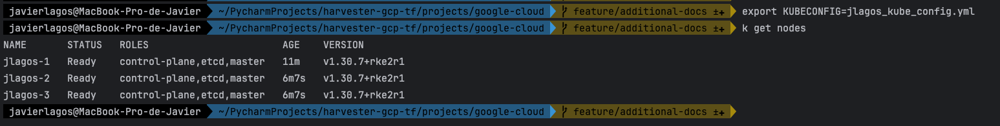
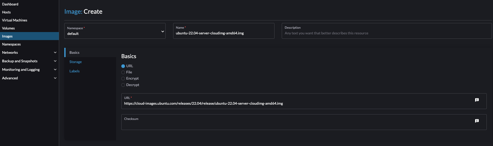
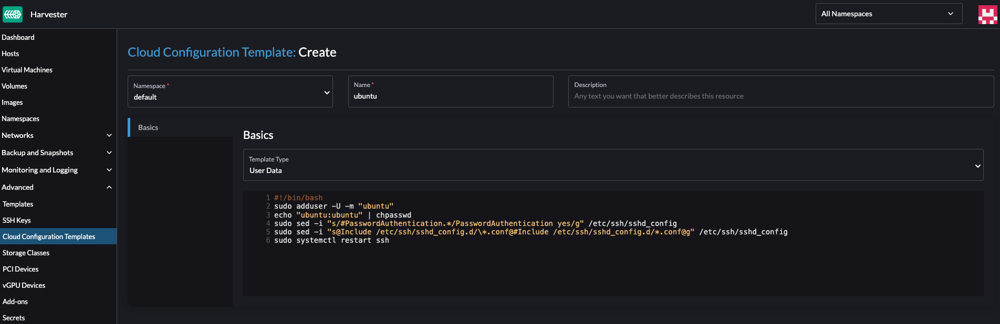
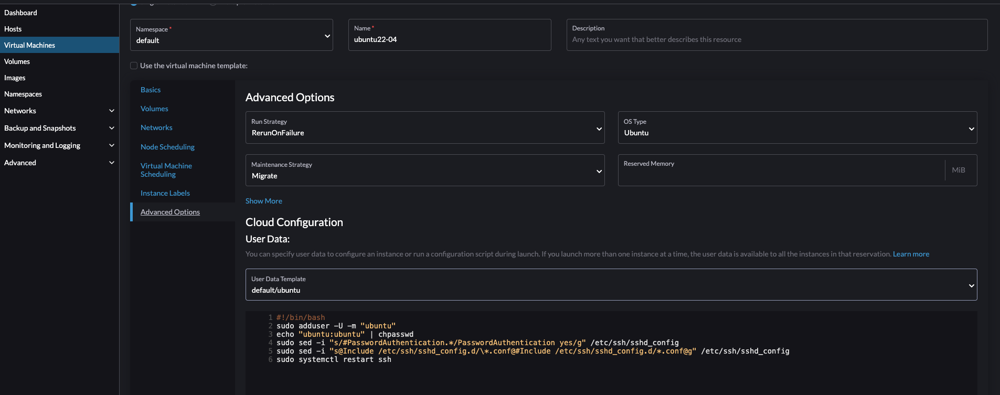
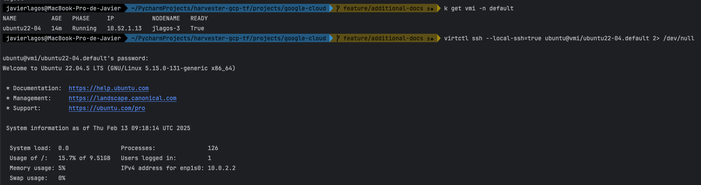

# How to create a basic Ubuntu virtual machine and access it via SSH from the local CLI

## Example

#### Export kubeConfig file a to access Harvester cluster from CLI

```bash
export KUBECONFIG=<prefix>_kube_config.yaml
```


#### Access Harvester UI to upload Ubuntu Image

```console
URL: https://cloud-images.ubuntu.com/releases/22.04/release/ubuntu-22.04-server-cloudimg-amd64.img
```


#### Create user-data Cloud Configuration Template in Harvester with the following Script

```bash
#!/bin/bash
sudo adduser -U -m "ubuntu"
echo "ubuntu:ubuntu" | chpasswd
sudo sed -i "s/#PasswordAuthentication.*/PasswordAuthentication yes/g" /etc/ssh/sshd_config
sudo sed -i "s@Include /etc/ssh/sshd_config.d/\*.conf@#Include /etc/ssh/sshd_config.d/*.conf@g" /etc/ssh/sshd_config
sudo systemctl restart ssh
```


**Pay attention when selecting the Cloud Configuration in the VM creation form. The `#cloud-config` line may be automatically added to the file, preventing the script from working correctly.**

#### Create Ubuntu Virtual Machine using ubuntu image and User-data template previously defined



#### Install Virtctl command in your CLI

```bash
export VERSION=v1.2.2
wget https://github.com/kubevirt/kubevirt/releases/download/${VERSION}/virtctl-${VERSION}-darwin-amd64
mv virtctl-v1.2.2-darwin-amd64 virtctl
chmod +x virtctl
sudo mv virtctl /usr/local/bin/
virtctl version
```

#### How to access Ubuntu machine created through virtctl from CLI 

```bash
kubectl -n <VM_NAMESPACE> get vmi
virtctl ssh --local-ssh=true <SSH_USERNAME>@vmi/<VM_NAME>.<VM_NAMESPACE>
# password: ubuntu
```


