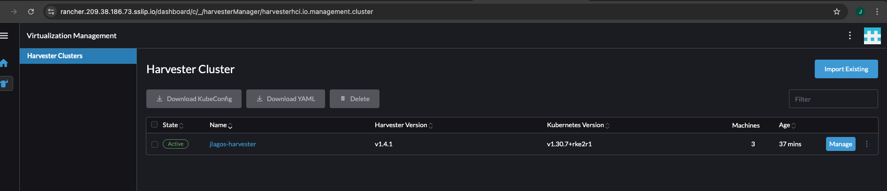
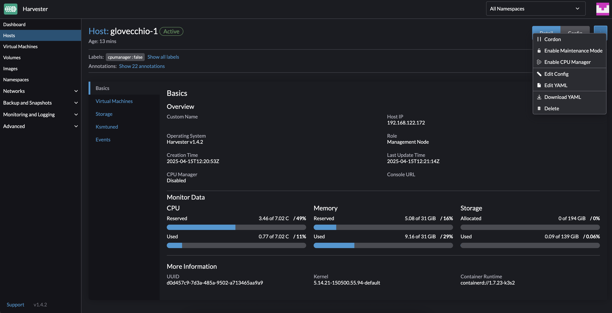
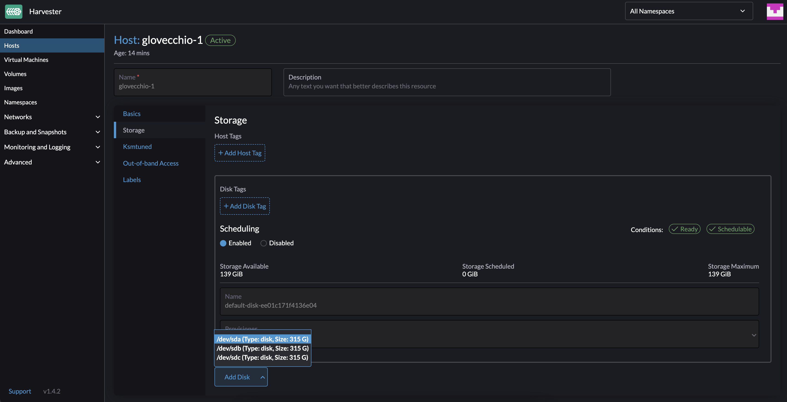
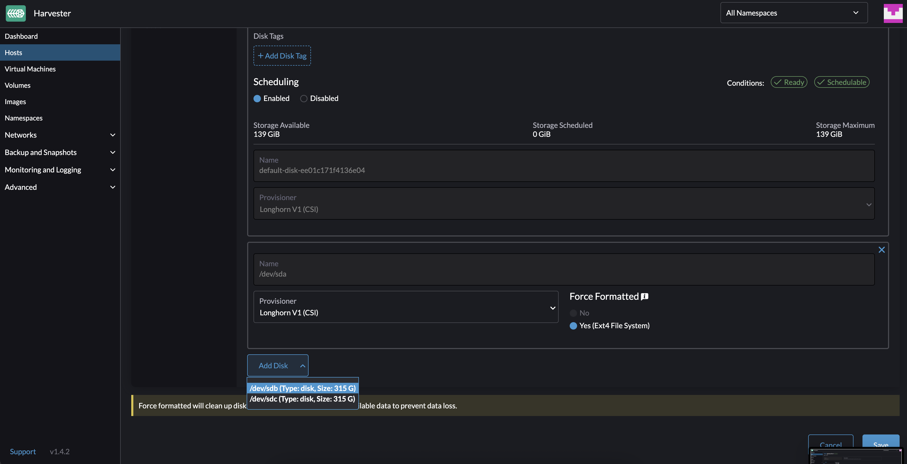
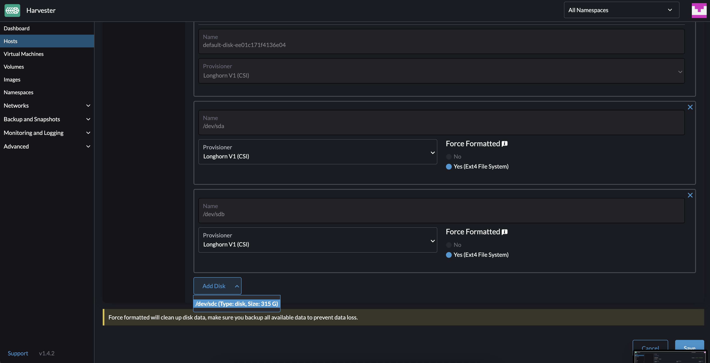
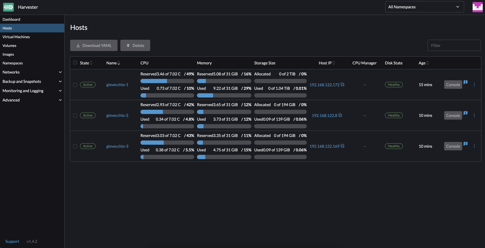

# How to create resources

- Copy `./terraform.tfvars.example` to `./terraform.tfvars`
- Edit `./terraform.tfvars`
  - Update the required variables:
    - `prefix` to give the resources an identifiable name (e.g., your initials or first name)
    - `os_image_id` to specify the openSUSE image ID uploaded to your DigitalOcean account
    - `do_token` to specify the DigitalOcean API token used to create resources
    - `region` to specify the DigitalOcean region where resources will be created
    - `harvester_node_count` to specify the number of Harvester nodes to create (1 or 3)
- Make sure you are logged into your DigitalOcean account using the `doctl` utility. See the preparatory steps [here](../../modules/digitalocean/README.md).
- Ensure that the openSUSE Leap image has been uploaded to your DigitalOcean organization. The recommended version for Terraform is openSUSE Leap 15.6. You can download it from [here](https://download.opensuse.org/distribution/leap/15.6/appliances/openSUSE-Leap-15.6-Minimal-VM.x86_64-Cloud.qcow2).  
  See the steps to upload the downloaded openSUSE image to DigitalOcean [here](https://docs.digitalocean.com/products/custom-images/how-to/upload/).
- Update the variable `os_image_id` with the correct ID of the uploaded openSUSE Leap image. You can retrieve the image ID by running:

```bash
doctl compute image list-user | grep "<NAME>"
```

#### Terraform Apply

```bash
terraform init -upgrade && terraform apply -auto-approve
```

#### Terraform Destroy

```bash
terraform destroy -auto-approve
```

#### OpenTofu Apply

```bash
tofu init -upgrade && tofu apply -auto-approve
```

#### OpenTofu Destroy

```bash
tofu destroy -auto-approve
```

## How to execute `kubectl` commands to Harvester cluster

#### Run the following command

```bash
export KUBECONFIG=<PREFIX>_kube_config.yaml
```

## How to access DigitalOcean Droplet

#### Run the following command

```bash
ssh -oStrictHostKeyChecking=no -i <PREFIX>-ssh_private_key.pem opensuse@<PUBLIC_IPV4>
```

## How to access Harvester Nested VMs

#### Run the following command within DigitalOcean VM where harvester is running

```bash
ssh rancher@<NESTED_VM_IPV4> # The password can be obtained from variable harvester_password or from join/create_cloud_config.yaml file in the current folder
```

# DEMOSTRATION 1 - Cluster Harvester with minimal possible configuration ("small" size)

#### Extract Image ID using doctl utility required for Terraform to run

```console
$ doctl compute image list-user | grep "openSUSE-Leap-15.6-Minimal"
179519713    openSUSE-Leap-15.6-Minimal                            custom      Unknown OS              false     7
```

#### Configure the terraform.tfvars file with the minimum necessary configurations

```console
$ cat terraform.tfvars
prefix               = "jlagos"
do_token             = "<DIGITALOCEAN_TOKEN>"
os_image_id          = "179519713"
region               = "fra1"
harvester_node_count = 3
```

#### Demonstration of applying Terraform files until accessing the Harvester UI


#### How to log in via SSH into the DigitalOcean Droplet VM


#### How to log in via SSH into nested VMs (Harvester nodes)


#### How to run `kubectl` commands on Harvester cluster


# DEMOSTRATION 2 - Cluster Harvester (with minimal possible configuration) that is automatically added to a Rancher cluster

#### Create API keys from the Rancher cluster


#### Configure the terraform.tfvars file by entering the Rancher API key

```console
$ cat terraform.tfvars
prefix               = "jlagos"
do_token             = "<DIGITALOCEAN_TOKEN>"
os_image_id          = "179519713"
region               = "fra1"
harvester_node_count = 3
rancher_api_url      = "<RANCHER_URL>"        # https://rancher.example.com
rancher_access_key   = "<RANCHER_ACCESS_KEY>" # token-abcde
rancher_secret_key   = "<RANCHER_SECRET_KEY>" # abcdefghijklmnopqrstuvwxyz
rancher_insecure     = true
```

#### Post-deployment checks

##### Harvester UI

 

##### Rancher UI



**PS: The Rancher cluster was created on an RKE2 Kubernetes cluster on Google Cloud infrastructure. To replicate the scenario, you can take a look [here](https://github.com/rancher/tf-rancher-up/tree/main/recipes/upstream/google-cloud/rke2).**

# DEMOSTRATION 3 - Cluster Harvester with 3 additional data disks per instance

#### Configure the terraform.tfvars file with the minimum necessary configurations

```console
$ cat terraform.tfvars
prefix               = "glovecchio"
do_token             = "<DIGITALOCEAN_TOKEN>"
os_image_id          = "180949249"
region               = "fra1"
harvester_node_count = 3
data_disk_count      = 4
```

**1 is the minimum accepted value, because it is the default disk needed for the Harvester host to function, so to have 3 more disks, the value will have to be 4.**

#### Harvester UI - Add Disks to Harvester Hosts (example for node 1)






