# How to create resources

- Copy `./terraform.tfvars.exmaple` to `./terraform.tfvars`
- Edit `./terraform.tfvars`
  - Update the required variables:
    - `prefix` to give the resources an identifiable name (e.g., your initials or first name)
    - `os_image_id` To specify OpenSUSE image ID uploaded to DigitalOcean Account.
    - `do_token` to specify token used to create resources in DigitalOcean account
    - `region` to specify the digitalocean region where resources will be created
    - `harvester_node_count` to specify the number of Harvester nodes to create (1 or 3)
- Make sure you are logged in your DigitalOcean account using doctl utility, See the preparatory steps [here](../../modules/digitalocean/README.md).
- Make sure you have uploaded OpenSUSE Leap to the DigitalOcean organization. The actual image recommended for the Terraform to run is OpenSUSE Leap 15.6, You can download it by clicking here [OpenSUSE Leap Minimal cloud 15.6](https://download.opensuse.org/distribution/leap/15.6/appliances/openSUSE-Leap-15.6-Minimal-VM.x86_64-Cloud.qcow2). See the steps to upload the OpenSUSE image downloaded to DigitalOcean [here](https://docs.digitalocean.com/products/custom-images/how-to/upload/) 
- Make sure you have configured variable `os_image_id` with the correct ID pointing to the OpenSUSE Leap image recently uploaded to DigitalOcean Account. You can execute the following command `doctl compute image list-user | grep "<name>"` to extract the image ID required.


#### Terraform Apply

```bash
terraform init -upgrade && terraform apply -auto-approve
```

#### Terraform Destroy

```bash
terraform destroy -auto-approve
```

#### OpenTofu Apply

```bash
tofu init -upgrade && tofu apply -auto-approve
```

#### OpenTofu Destroy

```bash
tofu destroy -auto-approve
```

## How to execute `kubectl` commands to Harvester cluster

#### Run the following command

```bash
export KUBECONFIG=<PREFIX>_kube_config.yaml
```

## How to access DigitalOcean Droplet

#### Run the following command

```bash
ssh -oStrictHostKeyChecking=no -i <PREFIX>-ssh_private_key.pem opensuse@<PUBLIC_IPV4>
```

## How to access Harvester Nested VMs

#### Run the following command within DigitalOcean VM where harvester is running

```bash
ssh rancher@<NESTED_VM_IPV4> # The password can be obtained from variable harvester_password or from join/create_cloud_config.yaml file in the current folder
```

# DEMOSTRATION 1 - Cluster Harvester with minimal possible configuration ("small" size)

#### Extract Image ID using doctl utility required for Terraform to run

```bash

$ doctl compute image list-user | grep "openSUSE-Leap-15.6-Minimal"

179519713    openSUSE-Leap-15.6-Minimal                            custom      Unknown OS              false     7

```

#### Configure the terraform.tfvars file with the minimum necessary configurations

```console
$ cat terraform.tfvars
prefix               = "jlagos"
do_token             = "<DIGITALOCEAN_TOKEN>"
os_image_id          = "179519713"
region               = "fra1"
harvester_node_count = 3
```

#### Demonstration of applying Terraform files until accessing the Harvester UI

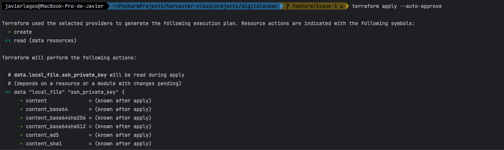
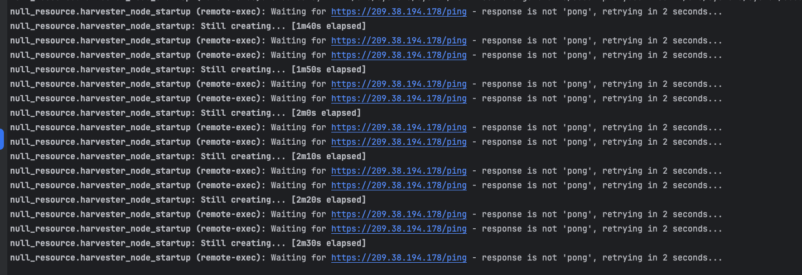
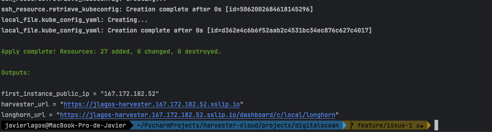
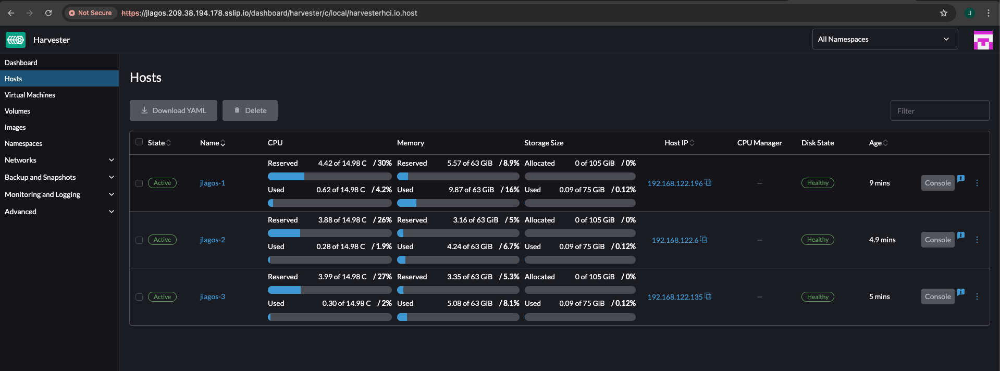

#### How to log in via SSH into the DigitalOcean Droplet VM

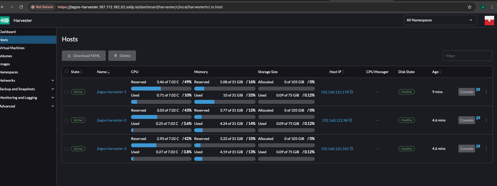

#### How to log in via SSH into nested VMs (Harvester nodes)

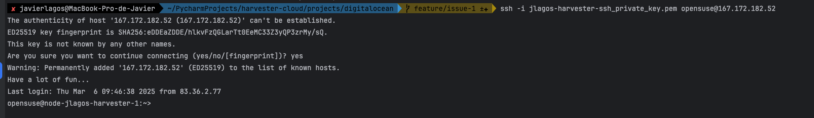

#### How to run `kubectl` commands on Harvester cluster

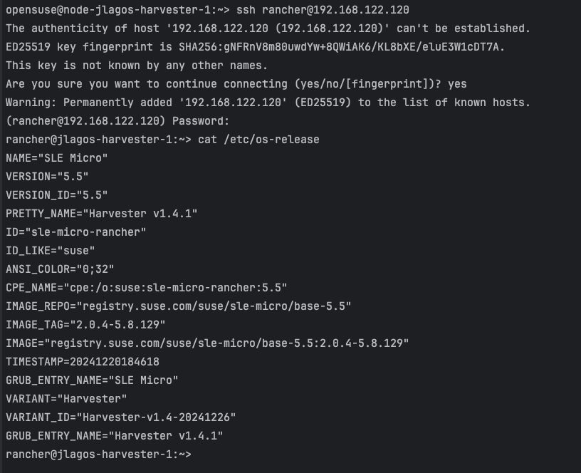

# DEMOSTRATION 2 - Cluster Harvester (with minimal possible configuration) that is automatically added to a Rancher cluster

#### Create API keys from the Rancher cluster

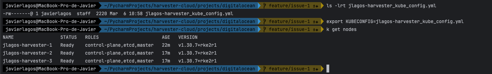
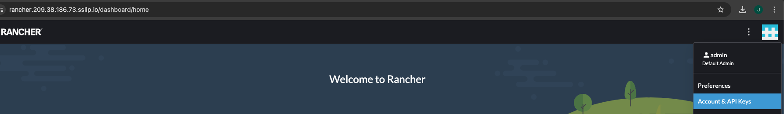

#### Configure the terraform.tfvars file by entering the Rancher API key

```console
$ cat terraform.tfvars
prefix               = "jlagos"
do_token             = "<DIGITALOCEAN_TOKEN>"
os_image_id          = "179519713"
region               = "fra1"
harvester_node_count = 3
rancher_api_url      = "<RANCHER_URL>"        # https://rancher.example.com
rancher_access_key   = "<RANCHER_ACCESS_KEY>" # token-abcde
rancher_secret_key   = "<RANCHER_SECRET_KEY>" # abcdefghijklmnopqrstuvwxyz
rancher_insecure     = true
```

#### Post-deployment checks

##### Harvester UI

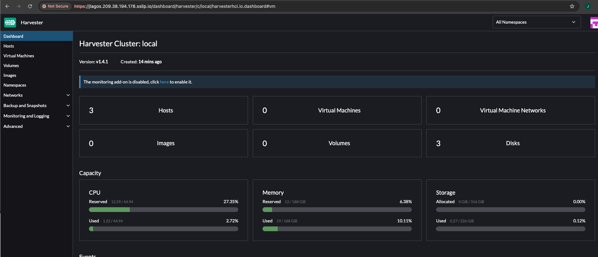 

##### Rancher UI

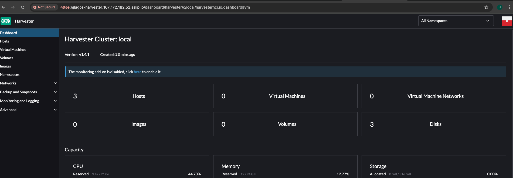

**PS: The Rancher cluster was created on an RKE2 Kubernetes cluster on Google Cloud infrastructure. To replicate the scenario, you can take a look [here](https://github.com/rancher/tf-rancher-up/tree/main/recipes/upstream/google-cloud/rke2).**
