# How to create resources

- Copy `./terraform.tfvars.exmaple` to `./terraform.tfvars`
- Edit `./terraform.tfvars`
  - Update the required variables:
    - `prefix` to give the resources an identifiable name (e.g., your initials or first name)
    - `project_id` to specify in which Project the resources will be created
    - `region` to specify the Google region where resources will be created
    - `harvester_node_count` to specify the number of Harvester nodes to create (1 or 3)
- Make sure you are logged into your Google Account from your local Terminal. See the preparatory steps [here](../../modules/google-cloud/README.md).

#### Terraform Apply

```bash
terraform init -upgrade && terraform apply -auto-approve
```

#### Terraform Destroy

```bash
terraform destroy -auto-approve
```

#### OpenTofu Apply

```bash
tofu init -upgrade && tofu apply -auto-approve
```

#### OpenTofu Destroy

```bash
tofu destroy -auto-approve
```

## How to execute `kubectl` commands to Harvester cluster

#### Run the following command

```bash
export KUBECONFIG=<PREFIX>_kube_config.yaml
```

## How to access Google VMs

#### Run the following command

```bash
ssh -oStrictHostKeyChecking=no -i <PREFIX>-ssh_private_key.pem sles@<PUBLIC_IPV4>
```

## How to access Harvester Nested VMs

#### Run the following command within Google VM where harvester is running

```bash
ssh rancher@<NESTED_VM_IPV4> # The password can be obtained from variable harvester_password or from join/create_cloud_config.yaml file in the current folder
```

# DEMOSTRATION 1 - Cluster Harvester with minimal possible configuration ("small" size)

#### Configure the terraform.tfvars file with the minimum necessary configurations

```console
$ cat terraform.tfvars
prefix               = "jlagos"
project_id           = "<PROJECT_ID>"
region               = "europe-west8"
harvester_node_count = 3
```

#### Demonstration of applying Terraform files until accessing the Harvester UI

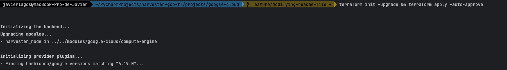
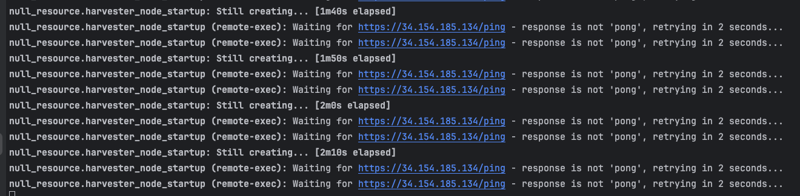
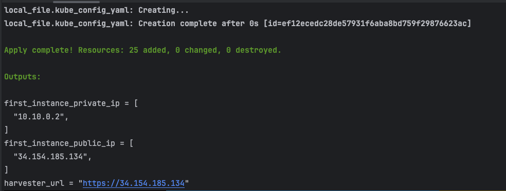
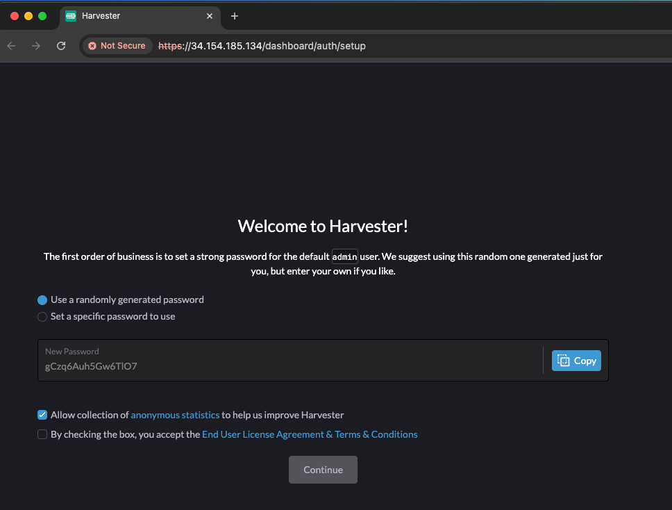
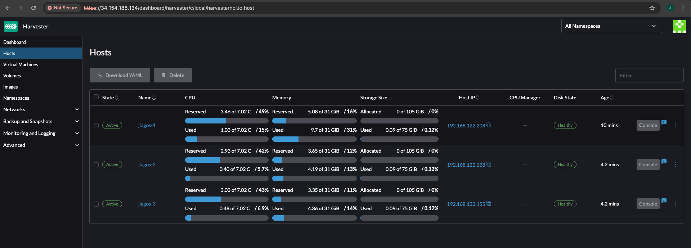

#### How to log in via SSH into the Google Cloud VM

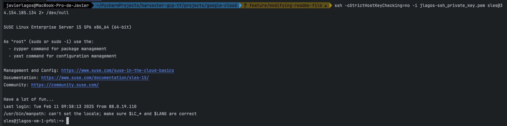

#### How to log in via SSH into nested VMs (Harvester nodes)

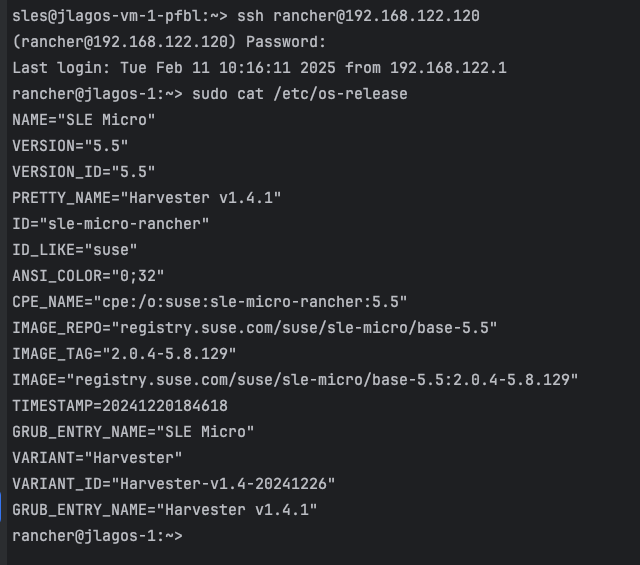

#### How to run `kubectl` commands on Harvester cluster

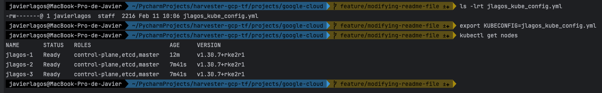

# DEMOSTRATION 2 - Cluster Harvester (with minimal possible configuration) that is automatically added to a Rancher cluster

#### Create API keys from the Rancher cluster

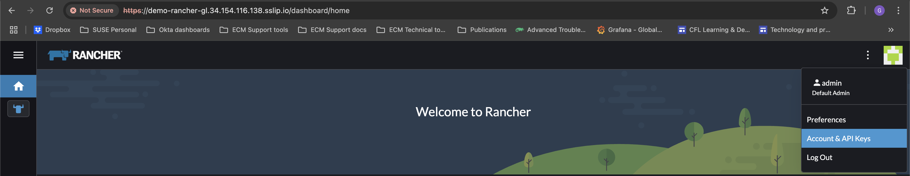
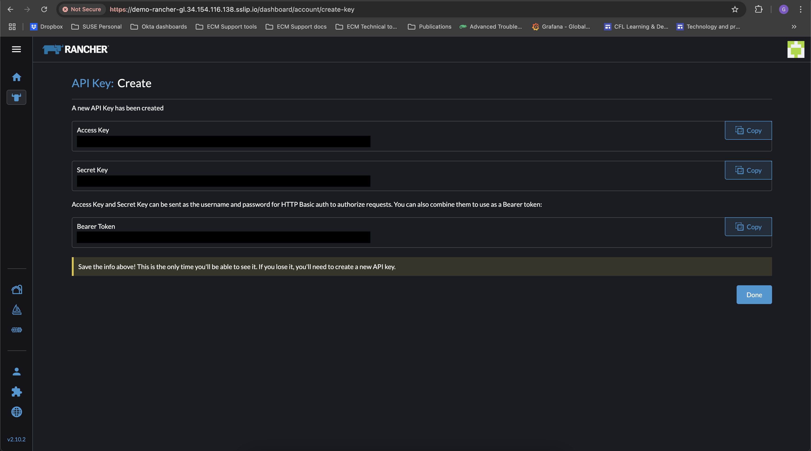

#### Configure the terraform.tfvars file by entering the Rancher API key

```console
$ cat terraform.tfvars
prefix               = "glovecchio"
project_id           = "<PROJECT_ID>"
region               = "europe-west8"
harvester_node_count = 3
rancher_api_url      = "<RANCHER_URL>"        # https://rancher.example.com
rancher_access_key   = "<RANCHER_ACCESS_KEY>" # token-abcde
rancher_secret_key   = "<RANCHER_SECRET_KEY>" # abcdefghijklmnopqrstuvwxyz
rancher_insecure     = true
```

#### Post-deployment checks

##### Harvester UI

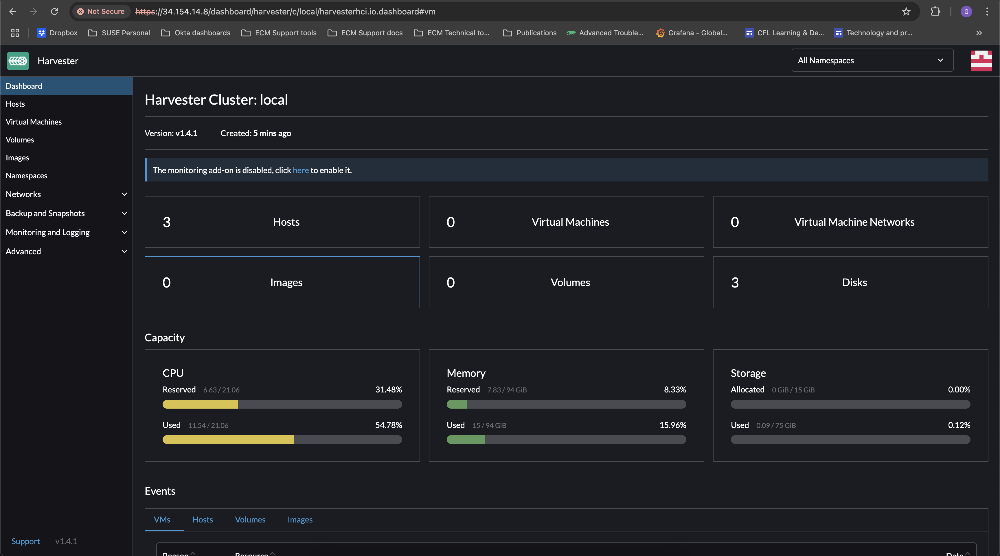 

##### Rancher UI

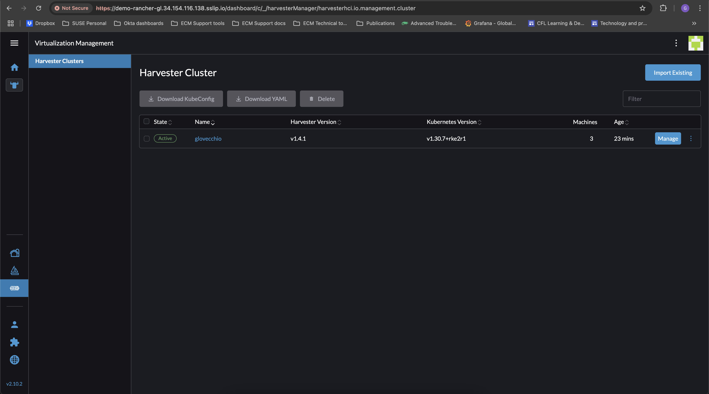

**PS: The Rancher cluster was created on an RKE2 Kubernetes cluster on Google Cloud infrastructure. To replicate the scenario, you can take a look [here](https://github.com/rancher/tf-rancher-up/tree/main/recipes/upstream/google-cloud/rke2).**
