# How to create resources

- Copy `./terraform.tfvars.exmaple` to `./terraform.tfvars`
- Edit `./terraform.tfvars`
  - Update the required variables:
    - `harvester_url` to specify the URL of the Harvester cluster API
    - `kubeconfig_file_path` to specify the full path to the Kubeconfig file, which is required to authenticate with the Harvester cluster
    - `kubeconfig_file_name` to specify the name of the Kubeconfig file used to access the Harvester cluster
    - `private_ssh_key_file_path` to specify the full path where the private SSH key file is located
    - `private_ssh_key_file_name` to specify the name of the private SSH key file used for authentication

#### Terraform Apply

```bash
terraform init -upgrade && terraform apply -auto-approve
```

#### Terraform Destroy

```bash
terraform destroy -auto-approve
```

#### OpenTofu Apply

```bash
tofu init -upgrade && tofu apply -auto-approve
```

#### OpenTofu Destroy

```bash
tofu destroy -auto-approve
```

## Description of the recipe

1. Create a second Virtual Network on the VM in the cloud (default name: `vlan2`).
2. Connect the newly created Virtual Network to the Harvester nodes (which are nested VMs).
3. Using Harvester's Terraform Provider, create a VM Network on the Harvester cluster.

**This recipe will perform a rolling reboot of the Harvester nodes.**

#### The process flow

VM in the cloud > (libvirt) Virtual Network *vlan2* > (libvirt) Attach network interface > (libvirt) Reboot VMs > Harvester nodes > VM Network

## Clean up the Virtual Machine (Cloud)

**Running `Terraform Destroy` will not delete the Virtual Network (libvirt) and will not detach the NIC from nested Harvester VMs.**

Obviously destroying the cluster solves the problem, but if you just want to roll back the configurations you made, run the script below:

```console
$ ssh -oStrictHostKeyChecking=no -i <PREFIX>-ssh_private_key.pem sles@<PUBLIC_IPV4>
$ sudo su -
$ cat << 'EOF' > detach-network-interface.sh
#!/bin/bash

CLUSTER_NETWORK_VLAN_NIC="virbr2" # Default value
NETWORK_NAME="vlan2" # Default value
NODE_COUNT=$(sudo virsh list --all | grep -c "running")

for i in $(seq 1 $NODE_COUNT); do
  MAC_ADDRESS=$(sudo virsh domiflist harvester-node-$i | grep $CLUSTER_NETWORK_VLAN_NIC | awk '{print $5}')
  if [ -n "$MAC_ADDRESS" ]; then
    echo "Detaching interface with MAC $MAC_ADDRESS from harvester-node-$i."
    sudo virsh detach-interface --domain harvester-node-$i --type bridge --mac $MAC_ADDRESS --config --live
  fi
done

for i in $(seq 1 $NODE_COUNT); do
  echo "Rebooting harvester-node-$i"
  sudo virsh reboot harvester-node-$i
  echo "Node harvester-node-$i rebooted, waiting for it to come back online..."
  TIMEOUT=300
  TIMER=0
  until sudo virsh list --all | grep "harvester-node-$i" | grep -q "running"; do
    echo "Waiting for harvester-node-$i to restart..."
    sleep 10
    TIMER=$((TIMER+10))
    if [ "$TIMER" -ge "$TIMEOUT" ]; then
      echo "Error: harvester-node-$i did not come back online within $TIMEOUT seconds."
      exit 1
    fi
  done
  echo "harvester-node-$i is back online."
done

echo "Destroying and undefining the network $NETWORK_NAME"
sudo virsh net-destroy --network $NETWORK_NAME || true
sudo virsh net-undefine --network $NETWORK_NAME || true

ATTEMPS=0
HARVESTER_URL="<HARVESTER_URL>" # Example https://<PREFIX>.<PUBLIC_IP4>.sslip.io

while [ "$ATTEMPS" -lt 15 ]; do
  RESPONSE=$(curl -k -s "$HARVESTER_URL/ping")
  if [ "$RESPONSE" == "pong" ]; then
    echo "Waiting for $HARVESTER_URL/ping - response: $RESPONSE"
    ((ATTEMPS++))
  else
    echo "Waiting for $HARVESTER_URL/ping - response is not 'pong', retrying in 2 seconds..."
  fi
  sleep 2
done
EOF
$ chmod +x ./detach-network-interface.sh
$ sh ./detach-network-interface.sh
```
**Remember to initialize the `CLUSTER_NETWORK_VLAN_NIC`, `NETWORK_NAME`, and `HARVESTER_URL` variables.**

**This script will perform a rolling reboot of the Harvester nodes.**

# DEMOSTRATION - Given a Harvester cluster, create a VM Network with all related resources

#### Harvester Cluster - UI | Cluster Network | Virtual Machine Networks - PRE-DEPLOY

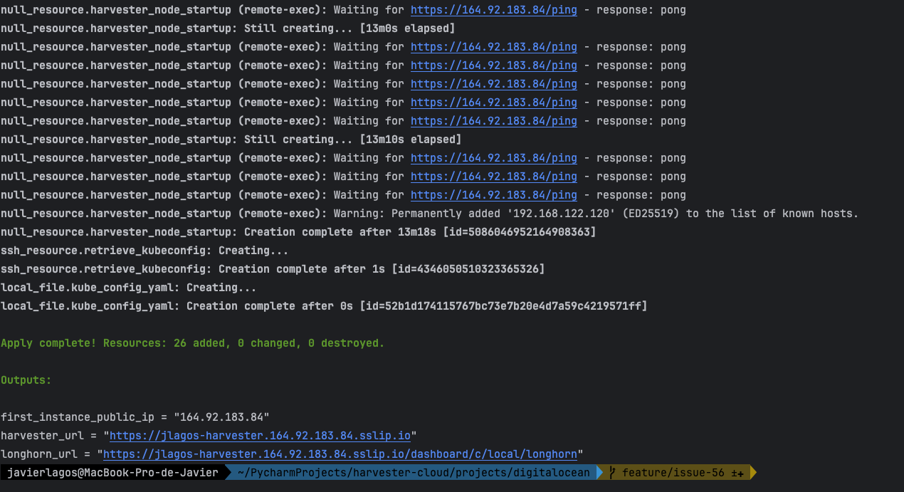
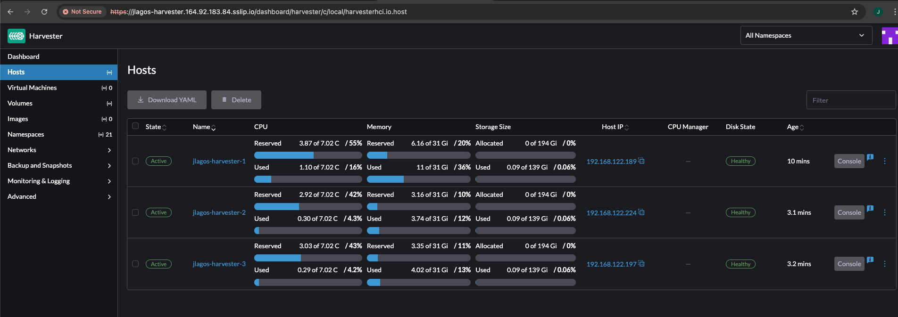
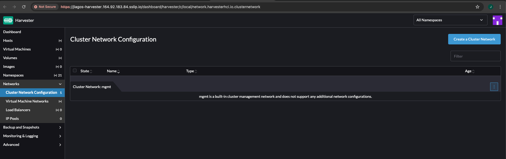
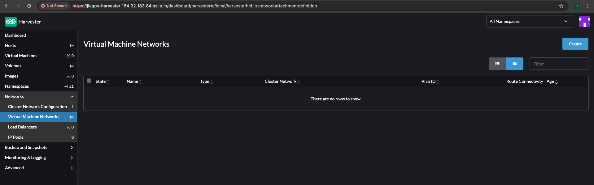

#### Configure the terraform.tfvars file with the minimum necessary configurations

```console
$ cat terraform.tfvars
harvester_url             = "https://glovecchio.34.154.151.215.sslip.io"
kubeconfig_file_path      = "../../google-cloud/"
kubeconfig_file_name      = "glovecchio_kube_config.yml"
private_ssh_key_file_path = "../../google-cloud/"
private_ssh_key_file_name = "glovecchio-ssh_private_key.pem"
```

#### Demonstration of applying Terraform files

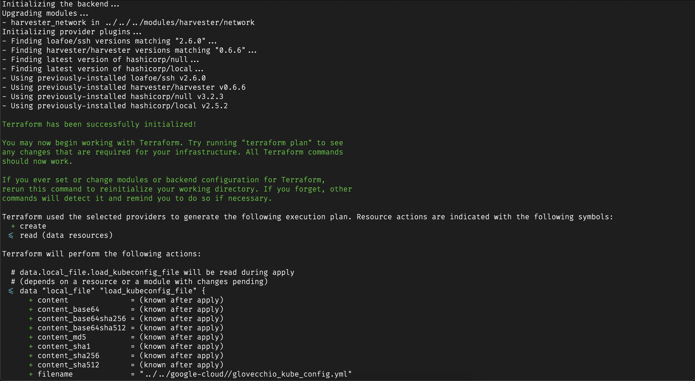
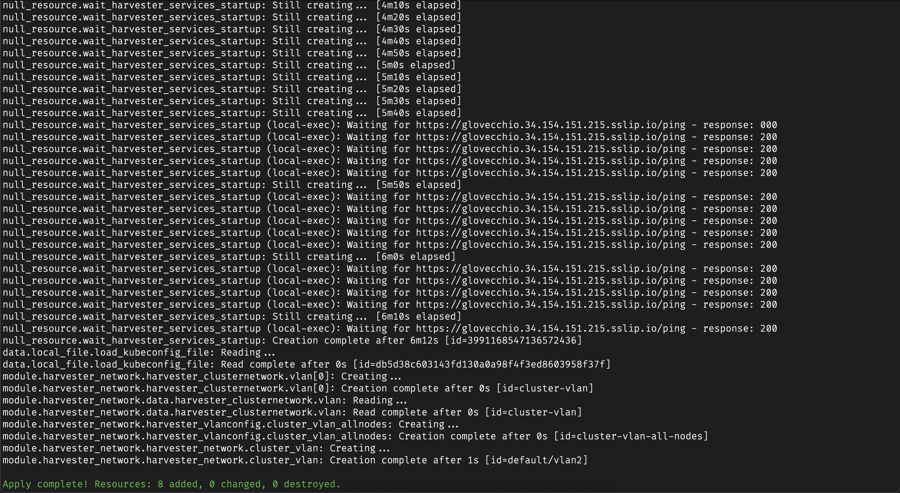

#### Harvester Cluster - UI | Cluster Network | Virtual Machine Networks - POST-DEPLOY

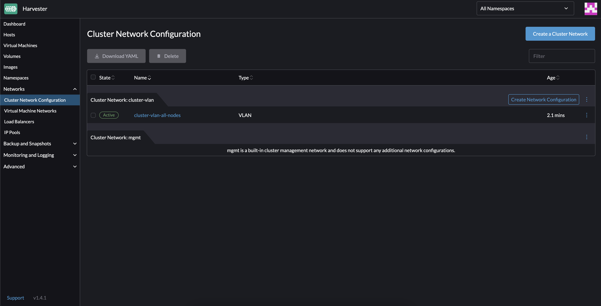
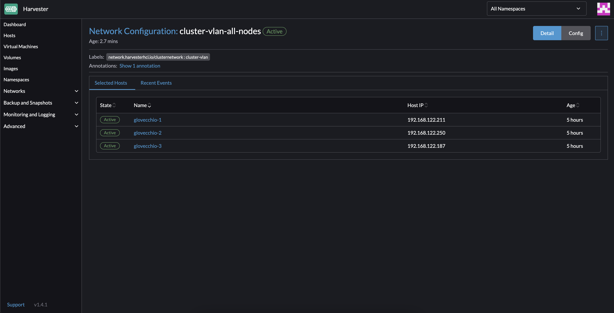
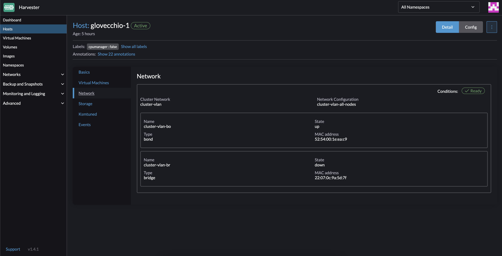
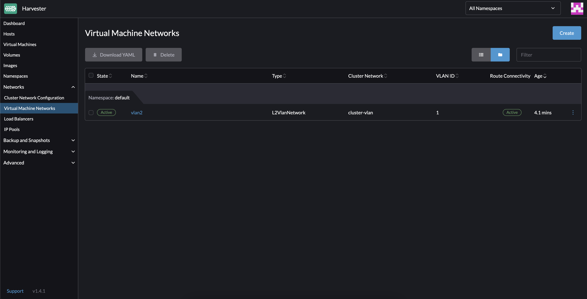
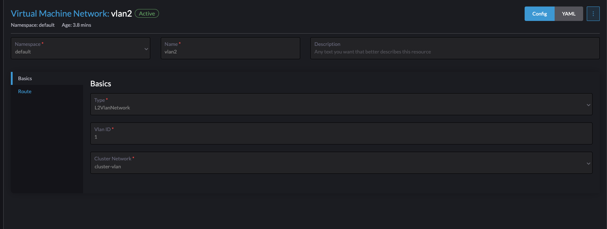

#### Check on the VM

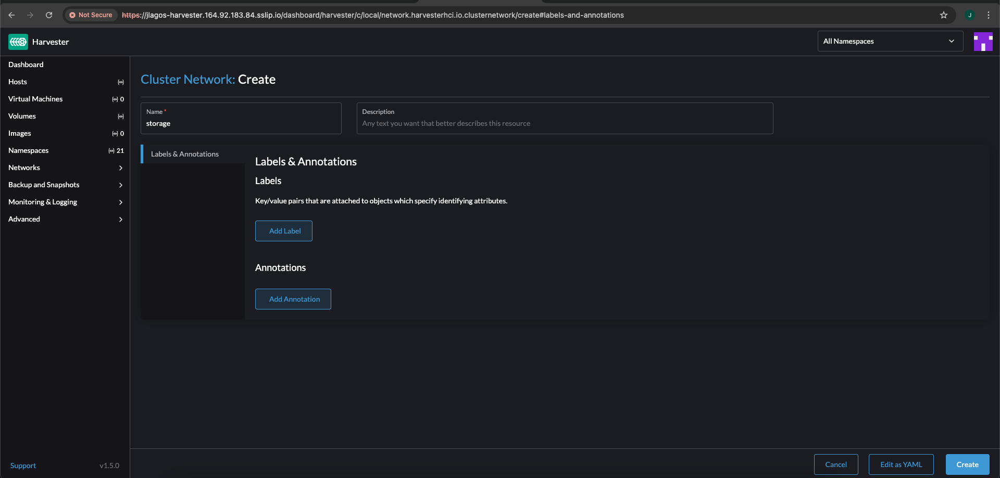

#### Demonstration of Terraform destroy

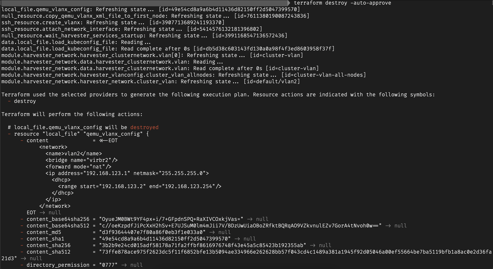
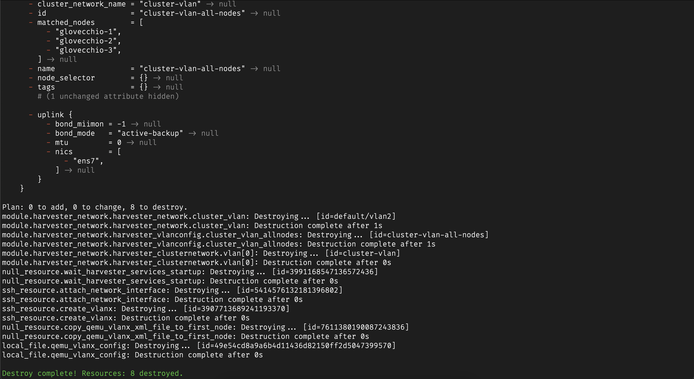

#### Harvester Cluster - UI | Cluster Network | Virtual Machine Networks - POST-DESTROY

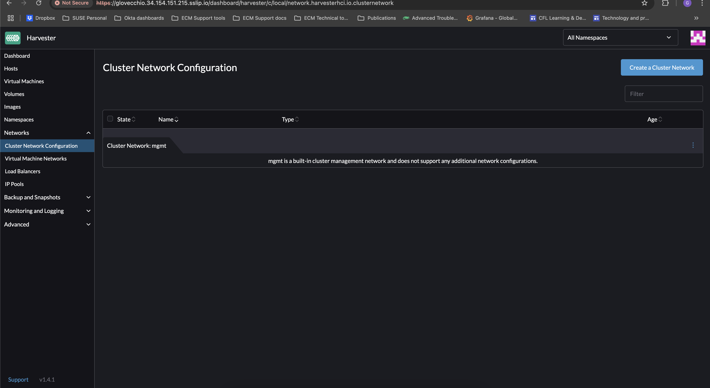
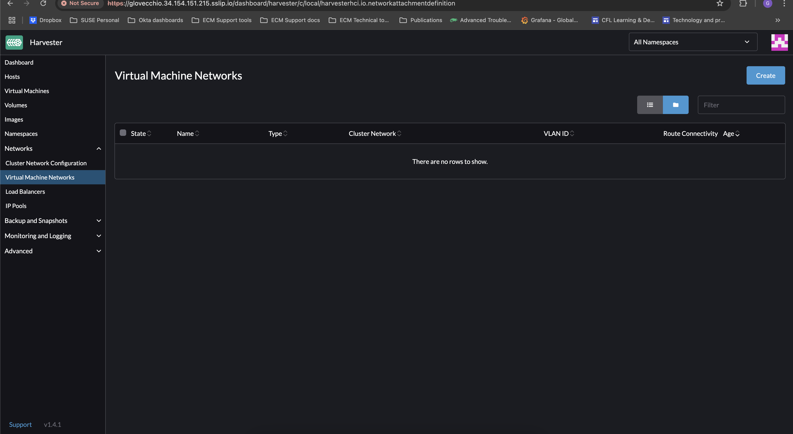

#### Deletion of the Virtual Network and detachment of the NIC from the nested VMs

1. Copy the above script and initialize the variables `CLUSTER_NETWORK_VLAN_NIC`, `NETWORK_NAME`, and `HARVESTER_URL`

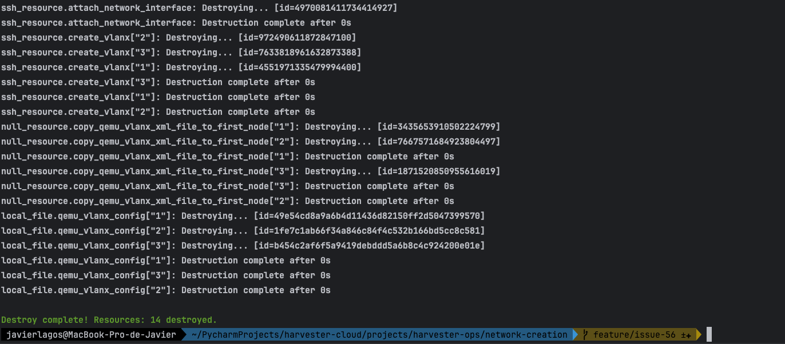

2. Run the script

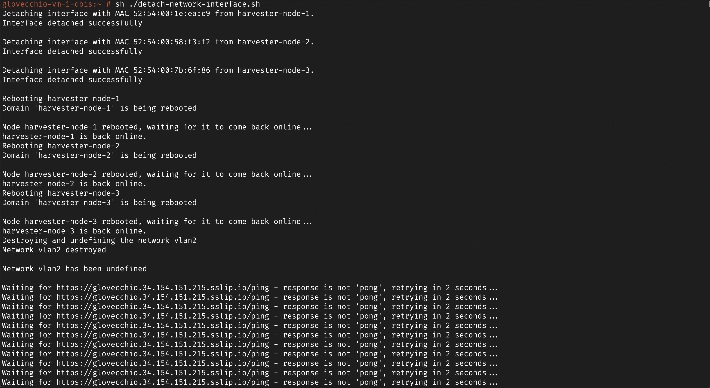


3. Double checks

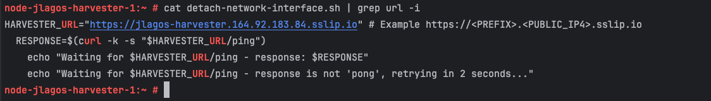
