# How to create resources

- Copy `./terraform.tfvars.example` to `./terraform.tfvars`
- Edit `./terraform.tfvars`
  - Update the required variables:
    - `harvester_url` to specify the URL of the Harvester cluster API
    - `kubeconfig_file_path` to specify the full path to the Kubeconfig file, which is required to authenticate with the Harvester cluster
    - `kubeconfig_file_name` to specify the name of the Kubeconfig file used to access the Harvester cluster

#### Terraform Apply

```bash
terraform init -upgrade && terraform apply -auto-approve
```

#### Terraform Destroy

```bash
terraform destroy -auto-approve
```

#### OpenTofu Apply

```bash
tofu init -upgrade && tofu apply -auto-approve
```

#### OpenTofu Destroy

```bash
tofu destroy -auto-approve
```

# DEMOSTRATION 1 - Given a Harvester cluster, create an Ubuntu Image and a single Virtual Machine (using the default variables)

### Create the Ubuntu Image

```console
$ cd projects/harvester-ops/image-creation
```

**NB: The default image is now openSUSE Leap 15.x.**

#### Configure the terraform.tfvars file with the minimum necessary configurations

```console
$ cat terraform.tfvars
harvester_url             = "<HARVESTER_URL>"
kubeconfig_file_path      = "../../google-cloud/"
kubeconfig_file_name      = "<PREFIX>_kube_config.yml"
```

#### Demonstration of applying Terraform files

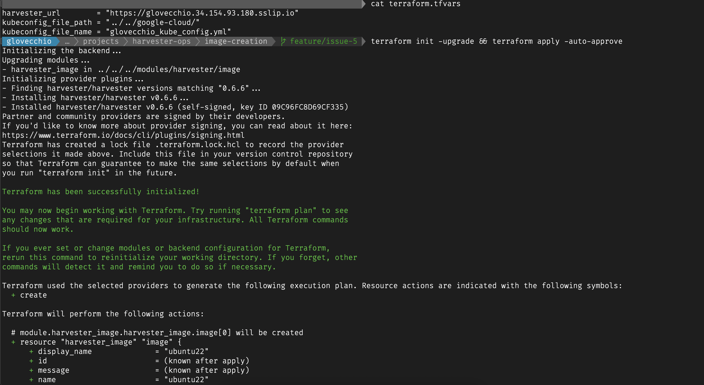
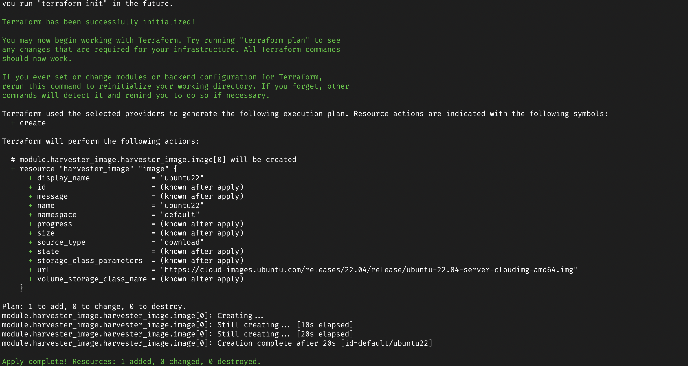

#### Harvester Cluster - UI | Image

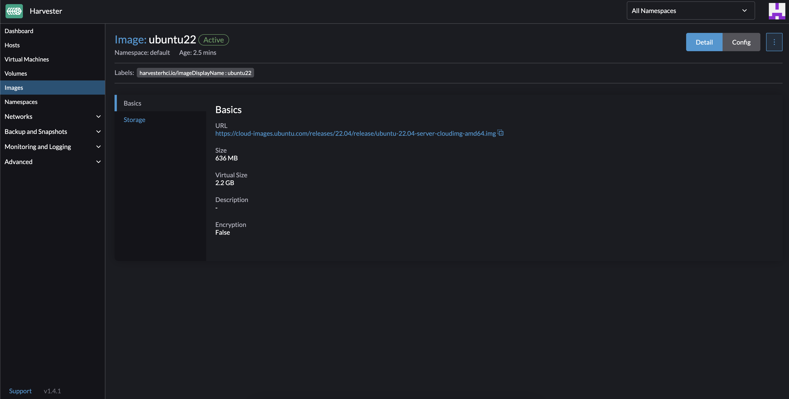

### Create the Virtual Machine

```console
$ cd ../vm-pool-creation
```

#### Configure the terraform.tfvars file with the minimum necessary configurations

```console
$ cat terraform.tfvars
harvester_url             = "<HARVESTER_URL>"
kubeconfig_file_path      = "../../google-cloud/"
kubeconfig_file_name      = "<PREFIX>_kube_config.yml"
```

#### Demonstration of applying Terraform files

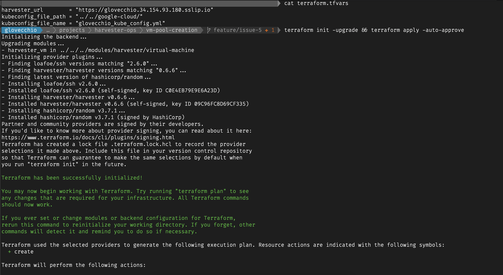
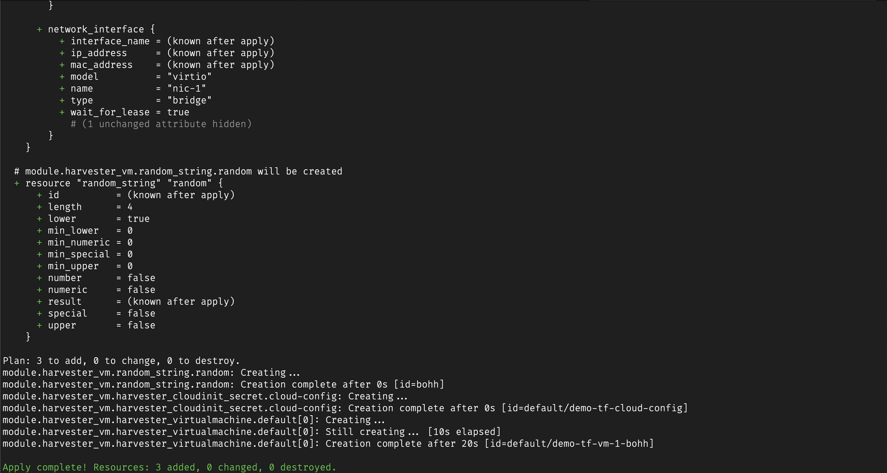

#### Harvester Cluster - UI | Virtual Machines

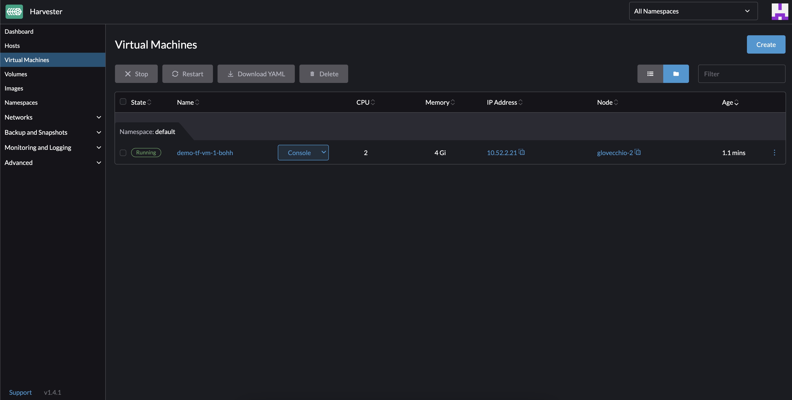

#### Test VM access

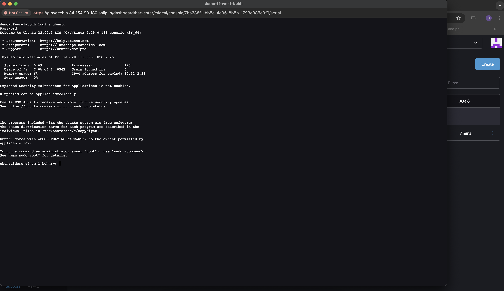

# DEMOSTRATION 2 - Given a Harvester cluster, create an Ubuntu Image, a VM Network, and a single Virtual Machine (using the default variables)

### Create the Ubuntu Image

**Check out demo 1 to see how to do it.**

**NB: The default image is now openSUSE Leap 15.x.**

### Create the VM Network (and all related resources)

```console
$ cd projects/harvester-ops/network-creation
```

#### Configure the terraform.tfvars file with the minimum necessary configurations

```console
$ cat terraform.tfvars
harvester_url             = "<HARVESTER_URL>"
kubeconfig_file_path      = "../../google-cloud/"
kubeconfig_file_name      = "<PREFIX>_kube_config.yml"
private_ssh_key_file_path = "../../google-cloud/"
private_ssh_key_file_name = "<PREFIX>-ssh_private_key.pem"
```

#### Demonstration of applying Terraform files

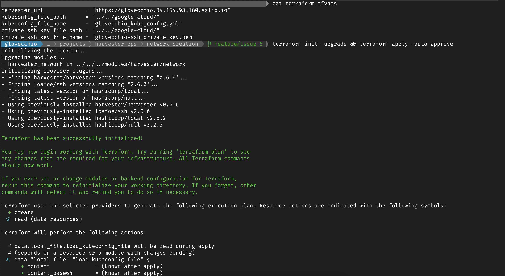
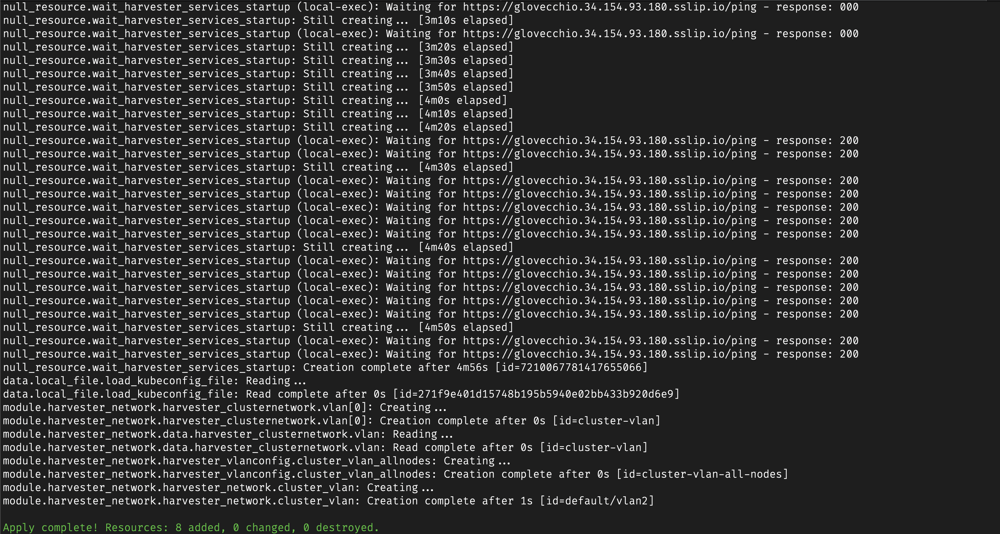

#### Harvester Cluster - UI | Cluster Network | Virtual Machine Networks

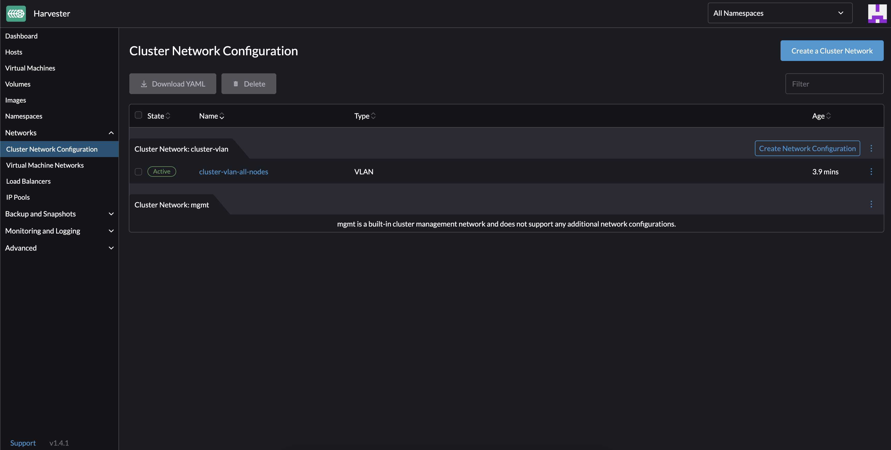
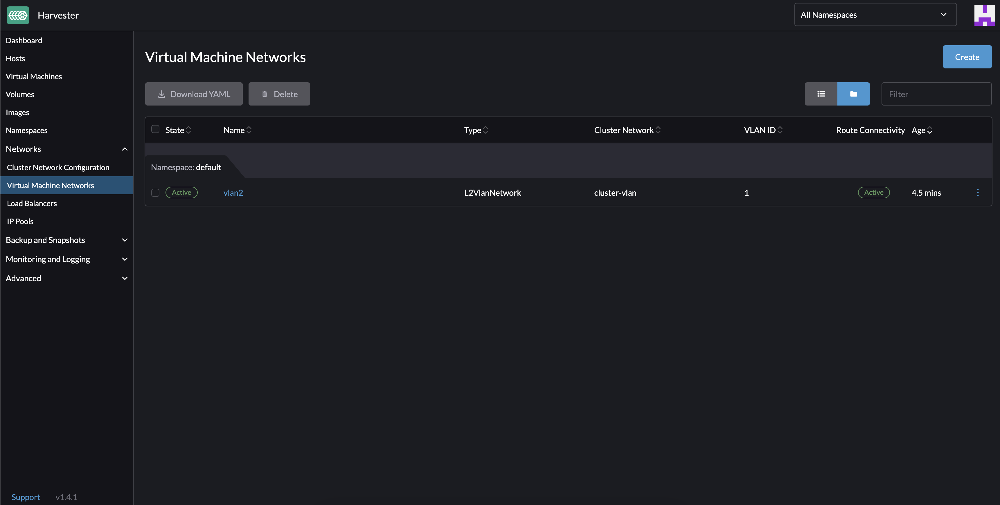

### Create the Virtual Machine

```console
$ cd ../vm-pool-creation
```

#### Configure the terraform.tfvars file with the minimum necessary configurations

```console
$ cat terraform.tfvars
network_name              = "vlan2" # default value of the `network_name` variable of the `network-creation` project.
harvester_url             = "<HARVESTER_URL>"
kubeconfig_file_path      = "../../google-cloud/"
kubeconfig_file_name      = "<PREFIX>_kube_config.yml"
```

#### Demonstration of applying Terraform files

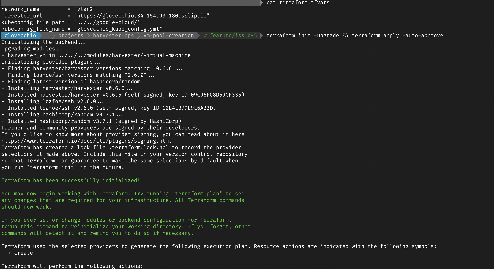
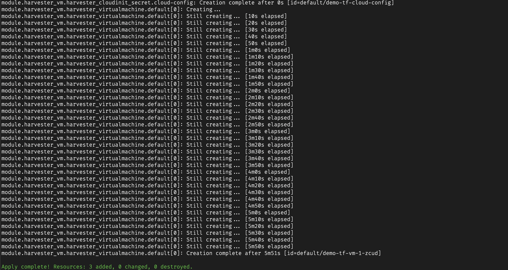

#### Harvester Cluster - UI | Virtual Machines

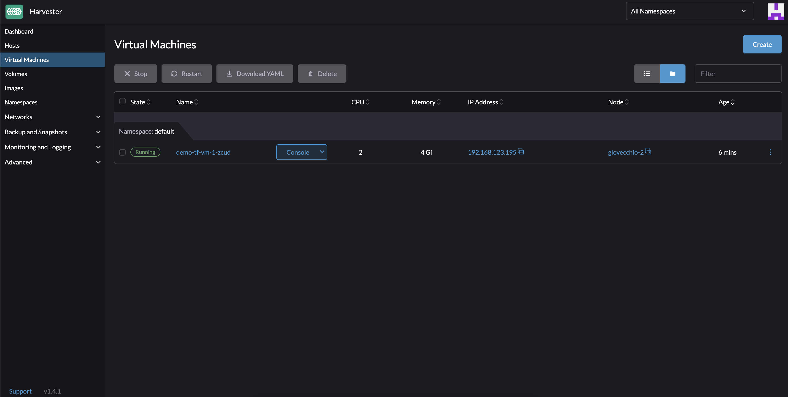

#### Test VM access

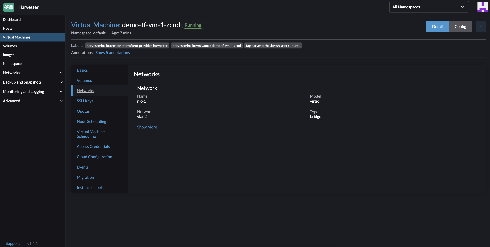
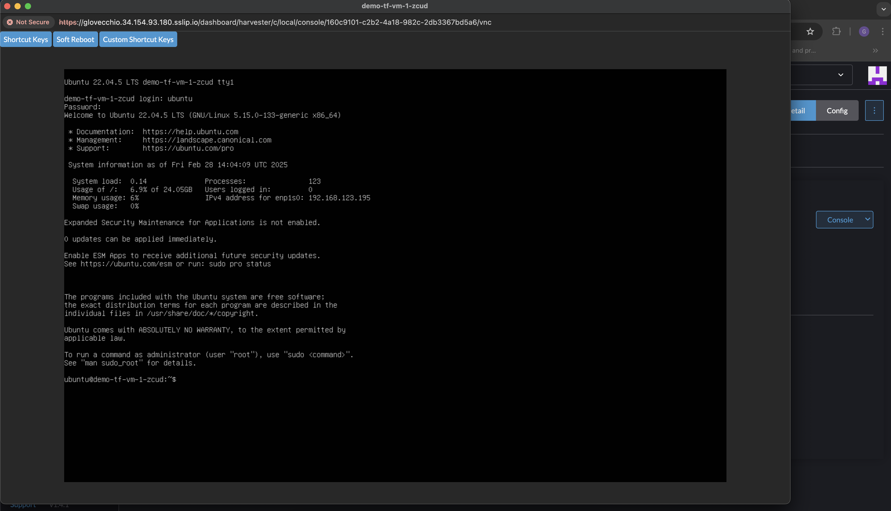
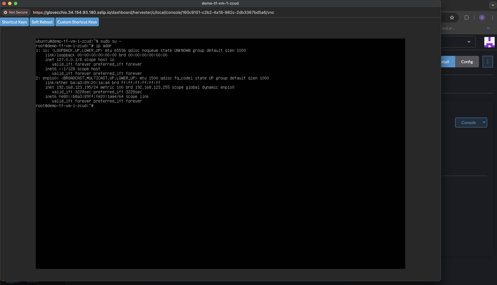

Remember that the Virtual Network created by the *network-creation* project has the following characteristics:

```console
# modules/harvester/deployment-script/qemu_vlanx_xml.tpl file
<network>
  <name>${name}</name>
  <bridge name="${nic}"/>
  <forward mode="nat"/>
  <ip address="${ip_base}.1" netmask="255.255.255.0">
    <dhcp>
      <range start="${ip_base}.2" end="${ip_base}.254"/>
    </dhcp>
  </ip>
</network>
```

Where the variable `ip_base` is initialized with `"192.168.123"`.

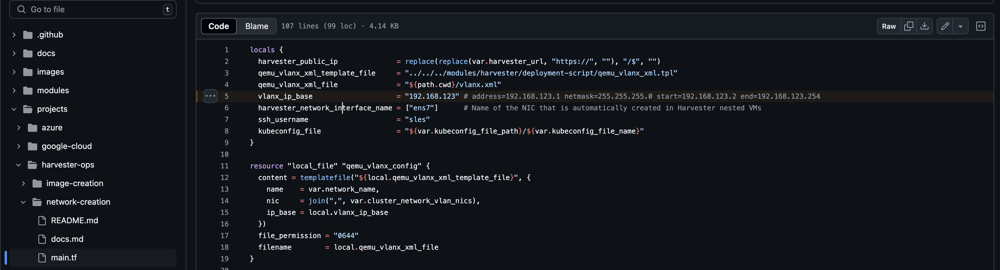
